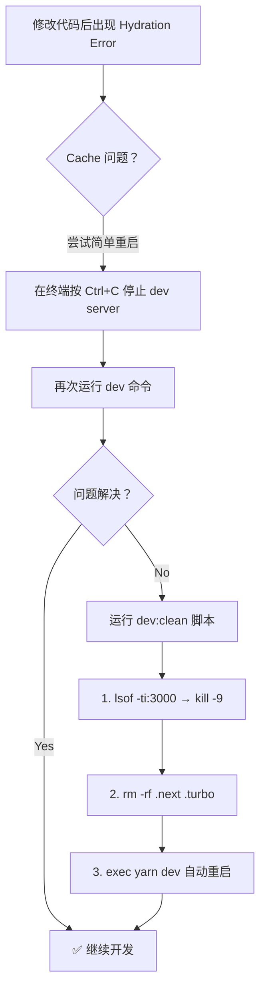

# 开发环境缓存一键修复方案

## 问题现象

修改代码（如 `BottomNavigation.tsx`）后：

1. **Turbopack HMR 失效**：服务端渲染出新 HTML，但客户端加载的 JS bundle 仍是旧版本
2. **Hydration Error**: `Hydration failed because the server rendered HTML didn't match the client`
3. **手动修复步骤**：`kill` 进程 → 删除 `.next` 和 `.turbo` 目录 → 重启 dev server

> 用户原话："这缓存开发环境如何一键修复啊，这样太耽误时间了"

---

## 根源分析

| 缓存层                       | 位置                              | 作用                           | 问题                              |
| ---------------------------- | --------------------------------- | ------------------------------ | --------------------------------- |
| **Turbopack 持久化磁盘缓存** | `apps/frontend-blog/.next/cache/` | 存储编译后的模块，加速下次启动 | code change 后返回 stale 编译产物 |
| **Next.js 构建输出**         | `apps/frontend-blog/.next/`       | server/client bundles、pages   | HMR 断连后不重建                  |
| **Turborepo 本地缓存**       | `apps/frontend-blog/.turbo/`      | 缓存 yarn workspace 任务输出   | 可能跳过重新编译                  |

**关键发现**：`next.config.ts` 中 `experimental` 块**没有**配置 `turbo` 选项，Turbopack 使用默认行为（开启持久化缓存）。

---

## 方案对比

### 方案 A：添加 `dev:clean` 脚本（推荐 ✅）

在 `apps/frontend-blog/package.json` 添加一条脚本，同时创建配套 shell 脚本。

**修改文件**：

- `apps/frontend-blog/package.json`（添加 1 行 scripts）
- `apps/frontend-blog/scripts/dev-clean.sh`（新建）

**用户操作**：在终端中按 `Ctrl+C` 停掉当前 dev server，然后运行：

```bash
cd /Volumes/MySSD/work/JoyMini_Nest_Monorepo && yarn workspace @lucky/frontend-blog dev:clean
```

**脚本逻辑**：

1. 使用 `lsof -ti:3000 | xargs kill -9` 杀掉占端口的进程（macOS 原生，无需装依赖）
2. 删除 `apps/frontend-blog/.next` 和 `apps/frontend-blog/.turbo`
3. 执行 `yarn workspace @lucky/frontend-blog dev`

**优点**：零依赖、纯 shell、兼容 macOS
**缺点**：需手动停旧进程再运行新命令

---

### 方案 B：根目录 `package.json` 加全局脚本

```json
"dev:blog:clean": "lsof -ti:3000 | xargs kill -9 2>/dev/null; rm -rf apps/frontend-blog/.next apps/frontend-blog/.turbo; yarn workspace @lucky/frontend-blog dev"
```

**优点**：从根目录可直接运行
**缺点**：命令太长，建议走脚本文件

---

### 方案 C：安装 `kill-port` 或 `fkill-cli` 替代 `lsof`

```json
// devDependencies
"kill-port": "^2.0.1"
```

**优点**：跨平台兼容，语义清晰
**缺点**：多一个依赖，且当前只在 macOS 开发，`lsof` 已足够

---

### 方案 D：配置 Turbopack 关闭持久化缓存

在 `next.config.ts` 中添加：

```ts
experimental: {
  turbo: {
    // 限制缓存行为
    rules: {},
  },
},
```

**优点**：根治问题，不需要清理
**缺点**：

- Next.js 15 的 Turbopack 配置 API 不稳定
- 不完全保证 HMR 不出问题
- 首次编译变慢（无缓存加速）

---

## 推荐方案详解

### 采用方案 A（package.json script + shell 脚本）

#### 执行清单

| #   | 文件                                      | 操作     | 说明                      |
| --- | ----------------------------------------- | -------- | ------------------------- |
| 1   | `apps/frontend-blog/scripts/dev-clean.sh` | **新建** | 一键清理 + 重启脚本       |
| 2   | `apps/frontend-blog/package.json`         | **修改** | 添加 `dev:clean` 脚本引用 |

---

#### 文件 1: `apps/frontend-blog/scripts/dev-clean.sh`

```bash
#!/bin/bash
set -e

SCRIPT_DIR="$(cd "$(dirname "$0")" && pwd)"
PROJECT_DIR="$(cd "$SCRIPT_DIR/.." && pwd)"

echo "========================================"
echo "  🧹 开发环境缓存清理 & 重启"
echo "========================================"

# 1. 杀掉占用 3000 端口的进程
echo ""
echo "📌 Step 1/3: 停止当前 dev server (port 3000)..."
PID=$(lsof -ti:3000 2>/dev/null || true)
if [ -n "$PID" ]; then
  kill -9 $PID 2>/dev/null || true
  echo "   ✅ 已杀掉进程 PID=$PID"
else
  echo "   ⏭️  没有进程占用 3000 端口"
fi

# 等待端口释放
sleep 1

# 2. 删除缓存目录
echo ""
echo "📌 Step 2/3: 清除编译缓存..."
cd "$PROJECT_DIR"

if [ -d ".next" ]; then
  rm -rf .next
  echo "   ✅ 已删除 .next/"
fi
if [ -d ".turbo" ]; then
  rm -rf .turbo
  echo "   ✅ 已删除 .turbo/"
fi

# 3. 重启 dev server
echo ""
echo "📌 Step 3/3: 启动 dev server..."
echo "========================================"
echo ""
exec yarn dev
```

#### 文件 2: `apps/frontend-blog/package.json` 修改

在 `scripts` 块中添加：

```json
"dev:clean": "bash scripts/dev-clean.sh",
```

放在 `"dev": "next dev"` 下方：

```json
"scripts": {
  "dev": "next dev",
  "dev:clean": "bash scripts/dev-clean.sh",
  ...
}
```

---

### 完整执行流程



---

### 用户操作方式（两种）

**方式 1：终端直接运行（推荐）**

```bash
# 先 Ctrl+C 停掉当前 dev server，然后：
yarn workspace @lucky/frontend-blog dev:clean
```

**方式 2：VSCode 终端复用**
如果不想停掉当前终端，可以开第二个终端窗口运行：

```bash
# 先杀掉端口（脚本会自动做），再重启
cd /Volumes/MySSD/work/JoyMini_Nest_Monorepo
lsof -ti:3000 | xargs kill -9
rm -rf apps/frontend-blog/.next apps/frontend-blog/.turbo
yarn workspace @lucky/frontend-blog dev
```

> 但方式 1 更方便——`dev:clean` 脚本全部自动化。

---

### 为什么不直接修改 `dev` 脚本？

当前 `"dev": "next dev"` 是标准启动命令，用于正常开发。我们不希望**每次**启动都清缓存（那样首次编译太慢）。`dev:clean` 是**按需**的修复命令——只在缓存出问题时使用。

---

## 风险管理

| 风险                                       | 缓解措施                                                            |
| ------------------------------------------ | ------------------------------------------------------------------- |
| `lsof` 在 Linux/macOS 可用，Windows 不可用 | 当前只在 macOS 开发，Windows 不需要考虑                             |
| 误杀其他进程                               | `lsof -ti:3000` 仅限端口 3000，精确匹配                             |
| `rm -rf` 误删                              | 路径限定在 `apps/frontend-blog/.next` 和 `.turbo`，相对路径安全检查 |
| 删除 `.next` 后首屏加载慢                  | 这是正常行为，相当于 clean build，后续 HMR 恢复快速                 |

---

## 未来优化方向

如果后续频繁遇到此问题，可考虑：

1. **升级 Next.js**：检查是否有新版修复了 Turbopack 缓存问题
2. **配置 `experimental.turbo`**：当 Turbopack API 稳定后，配置缓存策略
3. **安装 `wait-on`**：添加 `wait-on http://localhost:3000` 确保 dev server 完全就绪后再通知
4. **VSCode Task**：配置 `.vscode/tasks.json`，绑定快捷键一键执行清理重启
