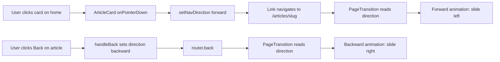
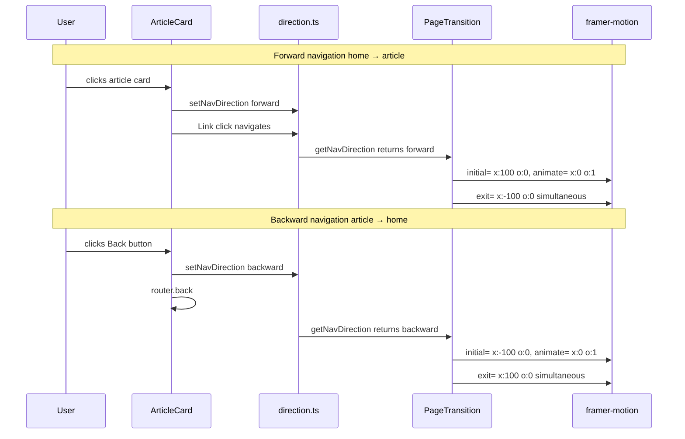

# Directional Page Transition Animation

## Problem

Pure crossfade (opacity only) creates a visible "flash" during navigation because at the midpoint of the transition both pages are semi-transparent, showing the body background through. The user wants proper "app-like" navigation with slide directionality:

- **Forward** (home → article detail): push content to the left
- **Backward** (article detail → home): push content to the right

## Root Cause Analysis

Current `PageTransition.tsx` uses:

```tsx
<AnimatePresence>
  <motion.div key={pathname}
    initial={{ opacity: 0 }}
    animate={{ opacity: 1 }}
    exit={{ opacity: 0 }}
    ...
  </motion.div>
</AnimatePresence>
```

At the midpoint (~75ms), both old and new pages have ~0.5 opacity, so the body background shows through the partially transparent pages. Even `bg-background` doesn't help because each page's background only covers its own content area.

## Solution: Direction-Aware Slide + Opacity Transition

### Architecture

Introduce a synchronous module-level direction tracker (not React state, because it needs to be set *before* the navigation event is processed).



### Module-Level Direction Tracker

**File**: `apps/frontend-blog/src/lib/navigation/direction.ts`

A simple module with a mutable variable and getter/setter. This is intentionally *not* React state because:

1. The direction must be set synchronously before `router.back()` or Link navigation processes
2. React state updates would be async and miss the navigation timing

```typescript
export type NavDirection = 'forward' | 'backward';

let _direction: NavDirection = 'forward';
let _popStateListener: (() => void) | null = null;

export function getNavDirection(): NavDirection {
  return _direction;
}

export function setNavDirection(dir: NavDirection) {
  _direction = dir;
}

/** Call once at app root to detect browser back/forward buttons */
export function initPopStateDetection() {
  if (_popStateListener) return;
  _popStateListener = () => { _direction = 'backward'; };
  window.addEventListener('popstate', _popStateListener);
}
```

### Animation Variants

**Forward** (home → article):
| Phase | Old Page | New Page |
|-------|----------|----------|
| Start | center (opacity 1, x:0) | off-screen right (opacity 0, x:100) |
| End | off-screen left (opacity 0, x:-100) | center (opacity 1, x:0) |

**Backward** (article → home):
| Phase | Old Page | New Page |
|-------|----------|----------|
| Start | center (opacity 1, x:0) | off-screen left (opacity 0, x:-100) |
| End | off-screen right (opacity 0, x:100) | center (opacity 1, x:0) |

Both exit and enter happen **simultaneously** (no `mode="wait"`) to avoid any blank gap.

## Files to Change

### 1. NEW: `apps/frontend-blog/src/lib/navigation/direction.ts`

Synchronous module-level direction tracker with `getNavDirection`, `setNavDirection`, `initPopStateDetection`.

### 2. MODIFY: `apps/frontend-blog/src/components/PageTransition.tsx`

- Import `getNavDirection` from direction tracker
- Define `pageVariants` object with `forward` and `backward` variants
- Read direction on each pathname change and select appropriate variants
- Keep `willChange: 'opacity'` → change to `willChange: 'transform, opacity'`
- Remove `bg-background` class (no longer needed with slide)
- Update `useSafeAnimation()` hook to also be direction-aware

### 3. MODIFY: `apps/frontend-blog/src/components/blog/ArticleCard.tsx`

- Import `setNavDirection` from direction tracker
- Add `onPointerDown` on the `<Link>` element:
  ```tsx
  onPointerDown={() => setNavDirection('forward')}
  ```
- `pointerDown` fires before `click` and before React Router processes the navigation

### 4. MODIFY: `apps/frontend-blog/src/app/[locale]/articles/[slug]/page.client.tsx`

- Import `setNavDirection` from direction tracker
- In `handleBack`, call `setNavDirection('backward')` before `router.back()`

## Edge Cases

| Case | How it's handled |
|------|-----------------|
| Browser back button | `popstate` listener in `initPopStateDetection` sets direction to `backward` |
| Direct URL entry | First load skips animation (hydration guard `!isClient`) |
| Category change on home | Same pathname, no re-animation (AnimatePresence key doesn't change) |
| User prefers reduced motion | `useReducedMotion()` check disables all animations (unchanged) |
| Fast double-click back | Direction is set each time, last one wins — animation plays once |
| Forward then forward | Both use forward variants — consistent direction for same-direction navigations |

## Data Flow Diagram



## Verification

1. `cd apps/frontend-blog && npx tsc --noEmit` — zero errors
2. Navigate home → article detail → verify slide-left animation with no blank flash
3. Click Back on article detail → verify slide-right animation with no blank flash
4. Click browser back button → verify slide-right animation
5. Navigate page 3 → article → back → verify KeepAlive still preserves articles
