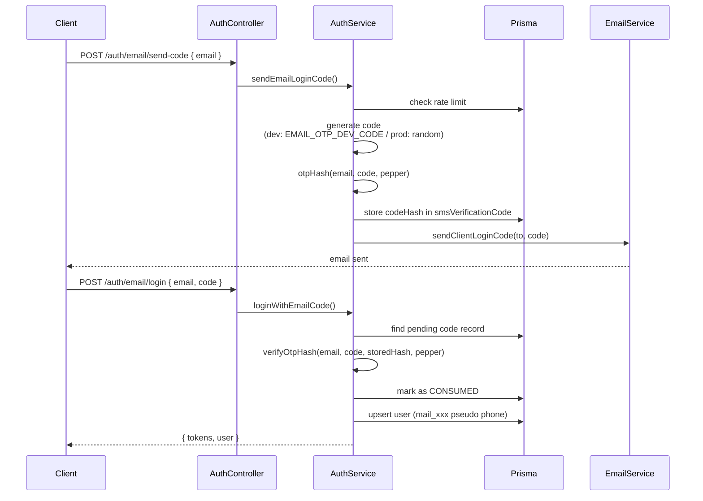

# Plan: Add Fixed Test Verification Code for Specific Email

## Overview

Add a fixed test verification code `999999` for the email `mrsuperportertest@gmail.com` so it can be used for testing across all environments (dev, staging, production), while keeping the existing OTP flow intact for all other users.

---

## Current Architecture

### Email OTP Login Flow



### Key Files

| File | Purpose |
|------|---------|
| `apps/api/src/client/auth/auth.service.ts` | Core email OTP logic (lines 483-543 send, 545-673 verify) |
| `apps/api/src/client/auth/auth.controller.ts` | HTTP endpoints `/auth/email/send-code` and `/auth/email/login` |
| `apps/api/src/client/auth/dto/email-login.dto.ts` | DTOs for request/response |
| `apps/api/src/common/email/email.service.ts` | Sends email via Resend |

### Current Code Generation Logic

```typescript
// auth.service.ts - sendEmailLoginCode(), lines 508-511
const isProd = this.configService.get<string>('NODE_ENV') === 'production';
const code = isProd
  ? gen6Code()
  : (this.configService.get<string>('EMAIL_OTP_DEV_CODE') ?? '666666');
```

---

## Proposed Changes

### Approach: Inject fixed code at send time for the test email

The cleanest approach — modify only the **send-code** step. When the normalized email matches the configured test email, inject `999999` as the code. Since the hash is computed from this injected code, the **verify step needs zero changes** — the hash comparison in `loginWithEmailCode()` will work naturally.

### Changes Required

#### 1. [`apps/api/src/client/auth/auth.service.ts`](apps/api/src/client/auth/auth.service.ts)

Modify the `sendEmailLoginCode()` method around **lines 508-511**:

- Add a new env var: `EMAIL_OTP_TEST_EMAIL` (comma-separated for future extensibility)
- Before generating the code, check if the normalized email is in the test email list
- If matched, use `'999999'` as the static code instead of the normal generation logic
- Add a log line for audit visibility

**Before:**
```typescript
const isProd = this.configService.get<string>('NODE_ENV') === 'production';
const code = isProd
  ? gen6Code()
  : (this.configService.get<string>('EMAIL_OTP_DEV_CODE') ?? '666666');
```

**After:**
```typescript
const isProd = this.configService.get<string>('NODE_ENV') === 'production';
const testEmailsRaw = this.configService.get<string>('EMAIL_OTP_TEST_EMAIL') ?? '';
const testEmails = testEmailsRaw.split(',').map(e => e.trim().toLowerCase()).filter(Boolean);
const isTestEmail = testEmails.includes(normalizedEmail);
const code = isTestEmail
  ? '999999'
  : isProd
    ? gen6Code()
    : (this.configService.get<string>('EMAIL_OTP_DEV_CODE') ?? '666666');

if (isTestEmail) {
  this.logger.log(`[Test Email] Using fixed code for ${normalizedEmail}`);
}
```

#### 2. [`apps/api/.env`](apps/api/.env) — Add environment variable

Add to the OTP section (around line 25):
```
EMAIL_OTP_TEST_EMAIL=mrsuperportertest@gmail.com
```

#### 3. [`deploy/.env.dev`](deploy/.env.dev) — Add environment variable

Add to the Email OTP section (around line 138):
```
EMAIL_OTP_TEST_EMAIL=mrsuperportertest@gmail.com
```

---

## What Does NOT Change

- `loginWithEmailCode()` — verification flow stays identical; hash comparison will succeed because the stored hash was computed from `'999999'`
- `sendEmailLoginCode()` rate limiting — test emails still respect rate limits (same logic applies)
- Email sending for test emails — the email with code `999999` will still be sent; if the user wants to suppress email sending for test accounts, that's a separate concern
- All other users — their code generation logic is completely unaffected

---

## Verification Steps

After implementation:

1. Call `POST /api/v1/auth/email/send-code` with `{ email: "mrsuperportertest@gmail.com" }`
2. Confirm `devCode` in response is `999999` (non-prod) or code email arrives with `999999` (prod)
3. Call `POST /api/v1/auth/email/login` with `{ email: "mrsuperportertest@gmail.com", code: "999999" }`
4. Confirm successful login with tokens returned
5. Call the same flow with a different email (e.g., `other@test.com`)
6. Confirm it receives the normal dev code (`666666`) or a random code

---

## Why This Approach?

| Consideration | Analysis |
|--------------|----------|
| **Minimal blast radius** | Only `sendEmailLoginCode()` is modified; verification logic untouched |
| **Type safety** | No new types or interfaces needed; env var is `string` |
| **Production-safe** | Works identically in all environments; only the configured test email is affected |
| **Auditability** | Test email usage is logged via `this.logger.log()` |
| **Extensibility** | Comma-separated env var supports multiple test emails in the future |
