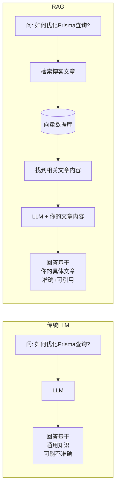
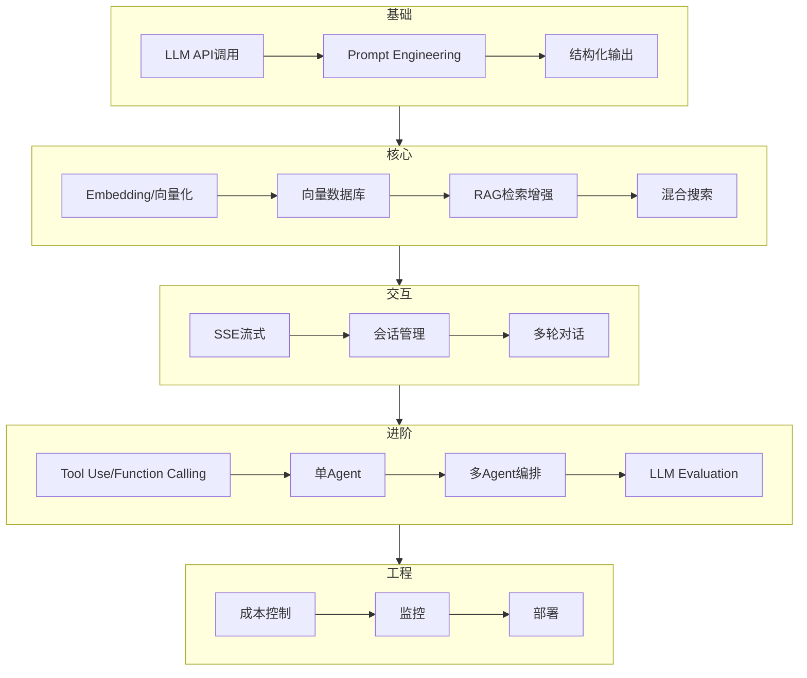

# 大模型应用开发到底是什么？—— 用你的博客讲清楚

## 一个核心问题

你现在的博客系统（NestJS + PostgreSQL + Next.js）是**传统软件**：

```
用户请求 → 你的代码逻辑 → 查询数据库 → 返回数据 → 渲染页面
                                                     ↑
                                          所有逻辑都是你手写的
```

**大模型应用**的差别就是：

```
用户请求 → 你的代码逻辑 → 查询数据库 → **调用LLM** → 返回AI生成的内容
                                              ↑
                                   你不再手写所有逻辑
                                   而是让AI帮你"思考"和"生成"
```

---

## 打个比方

### 传统开发 = 你亲自做饭
```
你要做一道菜（实现一个功能）
  → 自己洗菜、切菜、炒菜（手写所有代码逻辑）
  → 每道菜的做法你都得知道（每个逻辑都要你实现）
```

### LLM开发 = 你指挥一个高级厨师
```
你要做一道菜
  → 告诉厨师要什么菜（写Prompt）
  → 厨师自己会切菜炒菜（LLM自动完成）
  → 你只需要检查好不好吃（验证输出）
```

---

## 大模型应用的四个核心能力

### 能力1: 对话/生成 (Chat / Generation)
**LLM最基础的能力**——你说一句话，它回一句话。

```
你: "用一句话解释什么是Next.js的SSR"
AI: "SSR（服务端渲染）是在服务器上生成HTML再发送给客户端，
     相比客户端渲染，首屏加载更快，SEO更好。"
```

#### 在博客中的体现
- M1: 给文章生成SEO摘要
- M2: 自动推荐标签和分类

#### 代码有多简单？
```typescript
// M1 最简单的例子 —— 就这几行
async function generateSEODescription(title: string, content: string) {
  const prompt = `为以下技术文章写一段SEO描述（50-100字）: \n标题: ${title}\n内容: ${content.substring(0, 500)}`;
  
  const description = await aiService.generateText(prompt, {
    temperature: 0.3,       // 控制创造力（0=严谨，1=创意）
    maxOutputTokens: 200,     // 最多生成200个token
  });
  
  return description;
}
```

---

### 能力2: 理解你的数据 (RAG - Retrieval Augmented Generation)
**这是LLM应用的核心突破**——让AI能访问**你自己的数据**。

```
问题: LLM训练时没有你的博客数据
解决: 把博客文章"喂"给LLM，让它基于你的内容回答问题
```



#### 在博客中的体现
- M3: 语义搜索（搜"数据库优化"能找到"索引调优"的文章）
- M4: AI问答（基于博客内容回答问题，带引用来源）

#### 关键步骤
```
1. 把每篇文章切成小段（chunk）
2. 每段转成向量（embedding）
3. 存到向量数据库（pgvector）
4. 用户提问时，找最相关的段落
5. 把段落 + 问题一起发给LLM
6. LLM基于这些内容回答
```

---

### 能力3: 流式交互 (Streaming)
**让AI说话不是"一下子倒出来"，而是"一个字一个字显示"**。

```
没有流式:
  用户提问 → 等5秒 → 一整段文字突然出现
  用户: "它在生成中还是卡住了？"

有流式 (SSE):
  用户提问 → AI开始逐字输出
  "我" → "正在" → "正在查" → "正在查看" → ...
  用户可以看到实时进展
```

#### 在博客中的体现
- M5: 打字机效果
- M6: 聊天助手实时对话

---

### 能力4: 工具使用 + 多智能体 (Tool Use + Multi-Agent)
**让LLM不再只是"说话"，而是可以做事情**。

```
LLM只说话:
  用户: "帮我找一下Next.js相关的文章"
  AI: "好的，我建议你去搜索'Next.js'关键词"

LLM会使用工具:
  用户: "帮我找一下Next.js相关的文章"
  AI: (自动调用搜索函数)
      → 返回: "我找到了以下文章: ..."
```

#### 从单Agent到多Agent

```
单Agent（一个厨师做所有事）:
  用户: "写一篇Next.js优化文章"
  AI: 一个人从研究到写作到代码全部包办
  → 质量不稳定，容易出错

多Agent（一个厨房团队）:
  Orchestrator（主厨）: 分配任务
    → Research Agent（助手）: 搜索资料
    → Writer Agent（厨师）: 写文章
    → Code Agent（糕点师）: 写代码示例
    → Review Agent（品控）: 检查质量
  → 每个角色专精，质量更高
```

#### 在博客中的体现
- M7: AI助手能搜索文章、推荐文章、查看文章内容
- M8: 输入一个主题，AI自动产出完整文章

---

## 完整的LLM应用开发技能树



---

## 每次你做了什么

| 你做的工作 | LLM做了什么 |
|-----------|------------|
| 设计API端点 (`@Post()`, `@Get()`) | 根据你的Prompt生成内容 |
| 写Prompt（告诉AI要做什么） | 理解你的指令并执行 |
| 处理输入输出（解析、验证） | 确保输出符合预期格式 |
| 管理数据流（检索、存储） | 在你提供的数据范围内工作 |
| 编排Agent协作流程 | 各自完成分配的子任务 |

**你的代码 = 流程控制 + 数据管理 + 质量保障**

**LLM = 大脑，负责理解、推理、生成**

---

## 你现在博客已有的 vs 我们即将做的

| 类型 | 已有功能 | 我们的目标 |
|------|---------|-----------|
| AI工具 | ✅ 翻译、审核、自动回复 | — |
| 基础LLM调用 | ✅ `AiService.generateText()` | M1: SEO生成 |
| 结构化输出 | ⚠️ 有分隔符解析，无 Zod Schema 约束 | M2: 标签推荐（规范化） |
| RAG/向量检索 | ❌ 没有 | M3-M4: 语义搜索+问答 |
| 流式交互 | ⚠️ 有 SSE 基础模式（翻译检测用） | M5-M6: 复用模式到AI对话 |
| Tool Use | ❌ 没有 | M7: AI可执行操作 |
| Multi-Agent | ❌ 没有 | M8: AI自动写文章 |

---

## 三个关键认知

### 1. LLM不是魔法，是"概率预测"
```
输入: "Next.js 是一个 ___"
LLM: 根据训练数据猜下一个词 → "React" (概率最高)
     → "框架" (第二个)
     → "基于" (第三个)

所以你给LLM的指令（Prompt）越清晰
它猜对的概率就越高
```

### 2. LLM应用开发 = 传统开发 + 新技能
```
传统开发技能（你已有的）:
  • 后端API、数据库、缓存
  • 身份认证、权限控制
  • 错误处理、日志
  • 前端界面

新技能（要学的）:
  • Prompt Engineering（写指令）
  • RAG Pipeline（检索增强）
  • Agent编排（多智能体）
  • 向量数据库
  • LLM质量评估
```

### 3. 求职市场在招什么
```
2024年: "会用ChatGPT就够了"
2025年: "能做RAG系统"  
2026年: "能做Agent/Multi-Agent系统"

你现在开始学，正好赶上Multi-Agent这波浪潮
```

---

## 总结

**大模型应用开发** 说白了就是：

> **你构建一个系统，让LLM能够理解你的数据、使用你的工具、按你的流程工作，最终帮用户解决问题或生成内容。**

对于你的博客来说，就是从"读者只能自己看文章"变成"读者可以和AI对话，AI可以基于博客内容回答问题和生成内容"。

**M1开始，你就能亲手感受到这个变化。**
