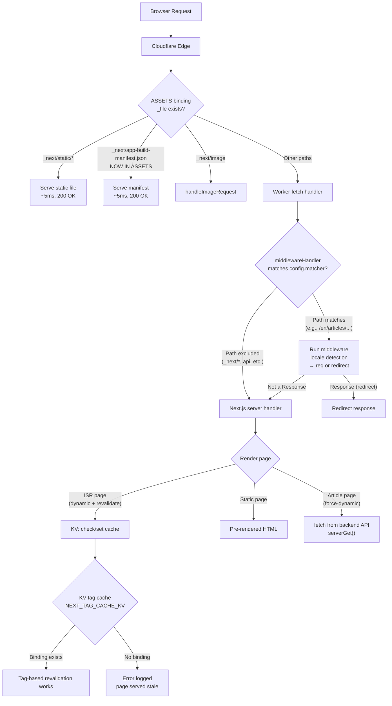

# Production Outage Analysis & Recovery Plan

## Summary

Version `762e1570-4ebb-4b5e-93bb-30921eb344d2` was deployed with the middleware matcher fix (`c8bb1ab`) and the new KV-based ISR cache (`open-next.config.ts`). **Three new issues emerged** beyond the original 404:

1. `/_next/app-build-manifest.json` **still 404** — middleware fix works, but the file is not in ASSETS
2. **KV cache binding missing** — `NEXT_TAG_CACHE_KV` not defined in `wrangler.jsonc`
3. **"Dummy queue is not implemented"** — ISR revalidation fails
4. **"Page changed from static to dynamic at runtime"** — article pages return 500
5. **"Worker exceeded resource limits" (error 1002)** — cascading from above errors

---

## Issue 1: `/_next/app-build-manifest.json` still 404

### Root Cause

The middleware fix **IS working correctly** — `_next/*` requests are now excluded from middleware processing. The file reaches the server handler. But the server handler also returns 404 because:

**`app-build-manifest.json` is NOT in the ASSETS directory.**

```
.open-next/assets/_next/
  static/...          ✅ All JS/CSS chunks, fonts, etc.
  ❌ app-build-manifest.json  ← MISSING
```

It exists only in the server bundle:
```
.open-next/server-functions/default/apps/frontend-blog/.next/
  app-build-manifest.json    ✅ Here (in server bundle)
  build-manifest.json        ✅ Here
```

The Cloudflare ASSETS binding serves files from `.open-next/assets/_next/`. Since `app-build-manifest.json` is not there, Cloudflare cannot serve it. The request falls through to the Worker → middleware (correctly skipped) → server handler → 404.

**This existed before the fix too** — the middleware was just masking it by redirecting to a different (also 404) URL.

### Fix

**Option A (Recommended):** Copy `app-build-manifest.json` (and `build-manifest.json`) into the ASSETS directory during build, by adding a post-build script.

Add to [`apps/frontend-blog/package.json`](apps/frontend-blog/package.json):
```json
"scripts": {
  "postbuild": "cp .next/app-build-manifest.json .open-next/assets/_next/ && cp .next/build-manifest.json .open-next/assets/_next/"
}
```

**Option B:** Add a handler in worker.js to serve from the server bundle. More complex and fragile.

### Why Cloudflare ASSETS handles it

The ASSETS binding serves files before the Worker runs. Once `app-build-manifest.json` is in `.open-next/assets/_next/`, Cloudflare will serve it directly:

```
GET /_next/app-build-manifest.json
  → ASSETS: file exists in assets/_next/ → 200 OK (instant, ~5ms)
  → Never reaches Worker
```

---

## Issue 2: Missing `NEXT_TAG_CACHE_KV` Binding

### Cloudflare Log

```
No KV binding NEXT_TAG_CACHE_KV found
Failed to revalidate stale page /en/categories/ FatalError: Dummy queue is not implemented
```

These errors appear for:
- `/en/categories/`
- `/en/tags/` 
- `/en/about/`
- Any ISR page needing revalidation

### Root Cause

[`open-next.config.ts`](apps/frontend-blog/open-next.config.ts:4-13) imports and uses `kvTagCache` from `@opennextjs/cloudflare/overrides/tag-cache/kv-next-tag-cache`:

```ts
import kvTagCache from "@opennextjs/cloudflare/overrides/tag-cache/kv-next-tag-cache";

export default defineCloudflareConfig({
  incrementalCache: kvIncrementalCache,
  tagCache: kvTagCache,
  queue: "dummy",
});
```

But [`wrangler.jsonc`](apps/frontend-blog/wrangler.jsonc:36-51) only defines these KV bindings:

```json
"kv_namespaces": [
  { "binding": "CACHE", "id": "e984df..." },
  { "binding": "ISR_CACHE", "id": "1fc88f..." },
  { "binding": "NEXT_INC_CACHE_KV", "id": "1fc88f..." }
  // ❌ NEXT_TAG_CACHE_KV is MISSING
]
```

The `kv-next-tag-cache` override looks for a KV binding called `NEXT_TAG_CACHE_KV`. Without it, all tag-based revalidation fails.

Additionally, `queue: "dummy"` causes `FatalError: Dummy queue is not implemented` — meaning OpenNext's dummy queue implementation throws when ISR tries to queue a revalidation.

### Fix

**Step 2a:** Add `NEXT_TAG_CACHE_KV` binding to [`wrangler.jsonc`](apps/frontend-blog/wrangler.jsonc:36-51):

```json
{
  "binding": "NEXT_TAG_CACHE_KV",
  "id": "1fc88f516bcf4efa9a50bef6e2912405",
  "preview_id": "1fc88f516bcf4efa9a50bef6e2912405"
}
```

**Step 2b:** Fix the queue configuration. The `queue: "dummy"` option throws errors. Options:
- (a) Remove `queue` entirely from `open-next.config.ts`
- (b) Check if a real Cloudflare Queue needs to be provisioned
- (c) Set `queue: undefined`

---

## Issue 3: "Page changed from static to dynamic at runtime"

### Cloudflare Log

```
Error: Page changed from static to dynamic at runtime
  /en/articles/typescript-monorepo-three-tier-tsconfig
  /en/articles/react-hooks-architecture-nextjs
```

These are RSC payload requests (`?_rsc=152z6`) returning **500**.

### Root Cause

The article page at [`[slug]/page.tsx`](apps/frontend-blog/src/app/%5Blocale%5D/articles/%5Bslug%5D/page.tsx:9-10):

```tsx
export const dynamic = 'auto';
export const revalidate = 3600; // 1 hour
export async function generateStaticParams() {
  return [];
}
```

With `dynamic = 'auto'`, Next.js tries to determine at build time if the page can be static. During build:
- `generateStaticParams()` returns `[]` (no pre-rendering)
- The page has no dynamic API usage detected (`serverGet` uses plain `fetch`, no `cookies()`/`headers()`)
- Next.js marks the page as "safe for static rendering"

At runtime on Cloudflare:
- The page renders for a real request with `params: Promise<...>` (Next.js 15 async params)
- Awaiting params triggers dynamic detection
- **Mismatch**: build-time static marking vs runtime dynamic behavior → 500 error

This error was likely **hidden before** by the middleware bug — the RSC requests were being redirected before they reached the page rendering code.

**Contributing factor**: The new KV cache activation changes Next.js's internal rendering pipeline. Previously with `dummy` cache, Next.js treated the page differently.

### Fix

**Option A (Recommended):** Change `dynamic` to explicit `force-dynamic`:

```tsx
export const dynamic = 'force-dynamic';
export const revalidate = 3600;
```

This tells Next.js: "This page MUST be rendered at runtime (no static prerendering), but cache the result for 3600s." This is the correct ISR pattern for pages that need runtime data.

**Option B:** Add `export const runtime = 'edge'` — not recommended as it changes the runtime.

**Option C:** Remove `dynamic` entirely (defaults to `auto`) but keep `revalidate`. This might still cause the issue since Next.js 15 auto-detection is aggressive.

---

## Issue 4: Worker exceeded resource limits (error 1002)

### Root Cause

This is a **cascading failure** from Issues 1-3:
1. 404 for `/_next/app-build-manifest.json` wastes CPU (915ms) trying to serve it
2. Failed KV tag cache operations (no binding) add latency
3. "Static to dynamic" 500 errors trigger error handling paths that consume more CPU
4. Multiple concurrent requests with high CPU usage → Worker hits 10ms CPU limit → error 1002

### Fix

This should resolve once Issues 1-3 are fixed. Monitor after fixes are deployed.

---

## Issue 5: `metadataBase` not configured (warning)

### Cloudflare Log

```
metadataBase property in metadata export is not set... using "http://localhost:3000"
```

### Fix

Add `metadataBase` to [`next.config.ts`](apps/frontend-blog/next.config.ts):

```ts
const baseConfig: NextConfig = {
  // ...
  metadata: {
    metadataBase: new URL('https://blog.joyminis.com'),
  },
};
```

---

## Updated Request Flow (After All Fixes)



---

## Files to Modify

| # | File | Change |
|---|------|--------|
| 1 | [`apps/frontend-blog/package.json`](apps/frontend-blog/package.json) | Add `postbuild` script to copy manifest files to assets |
| 2 | [`apps/frontend-blog/wrangler.jsonc`](apps/frontend-blog/wrangler.jsonc) | Add `NEXT_TAG_CACHE_KV` KV binding |
| 3 | [`apps/frontend-blog/open-next.config.ts`](apps/frontend-blog/open-next.config.ts) | Fix `queue: "dummy"` — remove or configure properly |
| 4 | [`apps/frontend-blog/src/app/[locale]/articles/[slug]/page.tsx`](apps/frontend-blog/src/app/%5Blocale%5D/articles/%5Bslug%5D/page.tsx) | Change `dynamic = 'auto'` → `dynamic = 'force-dynamic'` |
| 5 | [`apps/frontend-blog/next.config.ts`](apps/frontend-blog/next.config.ts) | Add `metadataBase` config |
| 6 | [`apps/frontend-blog/middleware.ts`](apps/frontend-blog/middleware.ts) | ✅ Already fixed in `c8bb1ab` |

---

## Execution Order

1. **Fix `app-build-manifest.json` not in assets** — Add postbuild script to `package.json`
2. **Fix KV binding** — Add `NEXT_TAG_CACHE_KV` to `wrangler.jsonc`
3. **Fix queue configuration** — Update `open-next.config.ts`
4. **Fix article page static-to-dynamic error** — Change `dynamic` to `force-dynamic`
5. **Fix `metadataBase` warning** — Add config to `next.config.ts`
6. **Build & deploy** via GitHub Actions
7. **Verify** all checks pass

---

## Verification (post-deployment)

```bash
# 1. Manifest file
curl -I https://blog.joyminis.com/_next/app-build-manifest.json
# Expected: 200 OK, cf-cache-status: HIT

# 2. Article page
curl -I https://blog.joyminis.com/en/articles/typescript-monorepo-three-tier-tsconfig/
# Expected: 200 OK

# 3. PWA install
# Open DevTools → Application → Service Workers → "Activated"

# 4. No KV binding errors
# Check Cloudflare dashboard logs for "NEXT_TAG_CACHE_KV" errors

# 5. metadataBase
# Check page source for <meta property="og:image"> URLs using blog.joyminis.com
```
