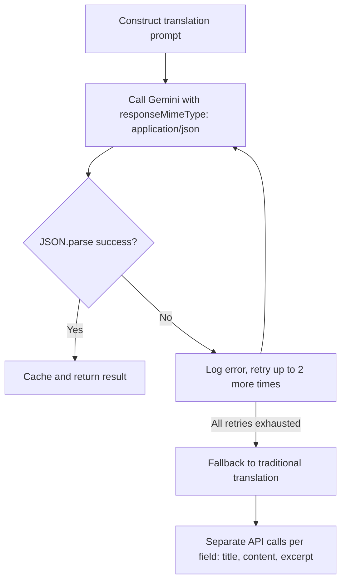
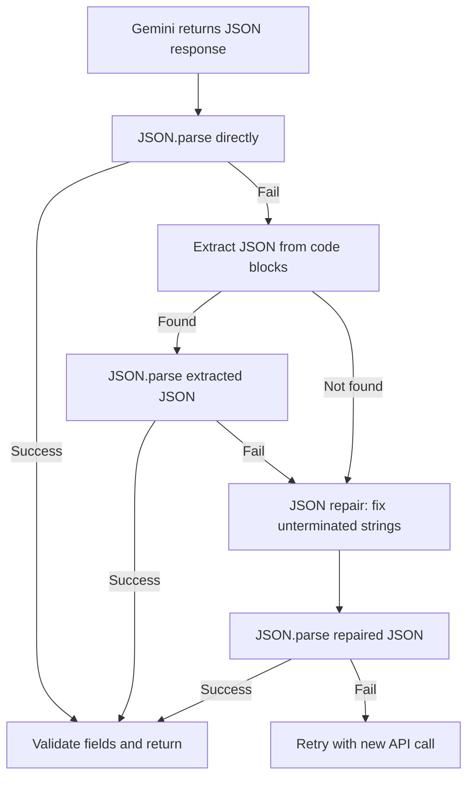

# Fix Batch Translation JSON Parsing Failure

## Problem Analysis

**File:** [`apps/api/src/blog/processors/blog-ai.processor.ts`](apps/api/src/blog/processors/blog-ai.processor.ts)

### Root Cause

The `batchTranslateArticle()` method (line 212) constructs a prompt asking Gemini to translate article title, excerpt, and full Markdown content into the target language, returning the result as JSON:

```json
{
  "title": "Translated title",
  "excerpt": "Translated excerpt",
  "content": "Translated content in Markdown"
}
```

The `content` field contains the full translated Markdown, which frequently includes characters that must be escaped in JSON strings:
- Unescaped double quotes (`"`) inside the Markdown
- Unescaped backslashes (`\`)
- Control characters

The `responseMimeType: 'application/json'` option (passed as `generationConfig` to Gemini) helps but **does not guarantee** valid JSON output, especially for long content with special characters.

### Error Evidence (from logs)

```
ERROR [BlogAiProcessor] 批量翻译JSON解析失败 (尝试 3/3)
Object {
  error: 'Unterminated string in JSON at position 2638',
  resultPreview: '{\n  "title": "...",\n  "excerpt": "...",\n'
}
```

Position 2638 falls within the `content` string value, confirming the translated Markdown contains a character that breaks JSON.

### Current Flow



### Why Fallback is Suboptimal

- 3x more API calls per article vs 1x with batch
- Higher risk of 429 rate limiting (the exact problem batch was designed to fix)
- Slower overall translation

---

## Solution Strategy

Adopt a **multi-layer defense** approach to make batch translation robust:

### Layer 1: Add JSON Repair Utility (Primary Fix)

Create a reusable `repairJsonResponse()` utility function that can fix common JSON issues from AI responses:

- **Unescaped double quotes** within string values (the main culprit)
- **Unescaped backslashes**
- **Trailing commas** in objects/arrays
- **Single quotes** used instead of double quotes
- **Missing closing brackets**

Approach: Instead of using a third-party library, implement a lightweight repair function that:
1. First tries `JSON.parse()` directly (fast path for already-valid JSON)
2. On failure, attempts to find and fix the unterminated string by identifying the JSON structure boundaries
3. Uses a state-machine approach to track whether we're inside a string, and properly handle escape sequences

### Layer 2: Improve the Prompt

Add explicit instructions in the prompt to escape special JSON characters in the translated content:

```
CRITICAL JSON FORMATTING: 
- Escape ALL double quotes inside string values as \"
- Escape ALL backslashes as \\
- The "content" field contains Markdown text that may have quotes
- Ensure the JSON is valid and parseable
```

### Layer 3: Fallback Extraction via Regex

If JSON repair still fails, try extracting JSON from the response using regex:
- Handle cases where AI wraps JSON in markdown code blocks (```json ... ```)
- Handle cases where AI adds explanatory text before/after the JSON

### Layer 4: Improved Error Logging

Log the exact position and surrounding context of JSON parse failures to aid future debugging.

---

## Implementation Plan

### Step 1: Create JSON Repair Utility

**File:** `apps/api/src/blog/utils/repair-json.ts` (new file)

Implement a `repairJsonResponse(raw: string): string` function with these strategies in order:

1. **Direct parse attempt** - return as-is if valid
2. **Code block extraction** - extract JSON from ```json ... ``` blocks
3. **First JSON object extraction** - find `{` and match braces to extract the outermost object
4. **String unescape** - for unterminated strings, try to find the problematic position and escape unescaped quotes
5. **Last resort** - return the original string and let it fail gracefully

### Step 2: Modify `batchTranslateArticle()` in blog-ai.processor.ts

**File:** `apps/api/src/blog/processors/blog-ai.processor.ts`

Changes around line 348-370 (the JSON.parse block):

```
Before:                          After:
JSON.parse(result)          ->   repairJsonResponse(result) then JSON.parse
```

The flow becomes:



### Step 3: Add JSON Escaping Instructions to Prompt

Modify the `translationPrompt` (around line 270-321) to add explicit JSON formatting instructions.

### Step 4: Improved Error Logging

When JSON parsing fails after all retries, log more context:
- The exact position of the parse error
- Surrounding characters (50 chars before and after the error position)
- The full result preview (increase character limit for logging)

---

## Detailed Changes

### 3.1 Create `apps/api/src/blog/utils/repair-json.ts`

```typescript
/**
 * Repair common JSON issues from AI responses
 */
export function repairJsonResponse(raw: string): string {
  if (!raw) throw new Error('Empty response');
  
  // Strategy 1: Try direct parse
  try {
    JSON.parse(raw);
    return raw; // Already valid
  } catch {
    // Continue to repair
  }

  // Strategy 2: Extract JSON from markdown code blocks
  const codeBlockMatch = raw.match(/```(?:json)?\s*([\s\S]*?)```/);
  if (codeBlockMatch) {
    const extracted = codeBlockMatch[1].trim();
    try {
      JSON.parse(extracted);
      return extracted;
    } catch {
      // Continue with extracted content
    }
    raw = extracted;
  }

  // Strategy 3: Find first { ... } pair with balanced braces
  const firstBrace = raw.indexOf('{');
  if (firstBrace !== -1) {
    let depth = 0;
    let inString = false;
    let escapeNext = false;
    for (let i = firstBrace; i < raw.length; i++) {
      const char = raw[i];
      if (escapeNext) { escapeNext = false; continue; }
      if (char === '\\') { escapeNext = true; continue; }
      if (char === '"') { inString = !inString; continue; }
      if (!inString) {
        if (char === '{') depth++;
        if (char === '}') depth--;
        if (depth === 0) {
          const candidate = raw.substring(firstBrace, i + 1);
          try {
            JSON.parse(candidate);
            return candidate;
          } catch {
            // Will be handled by repair below
          }
        }
      }
    }
  }

  // Strategy 4: Attempt to fix unterminated strings
  // This handles the common case where a " inside a string is unescaped
  let repaired = '';
  inString = false;
  escapeNext = false;
  for (let i = 0; i < raw.length; i++) {
    const char = raw[i];
    if (escapeNext) {
      repaired += char;
      escapeNext = false;
      continue;
    }
    if (char === '\\') {
      repaired += char;
      escapeNext = true;
      continue;
    }
    if (char === '"') {
      inString = !inString;
      repaired += char;
      continue;
    }
    if (inString && (char === '\n' || char === '\r')) {
      // Newlines inside strings should be \n
      repaired += '\\n';
      continue;
    }
    repaired += char;
  }

  // Try the repaired version
  try {
    JSON.parse(repaired);
    return repaired;
  } catch {
    // If still failing, try to close any unclosed strings/objects
    const finalRepair = repaired + '"}';
    try {
      JSON.parse(finalRepair);
      return finalRepair;
    } catch {
      throw new Error('Unable to repair JSON response');
    }
  }
}
```

### 3.2 Modify `batchTranslateArticle()` imports

Add import:
```typescript
import { repairJsonResponse } from '../utils/repair-json';
```

### 3.3 Modify JSON parsing in `batchTranslateArticle()`

Replace lines 348-370 with:

```typescript
try {
  const repaired = repairJsonResponse(result);
  const parsed = JSON.parse(repaired);
  
  // Validate required fields
  if (!parsed.title || !parsed.content) {
    throw new Error('Missing required fields in translation result');
  }
  
  // ... rest of validation and caching
} catch (parseError) {
  // ... existing error handling with improved logging
}
```

### 3.4 Add JSON escaping to prompt

After line 320 (`}`), add:

```
CRITICAL JSON VALIDITY:
- The "content" field contains Markdown text which may include special characters
- ESCAPE all double quotes inside values as \"
- ESCAPE all backslashes as \\
- ESCAPE newlines inside values as \\n
- The output must be valid JSON that can be parsed by JSON.parse()
- Double-check: no unescaped quotes in the content value
```

### 3.5 Improve error logging

Increase `resultPreview` from 200 to 500 characters for better debugging context. Add the exact error position.

---

## Risk Assessment

| Risk | Mitigation |
|------|-----------|
| JSON repair corrupts valid content | Only applies repair strategies sequentially on parse failure; fast-path for already-valid JSON |
| Edge cases in repair logic | Fallback to traditional translation still works as safety net |
| Increased complexity | Utility function is isolated and testable; existing behavior preserved |

## Files Modified

1. [`apps/api/src/blog/processors/blog-ai.processor.ts`](apps/api/src/blog/processors/blog-ai.processor.ts) - Modify `batchTranslateArticle()` method
2. `apps/api/src/blog/utils/repair-json.ts` - NEW: JSON repair utility
