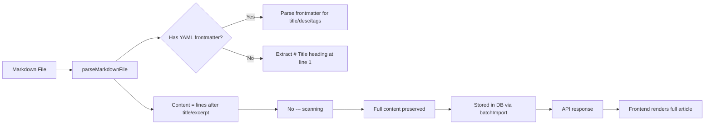

# Fix: Blog Article Content Truncation Plan

## Problem

Only 2 out of 5 backend blog articles display their full content correctly. The other 3 show only the last 2-3 lines as preview content.

**Working articles** (partially - first section also lost):
- `nestjs-wallet-optimistic-locking.md` - Has YAML frontmatter, title at line 13
- `nestjs-finance-audit-xendit.md` - Has YAML frontmatter, title at line 14

**Broken articles** (only last 2-3 lines visible):
- `nestjs-gemini-ai-circuit-breaker.md` - No frontmatter, title at line 1 → content = lines 506-508
- `nestjs-order-payment-pipeline.md` - No frontmatter, title at line 1 → content = lines 404-406
- `nestjs-webrtc-signaling-gateway.md` - No frontmatter, title at line 1 → content = lines 379-381

---

## Root Cause

The bug is in [`BlogService.parseMarkdownFile()`](apps/api/src/blog/blog.service.ts:477-487) content extraction logic:

```typescript
// 3. 提取正文
let contentStartIndex = titleLineIndex + 1;
for (let i = titleLineIndex + 1; i < lines.length; i++) {
  if (lines[i].trim() === '---') {
    contentStartIndex = i + 1;
    break;
  }
}
```

This scans from after the `# Title` heading for the first `---` line, then sets content to everything AFTER that line. The problem is that `---` is used for **two different purposes** in these markdown files:

1. **YAML frontmatter delimiters** (`---` at lines 1 and 11-12) — in files with frontmatter
2. **Markdown section dividers** (horizontal rules `---` within article body) — in ALL files

The scanner cannot distinguish between the two, causing content truncation at whichever `---` appears first after the title.

### Impact per file type

| File Type | Title Position | First `---` after title | Content extracted | Result |
|-----------|---------------|------------------------|-------------------|--------|
| With frontmatter | ~Line 13-14 | ~Line 26-34 (section divider) | Lines 27-430 (sections 2+) | **First section lost** |
| Without frontmatter | Line 1 | ~Line 378-505 (near EOF) | Last 2-3 lines | **Almost all content lost** |

---

## Fix Plan

### Fix 1: Correct `parseMarkdownFile` content extraction (PRIMARY)

**File**: [`apps/api/src/blog/blog.service.ts`](apps/api/src/blog/blog.service.ts:477-487)

**Change**: Remove the `---` scanning loop entirely. Content should start from the line after the title (or after the excerpt if one was found). The existing fallback code at lines 485-487 already handles this correctly:

```typescript
// 3. 提取正文
let contentStartIndex = titleLineIndex + 1;
if (excerptLineIndex !== -1) {
  contentStartIndex = excerptLineIndex + 1;
}
```

**Diff**:
```
<<<<<<< SEARCH
    // 3. 提取正文
    let contentStartIndex = titleLineIndex + 1;
    for (let i = titleLineIndex + 1; i < lines.length; i++) {
      if (lines[i].trim() === '---') {
        contentStartIndex = i + 1;
        break;
      }
    }
    if (contentStartIndex === titleLineIndex + 1 && excerptLineIndex !== -1) {
      contentStartIndex = excerptLineIndex + 1;
    }
=======
    // 3. 提取正文 - start from after title (or after excerpt if found)
    let contentStartIndex = titleLineIndex + 1;
    if (excerptLineIndex !== -1) {
      contentStartIndex = excerptLineIndex + 1;
    }
>>>>>>> REPLACE
```

This also fixes the "working" articles — they will no longer lose their first section.

### Fix 2: Add YAML frontmatter to 3 backend articles

For consistency and proper metadata extraction, add YAML frontmatter blocks to:

1. [`docs/blog/articles/backend/nestjs-gemini-ai-circuit-breaker.md`](docs/blog/articles/backend/nestjs-gemini-ai-circuit-breaker.md)
2. [`docs/blog/articles/backend/nestjs-order-payment-pipeline.md`](docs/blog/articles/backend/nestjs-order-payment-pipeline.md)
3. [`docs/blog/articles/backend/nestjs-webrtc-signaling-gateway.md`](docs/blog/articles/backend/nestjs-webrtc-signaling-gateway.md)

Each should get frontmatter with:
- `title` — extracted from existing `# Title` heading
- `description` — extracted from the introductory paragraph after "## 1. 引言"
- `tags` — relevant technology tags inferred from content

**Note**: This is optional if Fix 1 is applied (the parser will work correctly without frontmatter). However, adding frontmatter is recommended for proper metadata, excerpt extraction, and consistency.

### Fix 3: Re-import affected articles

After the code fix is deployed, re-import affected articles via the admin batch import API:

```bash
# 1. Scan local markdown files to see updated previews
GET /admin/blog/articles/scan-local

# 2. Batch import with overwrite=true for all backend articles
POST /admin/blog/articles/batch-import
Body: {
  "overwrite": true,
  "articles": [
    { "slug": "nestjs-gemini-ai-circuit-breaker", ... },
    { "slug": "nestjs-order-payment-pipeline", ... },
    { "slug": "nestjs-webrtc-signaling-gateway", ... }
  ]
}
```

This writes the correctly-parsed content to the database.

### Fix 4: Verify

Check the following article pages on the frontend to confirm full content rendering:

- `/zh/articles/nestjs-gemini-ai-circuit-breaker`
- `/zh/articles/nestjs-order-payment-pipeline`
- `/zh/articles/nestjs-webrtc-signaling-gateway`
- `/zh/articles/nestjs-wallet-optimistic-locking` (verify first section is now visible)
- `/zh/articles/nestjs-finance-audit-xendit` (verify first section is now visible)

---

## Mermaid: Data Flow with Fix



---

## Files Modified

| File | Change | Priority |
|------|--------|----------|
| [`apps/api/src/blog/blog.service.ts`](apps/api/src/blog/blog.service.ts:477-487) | Remove `---` content truncation loop | **Required** |
| [`docs/blog/articles/backend/nestjs-gemini-ai-circuit-breaker.md`](docs/blog/articles/backend/nestjs-gemini-ai-circuit-breaker.md) | Add YAML frontmatter | Recommended |
| [`docs/blog/articles/backend/nestjs-order-payment-pipeline.md`](docs/blog/articles/backend/nestjs-order-payment-pipeline.md) | Add YAML frontmatter | Recommended |
| [`docs/blog/articles/backend/nestjs-webrtc-signaling-gateway.md`](docs/blog/articles/backend/nestjs-webrtc-signaling-gateway.md) | Add YAML frontmatter | Recommended |

---

## Risk Assessment

- **Low risk**: The code change is a 2-line deletion + 3-line replacement. The new logic strictly starts content from after the title/excerpt, which is the correct and expected behavior.
- **No data loss**: Content in the database is separate from the markdown files. Re-importing overwrites DB content with the now-correctly-parsed markdown content.
- **No schema changes**: Only the parsing logic is modified; no database migrations needed.
- **Rollback**: Revert the code change and re-import articles with the old code to restore previous behavior.
