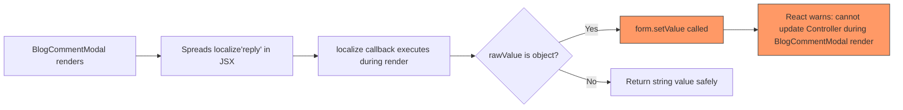

# Fix: BlogCommentModal Render Warning + Prisma reply Field Error

## Context

After fixing the i18n missing keys (`blog_comments_deleteComment`, `blog_comments_cancel`, `blog_comments_deleteConfirmText`, `blog_comments_actionCannotBeUndone`) and the HTTP method mismatch (`http.post` → `http.patch` for approve/reject), two pre-existing bugs surfaced:

---

## Bug A: React Rendering Warning — `setValue` during render

**Error**:
```
Cannot update a component (`Controller`) while rendering a different component (`BlogCommentModal`)
src/hooks/useLocalizedFormV2.ts (158:11) @ useLocalizedFormV2.useCallback[localize]
```

**Root Cause**:
In [`apps/admin-blog/src/hooks/useLocalizedFormV2.ts:135-197`](apps/admin-blog/src/hooks/useLocalizedFormV2.ts:135), the `localize()` callback is called **during render** when spread in JSX at [`BlogCommentModal.tsx:134`](apps/admin-blog/src/views/blog/BlogCommentModal.tsx:134):

```tsx
<FormTextareaField
  label=""
  placeholder={t('blog_comments_replyPlaceholder')}
  {...localize('reply')}   // <-- called during render
/>
```

Inside `localize()`, when `rawValue` is an object (localized string like `{zh: "aaa", en: ""}`), it calls [`form.setValue()` at line 158](apps/admin-blog/src/hooks/useLocalizedFormV2.ts:158) **directly during render**, violating React's rule against calling `setState` in a different component during render.

**Fix**:
Wrap the `setValue` call at line 158 in `setTimeout(() => ..., 0)` to defer it past the current render cycle.

**File**: [`apps/admin-blog/src/hooks/useLocalizedFormV2.ts`](apps/admin-blog/src/hooks/useLocalizedFormV2.ts)
**Lines**: 155-163

**Current code**:
```typescript
const currentLangValue = normalized[locale];
if (currentLangValue !== undefined && currentLangValue !== rawValue) {
  setValue(fieldPath, currentLangValue as PathValue<T, Path<T>>, {
    shouldDirty: false,
    shouldTouch: false,
    shouldValidate: false,
  });
}
```

**Fixed code**:
```typescript
const currentLangValue = normalized[locale];
if (currentLangValue !== undefined && currentLangValue !== rawValue) {
  setTimeout(() => {
    setValue(fieldPath, currentLangValue as PathValue<T, Path<T>>, {
      shouldDirty: false,
      shouldTouch: false,
      shouldValidate: false,
    });
  }, 0);
}
```

**Why `setTimeout(0)`?** This defers the `setValue` call to the next microtask/macrotask, ensuring it runs after the current render cycle completes and React warnings are avoided.

---

## Bug B: Prisma `reply` Field Error

**Error**:
```
Unknown argument `reply`. Available options are listed in green.
```

**Root Cause**:
The API runs inside a **Docker container** (paths show `/app/...`). The `node_modules` directory is stored in a **named Docker volume** (`backend_nm` from `compose.yml`), separate from the host machine's `node_modules`.

Running `prisma generate` on the **host machine** updates the host's `node_modules/@prisma/client`, but the **Docker container** uses its own volume-mounted `node_modules`. So the Prisma client in the container does NOT know about the `reply` field — even though:

- The Prisma schema at [`apps/api/prisma/schema.prisma:1631`](apps/api/prisma/schema.prisma:1631) correctly defines `reply` as `Json?` (mapped to PostgreSQL `JSONB`)
- The migration [`20260505084046_add_comment_reply`](apps/api/prisma/migrations/20260505084046_add_comment_reply/migration.sql) has been applied (the column exists in the DB)
- The `yarn workspace @lucky/api prisma:deploy` script in the container's startup command keeps migrations up-to-date

**Error evidence**: The available fields listed in the Prisma error DO NOT include `reply`:
```
  ?   id?: String...
  ?   author?: String...
  ?   email?: String...
  ?   website?: ...
  ?   content?: String...
  ?   ipAddress?: ...
  ?   userAgent?: ...
  ?   aiModerationScore?: ...
  ?   aiModerationReason?: ...
  ?   aiModerationCategories?: ...
  ?   aiModeratedAt?: ...
  ?   isAiGenerated?: Boolean...
  ?   createdAt?: DateTime...
  ?   updatedAt?: DateTime...
  ?   article?: ...
  ?   parent?: ...
  ?   children?: ...
```
No `reply` field in the list! This proves the container's Prisma client is stale.

**Fix**:
Run `prisma generate` **inside** the Docker container to update its Prisma client:

```bash
docker exec lucky-backend-dev sh -c "cd /app && yarn workspace @lucky/api prisma generate"
```

No restart needed — `prisma generate` updates the client code in the shared `backend_nm` volume, and the running NestJS dev server (`start:dev`) with hot-reload will pick it up automatically.

---

## Verification

After applying both fixes:

1. **Frontend lint**: `yarn workspace @lucky/admin-blog lint` — verify no ESLint errors
2. **API lint**: `yarn workspace @lucky/api lint` — verify no ESLint errors
3. **TypeScript**: `yarn workspace @lucky/admin-blog tsc --noEmit` — verify type-check passes
4. **Functional test**: Open BlogCommentModal, change status and add reply, submit — verify no console errors and API call succeeds
5. **Functional test**: Click approve/reject button on a comment — verify it updates status correctly

---

## Mermaid Diagram: Bug A Flow



---

## Mermaid Diagram: Bug B Flow

```flowchart LR
    A[User opens BlogCommentModal] --> B[Sets status + reply]
    B --> C[onSubmit calls updateComment]
    C --> D[comment.service.ts:279 prisma.update]
    D --> E{reply column exists in DB?}
    E -->|No| F[Prisma throws validation error]
    E -->|Yes| G[Update succeeds]
    
    style F fill:#f96,stroke:#333
    style G fill:#9f6,stroke:#333
```
