# Fix: Cloudflare Worker CPU Timeout — RSC Payload Optimization

## Root Cause

Cloudflare Workers **free plan** has a **10ms CPU time limit** per request.

The article page (`/zh/articles/nextjs-cloudflare-deployment-opennext/`) fails during **RSC navigation** (`_rsc=5fkst`) because the server component passes the full article object (including `content` + `contentMd` — potentially 50-100KB+) through the RSC payload. The worker spends too much CPU time:

1. Parsing the large JSON response from the API
2. Serializing the data into the RSC (React Server Components) payload format

Both operations are CPU-bound and easily exceed 10ms for large content.

## Architecture Diagram (Current)

```mermaid
flowchart LR
    User["User clicks article link"] --> Nav["Client-side navigation"]
    Nav --> Worker["Cloudflare Worker free tier 10ms CPU limit"]
    
    subgraph Worker["Worker Process RSC Request"]
        MW["Middleware locale/auth check"] --> SC["ArticlePage Server Component"]
        SC --> API["fetch→api.joyminis.com I/O wait"]
        API --> Parse["Parse large JSON response CPU ❌"]
        Parse --> RSC["RSC serialize full article CPU ❌"]
        RSC --> Response["Return RSC payload"]
    end
    
    Response --> Browser["Browser renders client component"]
    Browser --> FetchContent["useFrontendArticleBySlug fetch content again"]
```



## Solution Architecture (Proposed)


## Changes

### File 1: [`apps/frontend-blog/src/app/[locale]/articles/[slug]/page.tsx`](../../apps/frontend-blog/src/app/[locale]/articles/[slug]/page.tsx)

Strip `content` and `contentMd` fields from the article before passing to the client component, reducing RSC payload size drastically.

```diff
 export default async function ArticlePage({
   params,
 }: {
   params: Promise<{ locale: string; slug: string }>;
 }) {
   const { locale: routeLocale, slug } = await params;
   const locale = routeLocale;
 
   try {
     const article = await getCachedArticle(slug, locale);
 
-    return <ArticlePageClient initialArticle={article ?? undefined} />;
+    // Strip content fields to reduce RSC payload size for free-tier Cloudflare Workers.
+    // Full content is fetched client-side via useFrontendArticleBySlug.
+    const initialArticle = article
+      ? { ...article, content: undefined, contentMd: undefined }
+      : undefined;
+    return <ArticlePageClient initialArticle={initialArticle} />;
   } catch (error) {
     console.error('Article page server error:', error);
     return <ArticlePageClient initialArticle={undefined} />;
```

### File 2: [`apps/frontend-blog/src/lib/hooks/useFrontendArticles.ts`](../../apps/frontend-blog/src/lib/hooks/useFrontendArticles.ts)

Update the `useFrontendArticleBySlug` hook to detect when `initialData` has no content (stripped for RSC perf) and trigger an immediate client-side refetch.

```diff
 export function useFrontendArticleBySlug(slug: string, initialData?: any) {
   const locale = useCurrentLocale();
+  // When initialData is provided but content was stripped for RSC perf,
+  // trigger immediate refetch to get full article client-side.
+  const hasContent = !!(initialData?.content || initialData?.contentMd);
 
   return useQuery({
     queryKey: ['frontendArticle', slug, locale],
     queryFn: () => frontendBlogApi.getArticleBySlug(slug, locale),
-    staleTime: 60 * 60 * 1000, // 1小时缓存
+    staleTime: hasContent ? 60 * 60 * 1000 : 0, // Refetch immediately if content was stripped
     enabled: !!slug,
     initialData,
   });
```

### File 3: [`apps/frontend-blog/src/app/[locale]/articles/[slug]/page.client.tsx`](../../apps/frontend-blog/src/app/[locale]/articles/[slug]/page.client.tsx)

Add a content-area loading state that shows when the article metadata is present but content is still being fetched. The article header (title, tags, meta) renders immediately.

**Add a new state variable** to track content loading:
```diff
 export default function ArticlePageClient({
   initialArticle,
 }: ArticlePageClientProps) {
   const params = useParams();
   const locale = useLocale();
   const t = useTranslations('article');
   const tc = useTranslations('common');
 
   const slug = (params?.slug as string) || '';
 
   const {
     data: article,
     isLoading,
     error,
   } = useFrontendArticleBySlug(slug, initialArticle);
 
+  // Content is still loading when we have the initialArticle metadata
+  // but the full content hasn't been fetched client-side yet
+  const isContentLoading = !isLoading && !error && article && !article.content && !article.contentMd;
```

**Add a content loading skeleton** to display while content is being fetched:
```diff
         {/* Article content — render markdown with syntax highlighting, fall back to HTML */}
+        {isContentLoading ? (
+          <div className="space-y-4 my-8">
+            <Skeleton className="h-4 w-full" />
+            <Skeleton className="h-4 w-11/12" />
+            <Skeleton className="h-4 w-full" />
+            <Skeleton className="h-4 w-3/4" />
+            <Skeleton className="h-32 w-full my-6" />
+            <Skeleton className="h-4 w-full" />
+            <Skeleton className="h-4 w-5/6" />
+            <Skeleton className="h-4 w-full" />
+            <Skeleton className="h-4 w-4/5" />
+          </div>
+        ) : (
          <ArticleMarkdown content={article.contentMd || article.content || ''} />
+        )}
```

## Testing Plan

1. **Build check:** Run `yarn workspace @lucky/frontend-blog build` to verify no TypeScript errors
2. **RSC payload verification:** Check the size of the RSC payload in browser DevTools (Network tab → filter by `_rsc`)
   - Before fix: payload includes full article content (50-100KB+)
   - After fix: payload is only metadata (2-5KB)
3. **Functional test:** Navigate to the article → header renders immediately → content loads shortly after
4. **SSR test:** Direct page load (no `_rsc` param) still works with full content

## Deployment

Deploy via Cloudflare Workers as usual. The fix is purely frontend-side — no API/backend changes needed.
