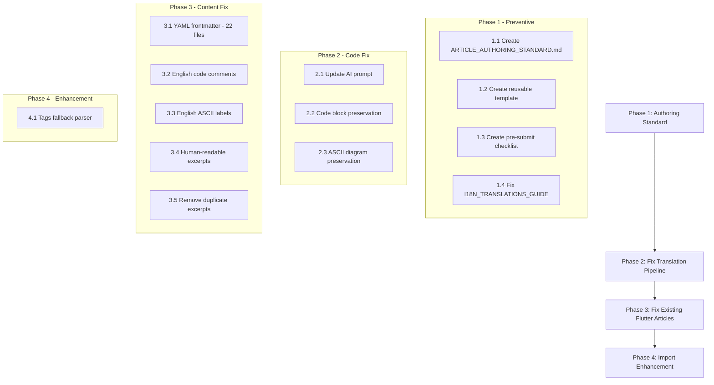

# Plan: Fix Flutter Article Import & Display Issues + Prevent Future Problems

## Root Cause Analysis

After investigating the full pipeline — from article authoring format → import parsing → AI translation → frontend rendering — **5 root causes** have been identified for why Flutter articles from [`docs/blog/articles/flutter/`](docs/blog/articles/flutter) don't display fully after import.

---

## Issue 1 (Critical): Format Violation — No YAML Frontmatter / `Tags:` Line

**What's wrong:** All 22 Flutter articles use a **legacy non-YAML format** but are missing the `Tags:` line that both parsers depend on.

**Correct format** (e.g., [`blog-ai-multilingual-translation.md`](docs/blog/articles/frontend/blog-ai-multilingual-translation.md:1)):
```markdown
---
title: Next.js 博客双语系统...
slug: blog-ai-multilingual-translation
tags: Next.js, AI, Gemini, Translation, i18n
---

# Title
...
```

**Flutter format** (e.g., [`error-strategy-decision-table.md`](docs/blog/articles/flutter/error-strategy-decision-table.md:1)):
```markdown
# ErrorStrategy 5 种策略 + 可配置决策表 — 应用级错误处理框架

> **Article F15** | **Difficulty:** ⭐⭐⭐⭐ | **Source:** `joy_mini_app/lib/core/error/`

## 1. 为什么需要 ErrorStrategy？
```

**Impact:** The browser-side [`parseNonYamlMarkdown()`](apps/admin-blog/src/lib/utils/frontmatter.ts:284) and backend [`parseMarkdownFile()`](apps/api/src/blog/blog.service.ts:488) both look for `Tags:` as the first line of body content. Since Flutter articles lack this line, **tags are never extracted** — articles have zero tags after import, making them unfindable via tag/category navigation.

**Fix:** Add YAML frontmatter with `title`, `slug`, `tags` to each Flutter article.

---

## Issue 2 (Critical): Translation Prompt Hardcodes Chinese-Only Source

**What's wrong:** The [`batchTranslateArticle()`](apps/api/src/blog/processors/blog-ai.processor.ts:271) method's prompt says:
```
Translate the following Chinese article to ${targetLang}:
...
CRITICAL: Every Chinese word/phrase MUST be translated. NO Chinese characters allowed in the output.
```

**Impact:**
- Code blocks with **Chinese comments** (e.g., `// 主色阶梯`, `// 语义色`) get translated, potentially breaking Dart code syntax
- **ASCII diagrams with Chinese labels** (e.g., `初始状态`, `已认证`) get translated, breaking diagram layout
- Mixed-language content confuses the AI, producing garbled/incomplete output

**Fix:** Update the AI translation prompt to:
1. Handle mixed Chinese/English source content (not assume "Chinese article")
2. Preserve code blocks verbatim (do not translate code comments)
3. Preserve ASCII diagram text or translate labels without breaking layout
4. Add rules for English technical terms that should remain untranslated

---

## Issue 3: Code Comments in Chinese Violate `CODE_STYLE_RULES`

**What's wrong:** [`CODE_STYLE_RULES.md`](docs/blog/development/CODE_STYLE_RULES.md:11) explicitly forbids Chinese in code comments. Flutter articles contain Dart code blocks with Chinese comments (e.g., `// 主色阶梯`, `// 语义色`, `// 背景`, `// 卡片`).

**Impact:** During translation, the AI attempts to translate these Chinese comments, often breaking the code formatting.

**Fix:** Rewrite all Chinese code comments in Flutter article code blocks to English.

---

## Issue 4: Excerpt Contains Metadata Markers Instead of Human-Readable Description

**What's wrong:** Flutter articles use `> ` quote blocks with metadata markers instead of natural excerpt:

```markdown
> **Article F15** | **Difficulty:** ⭐⭐⭐⭐ | **Source:** `joy_mini_app/lib/core/error/`
```

Both parsers extract this verbatim as the article's `excerpt` field.

**Impact:** Frontend shows raw metadata like "**Article F15** | **Difficulty:** ⭐⭐⭐⭐" instead of a meaningful summary in ArticleCard and SEO metadata.

**Fix:** Add `description:` in YAML frontmatter and remove the metadata quote block from body.

---

## Issue 5: I18N_TRANSLATIONS_GUIDE Contradiction

**What's wrong:** [`I18N_TRANSLATIONS_GUIDE.md`](docs/blog/i18n/I18N_TRANSLATIONS_GUIDE.md:12) says "❌ 动态内容不翻译" but the system fully translates articles via AI.

**Fix:** Update guide to reflect the actual translation pipeline.

---

## Remediation Plan

### Phase 1: Create Article Authoring Standard (Preventive — Do First)

This prevents future articles from having the same issues.

| # | Task | Description |
|---|------|-------------|
| 1.1 | Create [`docs/blog/development/ARTICLE_AUTHORING_STANDARD.md`](docs/blog/development) | Comprehensive guide with template, checklist, and rules |
| 1.2 | Include a **ready-to-use Markdown template** | Copy-paste boilerplate with YAML frontmatter, excerpt format, code comment rules |
| 1.3 | Include a **pre-submit checklist** | Before writing a new article, verify: frontmatter complete, no Chinese in code blocks, excerpt is readable, tags exist |
| 1.4 | Update [`I18N_TRANSLATIONS_GUIDE.md`](docs/blog/i18n/I18N_TRANSLATIONS_GUIDE.md:12) | Resolve contradiction about dynamic content translation |

### Phase 2: Fix Translation Pipeline (Code Changes)

| # | Task | File(s) | Description |
|---|------|---------|-------------|
| 2.1 | Update AI translation prompt | [`blog-ai.processor.ts:271`](apps/api/src/blog/processors/blog-ai.processor.ts) | Modify `batchTranslateArticle()` prompt to handle mixed Chinese/English content, preserve code blocks, preserve ASCII diagrams |
| 2.2 | Add code block preservation rule | [`blog-ai.processor.ts:313`](apps/api/src/blog/processors/blog-ai.processor.ts) | "CRITICAL: Code blocks MUST be preserved verbatim. Do NOT translate code comments, variable names, or string literals inside code blocks." |
| 2.3 | Add ASCII diagram preservation rule | [`blog-ai.processor.ts`](apps/api/src/blog/processors/blog-ai.processor.ts) | "CRITICAL: ASCII/Unicode diagrams MUST preserve their layout. Translate labels without breaking alignment." |

### Phase 3: Fix Existing Flutter Article Content (Data Fixes)

| # | Task | File(s) | Description |
|---|------|---------|-------------|
| 3.1 | Add YAML frontmatter to all 22 Flutter articles | All files in [`docs/blog/articles/flutter/`](docs/blog/articles/flutter) | Add `---` block with `title:`, `slug:`, `tags:` lines |
| 3.2 | Replace Chinese code comments with English | All Flutter articles with Dart code blocks | Replace `// 主色阶梯` → `// Primary color scale`, etc. |
| 3.3 | Replace Chinese ASCII diagram labels | [`auth-notifier-token-storage-auth-state-machine.md`](docs/blog/articles/flutter/auth-notifier-token-storage-auth-state-machine.md:26-42) | `初始状态` → `Initial`, `检查中` → `Checking`, etc. |
| 3.4 | Add `description:` in YAML frontmatter | All Flutter articles | Replace metadata excerpts with genuine human-readable summaries |
| 3.5 | Remove duplicate `> ` excerpt block from body | All Flutter articles | After frontmatter `description:` is set, remove the quote block to avoid duplication |

### Phase 4: Import Pipeline Enhancement (Optional)

| # | Task | File(s) | Description |
|---|------|---------|-------------|
| 4.1 | Add `---` separator scanning fallback | [`frontmatter.ts:231`](apps/admin-blog/src/lib/utils/frontmatter.ts) | When no `Tags:` line found and no YAML frontmatter, scan for `---` separator and extract tags from `> **Tag:** \`#Flutter\`` pattern |

---

## Article Authoring Standard — Draft Content

This is what [`ARTICLE_AUTHORING_STANDARD.md`](docs/blog/development) should contain:

### Required YAML Frontmatter

Every blog article **MUST** start with:

```markdown
---
title: Your Article Title Here
slug: your-article-slug
tags: Tag1, Tag2, Tag3
description: A concise 1-2 sentence summary of the article (used as excerpt/SEO description)
---

# Your Article Title (same as frontmatter title)

Article content starts here...
```

### Rules

| Rule | Details | Why |
|------|---------|-----|
| **1. YAML frontmatter required** | Must include `title`, `slug`, `tags`, `description` | The parsers extract metadata from frontmatter. Without it, tags and description are missing |
| **2. Code comments MUST be English** | All `// comments`, `/* block comments */` in code blocks must be English | CODE_STYLE_RULES.md mandates this, plus AI translation breaks Chinese comments inside code |
| **3. ASCII diagrams use English labels** | All diagram labels must be English | AI translation cannot handle Chinese labels in diagrams without breaking layout |
| **4. Excerpt is a readable summary** | `description:` field should be a natural-language summary, not metadata markers | Excerpt appears in ArticleCard, SEO tags, and social share previews |
| **5. slug must match filename** | `slug: my-article` ↔ `my-article.md` | The frontend route `/[locale]/articles/[slug]` looks up by slug |
| **6. Tags match existing taxonomy** | Use existing tags from the blog's tag system when possible | Consistent taxonomy helps with discoverability |
| **7. No Chinese in code blocks** | Variable names, function names, comments, string literals in code examples must be English | CODE_STYLE_RULES.md — zero Chinese characters in code |
| **8. Chinese article body is fine** | The article prose can be in Chinese | Only code blocks must be English. The translation pipeline handles Chinese prose → target languages |

### Pre-Submit Checklist

- [ ] YAML frontmatter present with `title`, `slug`, `tags`, `description`
- [ ] `slug` matches filename (e.g., `slug: my-article` for `my-article.md`)
- [ ] All code blocks: comments in English, no Chinese characters
- [ ] ASCII diagrams: labels in English
- [ ] `description:` is a natural-language summary (not metadata markers)
- [ ] No duplicate `> excerpt` block in body if using frontmatter `description`
- [ ] Article renders correctly in preview
- [ ] Run `yarn workspace @lucky/api lint` or at minimum verify no Chinese in code blocks

### Template

```markdown
---
title: Your Article Title
slug: your-article-slug
tags: Tag1, Tag2, Tag3
description: A concise 1-2 sentence summary of the article.
---

# Your Article Title

## 1. Introduction

Article content in Chinese or English...

```dart
// English comment only
final variable = someValue;
```

## 2. Main Content

```
┌──────────┐    ┌──────────┐
│  Initial  │───→│  Checking │
└──────────┘    └──────────┘
```

## 3. Conclusion

Summary here.
```

---

## Execution Order (Revised)



**Key dependencies:**
- Phase 1 is **preventive** — create the standard FIRST so all future articles are correct
- Phase 2 must be done before re-running translations (otherwise new translations have same issues)
- Phase 3 fixes existing articles; can be done in parallel with Phase 2
- Phase 4 is a nice-to-have fallback
