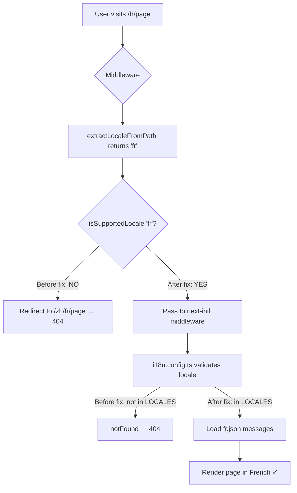

# Fix: French (fr) and German (de) Locales Returning 404

## Root Cause Analysis

The `frontend-blog` app's i18n configuration at [`apps/frontend-blog/src/lib/i18n/config.ts`](apps/frontend-blog/src/lib/i18n/config.ts:14) only defines **4 locales**:

```typescript
export const LOCALES = ['zh', 'en', 'ja', 'ko'] as const;
```

This `LOCALES` array is the **single source of truth** used by:

1. **Middleware** ([`apps/frontend-blog/middleware.ts`](apps/frontend-blog/middleware.ts:5)) — validates locale prefixes in URLs via `isSupportedLocale()`
2. **i18n request config** ([`apps/frontend-blog/i18n.config.ts`](apps/frontend-blog/i18n.config.ts:10)) — calls `notFound()` if locale isn't in the list
3. **Navigation** ([`apps/frontend-blog/src/navigation.ts`](apps/frontend-blog/src/navigation.ts:12)) — `createNavigation()` only generates routes for these locales
4. **`useCurrentLocale` hook** ([`apps/frontend-blog/src/lib/hooks/useCurrentLocale.ts`](apps/frontend-blog/src/lib/hooks/useCurrentLocale.ts:4)) — validates against `LOCALES`

**Why `fr` and `de` work in `admin-blog` but not `frontend-blog`:**

- The `admin-blog` app uses a **different** i18n config from `packages/shared/src/i18n/config.ts` which already includes `fr` and `de` in `ALL_LOCALE_CODES`.
- The `frontend-blog` app has its **own** i18n config at `apps/frontend-blog/src/lib/i18n/config.ts` which was never updated to include `fr` and `de`.

**Additionally**, there are no message files (`fr.json`, `de.json`) in [`apps/frontend-blog/src/messages/`](apps/frontend-blog/src/messages/) — only `zh.json`, `en.json`, `ja.json`, `ko.json` exist.

## Steps to Fix

### Step 1: Add `fr` and `de` to `LOCALES` array

**File:** [`apps/frontend-blog/src/lib/i18n/config.ts`](apps/frontend-blog/src/lib/i18n/config.ts:14)

Change:
```typescript
export const LOCALES = ['zh', 'en', 'ja', 'ko'] as const;
```

To:
```typescript
export const LOCALES = ['zh', 'en', 'ja', 'ko', 'fr', 'de'] as const;
```

### Step 2: Add `fr` and `de` metadata entries

**File:** [`apps/frontend-blog/src/lib/i18n/config.ts`](apps/frontend-blog/src/lib/i18n/config.ts:50)

Add after the `ko` entry in `LOCALES_METADATA`:

```typescript
fr: {
  code: 'fr',
  name: 'French',
  nativeName: 'Français',
  isDefault: false,
  fileName: 'fr',
  enabled: true,
},
de: {
  code: 'de',
  name: 'German',
  nativeName: 'Deutsch',
  isDefault: false,
  fileName: 'de',
  enabled: true,
},
```

### Step 3: Create message files

Create [`apps/frontend-blog/src/messages/fr.json`](apps/frontend-blog/src/messages/fr.json) — a minimal French translation file. At minimum it should contain the same top-level keys as the other locale files (can start as a copy of `en.json` with French translations, or even a copy of `en.json` as a fallback).

Create [`apps/frontend-blog/src/messages/de.json`](apps/frontend-blog/src/messages/de.json) — same approach for German.

### Step 4: Add `fr` and `de` date-fns locale support

**File:** [`apps/frontend-blog/src/lib/utils/date-locale.ts`](apps/frontend-blog/src/lib/utils/date-locale.ts:1)

The `getDateFnsLocale()` function only handles `zh`, `en`, `ja`, `ko` and falls back to `enUS` for unknown locales. While `fr` and `de` will gracefully fall back to English (no crash), it's good practice to add them:

```typescript
import { zhCN, enUS, ja, ko, fr, de } from 'date-fns/locale';
```

And add cases in the switch statement for `'fr'` and `'de'`.

### Step 5: Verify no other files need changes

The following files all import from `@/lib/i18n/config` and will automatically pick up the new locales:

- [`apps/frontend-blog/middleware.ts`](apps/frontend-blog/middleware.ts:5) — imports `LOCALES`, `DEFAULT_LOCALE`
- [`apps/frontend-blog/i18n.config.ts`](apps/frontend-blog/i18n.config.ts:4) — imports `getLocales()`, `DEFAULT_LOCALE`, `getLocaleToFileMap()`
- [`apps/frontend-blog/src/navigation.ts`](apps/frontend-blog/src/navigation.ts:12) — imports `LOCALES`, `DEFAULT_LOCALE`
- [`apps/frontend-blog/src/lib/utils/locale.ts`](apps/frontend-blog/src/lib/utils/locale.ts:1) — imports `LOCALES`
- [`apps/frontend-blog/src/lib/hooks/useCurrentLocale.ts`](apps/frontend-blog/src/lib/hooks/useCurrentLocale.ts:4) — imports `LOCALES`
- [`apps/frontend-blog/src/lib/pwa/manifest-loader.ts`](apps/frontend-blog/src/lib/pwa/manifest-loader.ts:6) — imports `LOCALES`

No changes needed in these files — they all reference the shared `LOCALES` array.

The HTTP language normalization in [`apps/frontend-blog/src/lib/api/http.ts`](apps/frontend-blog/src/lib/api/http.ts:290) already handles `fr-FR` → `fr` and `de-DE` → `de`, so no change needed there.

### Step 6: Restart dev server

After making the changes, restart the Next.js dev server for the `frontend-blog` app to pick up the new locale routes.

## Verification

1. Navigate to `/fr` — should render the homepage in French
2. Navigate to `/de` — should render the homepage in German
3. Navigate to `/fr/articles/some-slug` — should render article pages in French
4. Navigate to `/de/articles/some-slug` — should render article pages in German
5. Use the language switcher to toggle between all 6 locales — no 404s

## Architecture Diagram


