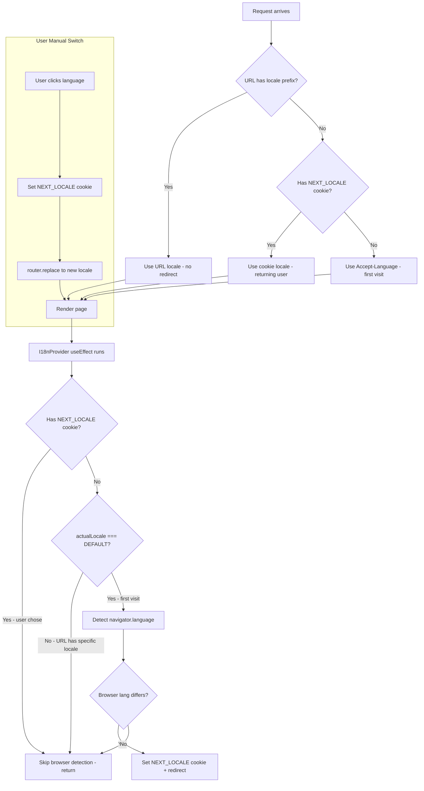

# Fix: Language Switch Overridden by Browser Language Detection

## Problem

When a user manually switches the blog language (e.g., from Chinese to English), the system automatically switches back to the browser's preferred language shortly after. This makes manual language switching effectively broken.

## Root Cause Analysis

The bug involves 3 interacting components with conflicting logic:

### Flow Trace

1. **User triggers `switchLocale('en')`** in [`Header.tsx`](../apps/frontend-blog/src/components/Header.tsx:105):
   - Sets `locale=en` cookie (non-standard name, not recognized by next-intl)
   - Calls `router.replace(pathname, { locale: 'en' })`

2. **`MobileSettingsContent.tsx` `switchLocale('en')`** ([line 50](../apps/frontend-blog/src/components/mobile/MobileSettingsContent.tsx:50)):
   - Does NOT set ANY cookie at all
   - Only calls `router.replace(pathname, { locale: 'en' })`

3. **`I18nProvider.tsx` useEffect** ([line 17](../apps/frontend-blog/src/lib/providers/I18nProvider.tsx:17)):
   - Checks `if (actualLocale !== DEFAULT_LOCALE) return;`
   - If current locale IS the default ('zh'), it reads `navigator.language` and redirects to the browser's language
   - **Problem**: It doesn't check if user has an explicit cookie preference. Even after user manually switched to 'en', if `actualLocale` briefly equals DEFAULT_LOCALE during transition, it fires the redirect back.

4. **`middleware.ts` `detectLocale()`** ([line 23](../apps/frontend-blog/src/lib/utils/locale.ts:20)):
   - For URLs WITH locale prefix: returns path locale (correct)
   - For URLs WITHOUT locale prefix: falls back to `Accept-Language` header
   - Does NOT check `NEXT_LOCALE` cookie before Accept-Language fallback
   - **Problem**: On next page load, if URL has no locale prefix, browser language wins over user's cookie preference

### Key Issues Identified

| # | Issue | File | Severity |
|---|-------|------|----------|
| 1 | `switchLocale` sets `locale` cookie instead of standard `NEXT_LOCALE` | `Header.tsx:108` | High |
| 2 | `switchLocale` in mobile settings sets NO cookie at all | `MobileSettingsContent.tsx:51` | High |
| 3 | `I18nProvider` doesn't check for user's explicit cookie preference before doing browser detection | `I18nProvider.tsx:28-53` | Critical |
| 4 | `detectLocale()` doesn't check `NEXT_LOCALE` cookie before Accept-Language fallback | `locale.ts:31-37` | Medium |

## Fix Plan

### Core Logic (Priority Chain)

```
1. URL path has locale prefix?        → Use that (user is on /en/...)
2. User has NEXT_LOCALE cookie?       → Use that (user previously chose a language)
3. Neither? (first-time visitor)      → Use browser Accept-Language
```

### Fix 1: Update `switchLocale` in Header.tsx

**File**: [`apps/frontend-blog/src/components/Header.tsx`](../apps/frontend-blog/src/components/Header.tsx:105)

**Change**: Set the standard `NEXT_LOCALE` cookie (in addition to `locale` for backward compatibility).

```typescript
const switchLocale = (nextLocale: string) => {
    if (typeof document !== 'undefined') {
      // Set both for backward compatibility
      document.cookie = `NEXT_LOCALE=${nextLocale}; path=/; max-age=31536000; SameSite=Lax`;
      document.cookie = `locale=${nextLocale}; path=/; max-age=31536000; SameSite=Lax`;
    }
    router.replace(pathname, { locale: nextLocale });
    setLangMenuOpen(false);
};
```

### Fix 2: Update `switchLocale` in MobileSettingsContent.tsx

**File**: [`apps/frontend-blog/src/components/mobile/MobileSettingsContent.tsx`](../apps/frontend-blog/src/components/mobile/MobileSettingsContent.tsx:50)

**Change**: Add cookie setting (currently missing entirely).

```typescript
const switchLocale = (nextLocale: string) => {
    if (typeof document !== 'undefined') {
      document.cookie = `NEXT_LOCALE=${nextLocale}; path=/; max-age=31536000; SameSite=Lax`;
      document.cookie = `locale=${nextLocale}; path=/; max-age=31536000; SameSite=Lax`;
    }
    router.replace(pathname, { locale: nextLocale });
    setShowLanguageList(false);
    if (onClose) onClose();
};
```

### Fix 3: Update I18nProvider.tsx - Skip browser detection when user has cookie or URL has locale

**File**: [`apps/frontend-blog/src/lib/providers/I18nProvider.tsx`](../apps/frontend-blog/src/lib/providers/I18nProvider.tsx:17)

**Change**: 
- If `NEXT_LOCALE` cookie exists → user has explicit preference → skip browser detection entirely
- If URL locale is not DEFAULT → user navigated to a specific locale → skip browser detection
- Only run browser detection for first-time visitors (no cookie, on default locale)

```typescript
useEffect(() => {
    if (typeof document === 'undefined') return;

    // Sync locale to HTML and global
    document.documentElement.lang = actualLocale;
    (globalThis as any).__NEXT_INTL_LOCALE__ = actualLocale;

    // FIX: If user has NEXT_LOCALE cookie (explicit preference), skip browser detection
    const hasCookie = document.cookie.match(new RegExp('(^| )NEXT_LOCALE=([^;]+)'));
    if (hasCookie) return;

    // FIX: If URL already has a non-default locale, user navigated here, respect it
    if (actualLocale !== DEFAULT_LOCALE) return;

    // Only here: first-time visitor on default locale with no cookie
    // Detect browser language and redirect if needed
    const browserLang = navigator.language.split('-')[0].toLowerCase();
    if (!browserLang || browserLang === actualLocale) return;
    if (!(LOCALES as readonly string[]).includes(browserLang)) return;

    // Set cookie and redirect for first-time visitors
    const expires = new Date(
      Date.now() + 365 * 24 * 60 * 60 * 1000,
    ).toUTCString();
    document.cookie = `NEXT_LOCALE=${browserLang}; path=/; expires=${expires}; SameSite=Lax`;

    const newPathname = pathname.replace(`/${actualLocale}`, `/${browserLang}`);
    router.push(newPathname);
}, [actualLocale, pathname, router]);
```

### Fix 4: Update `detectLocale()` in locale.ts - Check cookie before Accept-Language

**File**: [`apps/frontend-blog/src/lib/utils/locale.ts`](../apps/frontend-blog/src/lib/utils/locale.ts:20)

**Change**: When URL has no locale prefix, check `NEXT_LOCALE` cookie BEFORE falling back to `Accept-Language` header.

```typescript
export function detectLocale(request?: NextRequest): SupportedLocale {
  if (request) {
    const url = new URL(request.url);
    const pathLocale = extractLocaleFromPath(url.pathname);
    if (pathLocale) {
      return pathLocale; // URL path wins
    }

    // FIX: Check NEXT_LOCALE cookie before Accept-Language
    // This ensures returning users get their manually chosen language
    const cookieLocale = getLocaleFromCookie(request);
    if (cookieLocale && isSupportedLocale(cookieLocale)) {
      return cookieLocale;
    }

    // Fall back to Accept-Language header for first-time visitors
    const acceptLanguage = request.headers.get('accept-language');
    const browserLocale = parseAcceptLanguage(acceptLanguage);
    if (browserLocale) {
      return browserLocale;
    }
  }

  // Client-side: trust URL path only
  if (typeof window !== 'undefined') {
    const pathLocale = extractLocaleFromPath(window.location.pathname);
    return pathLocale || DEFAULT_LOCALE;
  }

  // SSR fallback
  const cookieLocale = getLocaleFromCookie(request);
  if (cookieLocale && isSupportedLocale(cookieLocale)) {
    return cookieLocale;
  }

  return FALLBACK_LOCALE;
}
```

## Edge Cases Covered

| Scenario | Expected Behavior |
|----------|------------------|
| **First-time visitor** (no cookie, no URL locale) | Browser language detection → auto-redirect to matching locale |
| **User manually switches language** | `NEXT_LOCALE` cookie is set → browser detection is skipped → choice is respected |
| **Returning user** (has cookie) | Cookie is checked before Accept-Language → gets their preferred language |
| **User navigates via URL** (e.g., types /en/...) | URL path locale wins, no redirect |
| **User clears cookies** | Falls back to first-time visitor behavior → browser language detection |
| **Mobile settings language switch** | Now also sets `NEXT_LOCALE` cookie (was missing entirely) |
| **Browser language changes** | User's cookie preference still respected → no unwanted redirects |

## Architecture Diagram



## Files to Modify

1. [`apps/frontend-blog/src/components/Header.tsx`](../apps/frontend-blog/src/components/Header.tsx) - `switchLocale()` function (line ~105-113)
2. [`apps/frontend-blog/src/components/mobile/MobileSettingsContent.tsx`](../apps/frontend-blog/src/components/mobile/MobileSettingsContent.tsx) - `switchLocale()` function (line ~50-54)
3. [`apps/frontend-blog/src/lib/providers/I18nProvider.tsx`](../apps/frontend-blog/src/lib/providers/I18nProvider.tsx) - `useEffect` logic (line ~17-54)
4. [`apps/frontend-blog/src/lib/utils/locale.ts`](../apps/frontend-blog/src/lib/utils/locale.ts) - `detectLocale()` function (line ~20-57)
