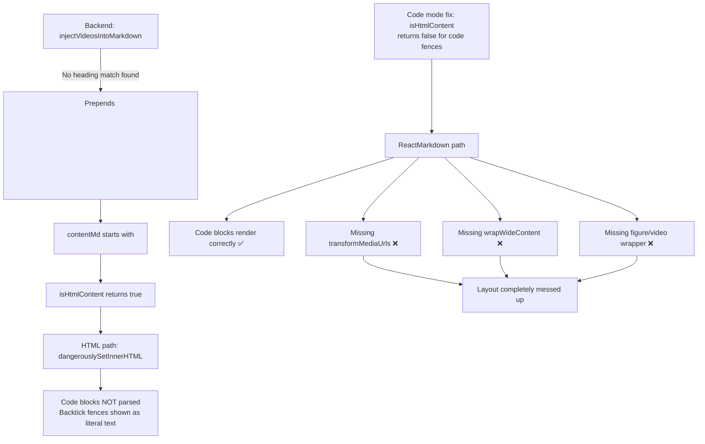
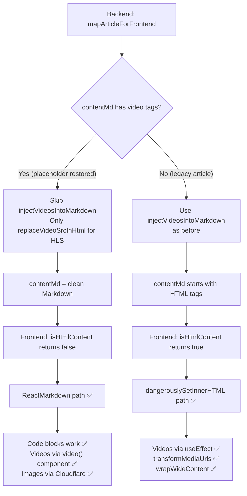

# Fix: Layout Breakage After `isHtmlContent` Change

## Current State

After the Code mode fix to [`ArticleMarkdown.tsx:82-89`](../apps/frontend-blog/src/components/blog/ArticleMarkdown.tsx:82):
```typescript
function isHtmlContent(content: string): boolean {
  // NEW: code fence check
  if (/^```/m.test(content)) return false;
  return /^\s*<\w+[^>]*>/.test(content.trim());
}
```

Content routes through ReactMarkdown path instead of `dangerouslySetInnerHTML`. The ReactMarkdown path lacks:
- [`transformMediaUrls()`](../apps/frontend-blog/src/components/blog/ArticleMarkdown.tsx:211) — Cloudflare Image Resizing for `` and `<video poster>`
- [`wrapWideContent()`](../apps/frontend-blog/src/components/blog/ArticleMarkdown.tsx:148) — scrollable containers for `<figure>`, `<video>`, `<table>`, `<pre>`, `<svg>`
- Proper `<figure>` handling (no component override for raw HTML from rehypeRaw)

## Root Cause Chain



## Fix Strategy

Fix at the **data source** (backend), not the rendering heuristic (frontend). Two independent fixes:

### Step 1: Backend — Skip `injectVideosIntoMarkdown` when placeholder already handled videos

**File**: [`apps/api/src/blog/frontend/frontend-blog.service.ts:363-378`](../apps/api/src/blog/frontend/frontend-blog.service.ts:363)

**Problem**: [`injectVideosIntoMarkdown()`](../apps/api/src/blog/frontend/frontend-blog.service.ts:527) does:
1. Line 541-543: **Removes ALL `<video>` tags** from `contentMd` (even those correctly placed by placeholder restoration)
2. Lines 603-686: Re-inserts them based on heading matching from the Quill HTML
3. If no heading match → inserts at the **beginning** of the document

This destroys the correct video positioning from placeholder restoration and causes `contentMd` to start with `<figure><video>`.

**Fix**: Before calling `injectVideosIntoMarkdown`, check if `contentMd` already has `<video>` tags (from placeholder restoration). If so:
- Skip the full injection
- Only do HLS URL replacement via [`replaceVideoSrcInHtml()`](../apps/api/src/blog/frontend/frontend-blog.service.ts:697)

```typescript
// In mapArticleForFrontend(), replace lines 363-378:
if (result.content && /<video[\s\S]*?<\/video>/i.test(result.content)) {
  const baseMd = result.contentMd || result.content || '';
  const contentVideo = Array.isArray(result.meta?.contentVideo)
    ? result.meta.contentVideo
    : undefined;

  // If contentMd already has video tags from placeholder restoration,
  // skip the legacy injection that would remove and re-position them.
  // Just do HLS URL replacement on the existing content.
  if (/<video[\s\S]*?<\/video>/i.test(baseMd)) {
    result.contentMd = baseMd;
    if (contentVideo?.length) {
      result.contentMd = this.replaceVideoSrcInHtml(result.contentMd, contentVideo);
    }
  } else {
    // No videos yet — use legacy injection for articles translated before placeholder fix
    result.contentMd = this.injectVideosIntoMarkdown(
      baseMd,
      result.content,
      contentVideo,
    );
  }
}
```

**Result**: `contentMd` no longer starts with `<figure><video>`. Videos stay at their correct positions from placeholder restoration.

### Step 2: Frontend — Revert `isHtmlContent` to original logic

**File**: [`apps/frontend-blog/src/components/blog/ArticleMarkdown.tsx:82-89`](../apps/frontend-blog/src/components/blog/ArticleMarkdown.tsx:82)

Remove the code fence check. Since Step 1 ensures `contentMd` doesn't start with HTML tags, the original simple check works:

```typescript
function isHtmlContent(content: string): boolean {
  return /^\s*<\w+[^>]*>/.test(content.trim());
}
```

**Result**:
- `contentMd` (Markdown) → `isHtmlContent` returns `false` → ReactMarkdown path → code blocks render correctly ✅
- `content` (Quill HTML) → `isHtmlContent` returns `true` → HTML path with `transformMediaUrls` + `wrapWideContent` ✅

### Step 3: Frontend — Fix `sanitizeMarkdownForReact` escape

**File**: [`apps/frontend-blog/src/components/blog/ArticleMarkdown.tsx:127`](../apps/frontend-blog/src/components/blog/ArticleMarkdown.tsx:127)

The current code outputs literal `<` / `>` instead of HTML entities `<` / `>`:

```typescript
// Current (WRONG — still outputs literal angle brackets):
return '<' + slash + tagName + attrs + '>';

// Fix:
return '<' + slash + tagName + attrs + '>';
```

**Note**: This function is defined but currently **not called** in the rendering pipeline. It's a safety net for non-standard HTML tags (like `<toutput>`) that would cause React console errors. Consider integrating it as `sanitizeMarkdownForReact(content)` before passing to ReactMarkdown at line 772.

## Data Flow After Fix



## Files Modified

| File | Change | Risk |
|------|--------|------|
| [`apps/api/src/blog/frontend/frontend-blog.service.ts`](../apps/api/src/blog/frontend/frontend-blog.service.ts) | Add early-return in `mapArticleForFrontend` when `contentMd` already has videos | Low — only affects the conditional path |
| [`apps/frontend-blog/src/components/blog/ArticleMarkdown.tsx`](../apps/frontend-blog/src/components/blog/ArticleMarkdown.tsx) | Revert `isHtmlContent` + fix `sanitizeMarkdownForReact` escape | Low — restores original behavior |

## Verification

1. Deploy frontend + backend changes
2. Re-translate the DeviceFingerprint article (or any article with video + code blocks)
3. Check:
   - ✅ Video appears at the correct position
   - ✅ Code blocks render with syntax highlighting
   - ✅ Images use Cloudflare Image Resizing URLs
   - ✅ Tables/videos have scrollable `article-media-wrapper`
   - ✅ No `<toutput>` React console errors
