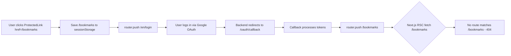

# Fix: OAuth Callback Redirects Without Locale Prefix Cause 404

## Bug Description

After OAuth login, navigating back to the bookmarks page (or any protected route) results in a 404 error. The browser shows a 404 page even though the server returns 200 for the RSC data fetch.

## Root Cause Analysis

### Trace Evidence (from Cloudflare production logs)

1. `GET /oauth/callback/?token=...&refreshToken=...&state=...` → 200 (OAuth processing succeeds)
2. `GET /bookmarks/?_rsc=3442x` → 200 (RSC data fetch, but client shows 404)

### The Real Problem

The OAuth callback page at [`oauth/callback/page.tsx`](apps/frontend-blog/src/app/oauth/callback/page.tsx) uses `useRouter` from `next/navigation` (standard Next.js router), **not** from `@/navigation` (locale-aware router).

When login succeeds, it calls `router.push(redirectPath)` where:

| Source | Saved Path | Has Locale? |
|--------|-----------|-------------|
| [`ProtectedLink`](apps/frontend-blog/src/components/auth/ProtectedLink.tsx:56) saves raw `href` | `/bookmarks` | ❌ No |
| [`ProtectedRouteV2`](apps/frontend-blog/src/components/auth/ProtectedRouteV2.tsx:95) saves `window.location.pathname` | `/en/bookmarks` | ✅ Yes |
| Default fallback | `/` | ❌ No |

All routes are under `/[locale]/...`, so navigating to `/bookmarks/` without locale prefix hits a 404 because no route matches `apps/frontend-blog/src/app/bookmarks/`.

**Why the trace shows 200 but browser shows 404:** The server returns an RSC payload for the 404 page (which is technically a successful response), but the client-side router interprets it as a 404 and shows the error UI.

### Secondary Issues

1. **Login page** ([`login/page.client.tsx`](apps/frontend-blog/src/app/[locale]/login/page.client.tsx:5)) also uses `next/navigation` `useRouter` — same problem for email login redirects
2. **Bookmarks page** ([`page.tsx`](apps/frontend-blog/src/app/[locale]/bookmarks/page.tsx:11)) uses `force-static` — after login, the statically rendered shell is served for unauthenticated users
3. The `oauth/callback` route is outside the `[locale]` group, so there's no locale context available to use `@/navigation`'s `redirect()` directly

## Flow Diagram

## Solution

### Fix 1: Make OAuth Callback Redirect Locale-Aware

In [`oauth/callback/page.tsx`](apps/frontend-blog/src/app/oauth/callback/page.tsx), before redirecting:

1. Import `detectLocale` from `@/lib/utils/locale`
2. Import `withLocale` from `@/lib/utils/locale`
3. Before each `router.push()` call, detect the current locale and prefix the path:
   - Get locale from `NEXT_LOCALE` cookie or URL referrer
   - Use `withLocale(redirectPath, detectedLocale)` to ensure path has locale prefix
   - Fall back to `DEFAULT_LOCALE` ('zh') if detection fails

### Fix 2: Make Login Page Redirect Locale-Aware

In [`login/page.client.tsx`](apps/frontend-blog/src/app/[locale]/login/page.client.tsx):

1. Import `useCurrentLocale` from `next-intl` (available since this component IS inside `[locale]`)
2. Before `router.push()`, use the current locale to ensure the redirect path has the correct prefix
3. OR better: Switch to using `useRouter` from `@/navigation` instead of `next/navigation`

### Fix 3: Fix ProtectedLink to Save Locale-Prefixed Path

In [`ProtectedLink.tsx`](apps/frontend-blog/src/components/auth/ProtectedLink.tsx:56):

1. Instead of saving raw `href` (e.g., `/bookmarks`), save with locale prefix
2. Use the current locale from `useCurrentLocale()` + `withLocale()` to build the full path

### Fix 4: Remove force-static from Bookmarks Page

In [`bookmarks/page.tsx`](apps/frontend-blog/src/app/[locale]/bookmarks/page.tsx:11):

1. Change `export const dynamic = 'force-static'` to `export const dynamic = 'force-dynamic'`
2. OR use `export const revalidate = 0` to disable static optimization

Since the bookmarks page requires authentication, it should NEVER be statically pre-rendered. The statically rendered shell will be served to all users, including unauthenticated ones, which defeats the purpose of auth protection.

## Files to Modify

| File | Change |
|------|--------|
| [`apps/frontend-blog/src/app/oauth/callback/page.tsx`](apps/frontend-blog/src/app/oauth/callback/page.tsx) | Add locale detection, wrap redirect paths with `withLocale()` |
| [`apps/frontend-blog/src/app/[locale]/login/page.client.tsx`](apps/frontend-blog/src/app/[locale]/login/page.client.tsx) | Use locale-aware redirect (use `@/navigation` router or `withLocale()`) |
| [`apps/frontend-blog/src/components/auth/ProtectedLink.tsx`](apps/frontend-blog/src/components/auth/ProtectedLink.tsx) | Save locale-prefixed path to `redirectAfterLogin` |
| [`apps/frontend-blog/src/app/[locale]/bookmarks/page.tsx`](apps/frontend-blog/src/app/[locale]/bookmarks/page.tsx) | Remove `force-static`, use `force-dynamic` |

## Testing

1. **Local dev**: Start dev server, navigate to `/en/bookmarks` (not logged in) → should redirect to `/en/login`
2. **Local dev**: Complete OAuth login flow → should redirect back to `/en/bookmarks` (200, not 404)
3. **Local dev**: Test email login → should also redirect correctly
4. **Local dev**: Test with different locales (en, ja, zh, ko) → locale should persist through OAuth flow
5. **Production**: Deploy and verify the same flows work

## Verification

- [ ] OAuth callback redirects to locale-prefixed path
- [ ] Login page redirects to locale-prefixed path
- [ ] ProtectedLink saves locale-prefixed redirect path
- [ ] Bookmarks page uses dynamic rendering
- [ ] No 404 after login for any locale
