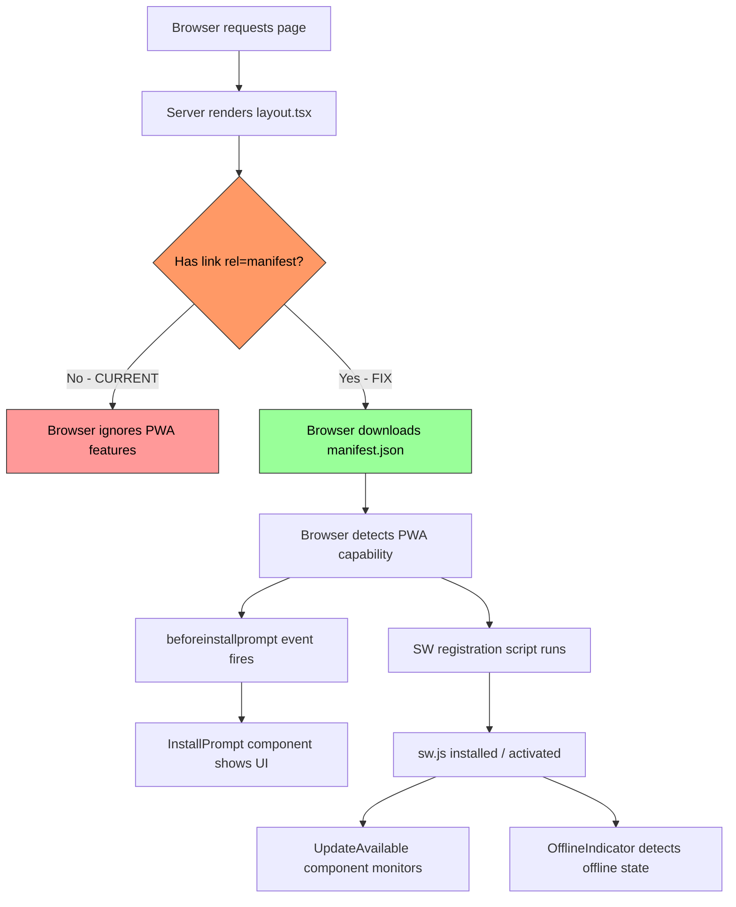

# PWA Not Working on Cloudflare Pages - Fix Plan

## Root Cause Analysis

### What I Found

**1. ✅ PWA files ARE in `.open-next/assets/`**
The previous build already placed `sw.js`, `workbox-fe2caf3f.js`, `manifest.json`, and locale-specific manifests (`manifest-en.json`, `manifest-ja.json`, `manifest-ko.json`, `manifest-zh.json`) into the deployed assets directory. The Cloudflare Pages build pipeline is NOT the problem.

**2. ❌ No `<link rel="manifest">` in HTML `<head>`**
Neither the root `layout.tsx` nor the `[locale]/layout.tsx` include a manifest link tag. The root layout only has a theme-script in `<head>`. Without this link, the browser has **no way to discover the PWA manifest**, so `beforeinstallprompt` never fires, and PWA features like "Add to Home Screen" are unavailable.

**3. ❌ `next-pwa` v5.6.0 manifest injection doesn't work with App Router**
`next-pwa`'s `register: true` + automatic `<link rel="manifest">` injection is designed for the Pages Router (`_document.tsx`). With Next.js App Router (used here), the webpack plugin cannot inject the manifest link or SW registration script into the server-rendered layout. The `sw.js` file is generated correctly, but the **browser is never told to load it**.

**4. ✅ PWA components ARE rendered**
`InstallPrompt`, `OfflineIndicator`, and `UpdateAvailable` are correctly placed in `[locale]/layout.tsx`. These components handle the UI for install prompts, offline status, and update notifications, but they rely on the browser first recognizing the site as a PWA via the manifest.

**5. ✅ `manifest-loader.ts` exists for locale switching**
The `manifest-loader.ts` has logic for dynamically switching manifests per locale, but `initManifestLoader()` uses a `MutationObserver` that waits for a `<link rel="manifest">` tag to exist. Since no such tag exists, the loader is effectively dead code.

### Summary

| Aspect | Status | Detail |
|--------|--------|--------|
| `sw.js` in `.open-next/assets/` | ✅ Present | Generated by `next-pwa` build |
| `manifest.json` in `.open-next/assets/` | ✅ Present | Present with locale variants |
| `<link rel="manifest">` in HTML | ❌ Missing | **Root cause #1** |
| SW registration script in HTML | ❌ Likely missing | **Root cause #2** (`next-pwa` App Router limitation) |
| PWA UI components | ✅ Rendered | But can't fire without manifest detection |
| `manifest-loader.ts` | ❌ Dead code | No manifest tag for it to observe |

## Fix Plan

### Step 1: Add `<link rel="manifest">` to root `layout.tsx`

**File:** [`apps/frontend-blog/src/app/layout.tsx`](apps/frontend-blog/src/app/layout.tsx)

Add the manifest link tag inside `<head>`. This is the most critical fix — it tells the browser "this site is a PWA".

```diff
 <head>
+  <link rel="manifest" href="/manifest.json" />
   <script
     dangerouslySetInnerHTML={{ __html: `...theme script...` }}
   />
 </head>
```

**Why root layout?** The root `layout.tsx` wraps all pages (including locale-specific ones). Adding the manifest link here ensures it's present on every page.

### Step 2: Add manual Service Worker registration

**File:** [`apps/frontend-blog/src/app/layout.tsx`](apps/frontend-blog/src/app/layout.tsx)

Since `next-pwa`'s automatic `register: true` doesn't work with App Router, add a manual service worker registration script.

```diff
 <head>
   <link rel="manifest" href="/manifest.json" />
+  <script
+    dangerouslySetInnerHTML={{
+      __html: `
+        if ('serviceWorker' in navigator) {
+          window.addEventListener('load', function() {
+            navigator.serviceWorker.register('/sw.js');
+          });
+        }
+      `,
+    }}
+  />
   <script ...theme script... />
 </head>
```

**Why manual?** `next-pwa` generates `sw.js` but doesn't inject the registration script in App Router. This replaces the missing `register: true` behavior.

### Step 3: Fix `manifest-loader.ts` to work when manifest tag is present

**File:** [`apps/frontend-blog/src/lib/pwa/manifest-loader.ts`](apps/frontend-blog/src/lib/pwa/manifest-loader.ts)

The `initManifestLoader()` function's `MutationObserver` should now work since we're adding the manifest link tag. But we should verify it handles the multi-locale manifest switching correctly. If the default `/manifest.json` is used, the locale-specific switching via `manifest-loader.ts` is a bonus for users who change locale without page reload.

**No code change needed** — the observer will detect our new `<link rel="manifest">` tag and work as designed.

### Step 4: Verify changes

1. Run `yarn workspace @lucky/frontend-blog build` to confirm no build errors
2. Check built HTML in `.next/server/app/index.html` for presence of manifest link + SW script
3. Deploy and verify via Chrome DevTools → Application → Manifest

## Risk Assessment

| Change | Risk | Mitigation |
|--------|------|------------|
| Adding `<link>` to layout | Low — standard HTML element, no side effects | Verified in build |
| Adding SW registration script | Low — guarded by `'serviceWorker' in navigator` check | Safe in all browsers |
| manifest-loader.ts | None — no actual code change | Just verification |

## Rollback

Revert the two changes in `layout.tsx` — remove the `<link>` tag and the `<script>` block. The build will still succeed; PWA will simply not be active (current state).

## Flow Diagram



## Implementation Order

1. Edit [`apps/frontend-blog/src/app/layout.tsx`](apps/frontend-blog/src/app/layout.tsx) — add manifest link + SW registration script
2. Build to verify (`yarn workspace @lucky/frontend-blog build`)
3. Deploy and confirm in DevTools
