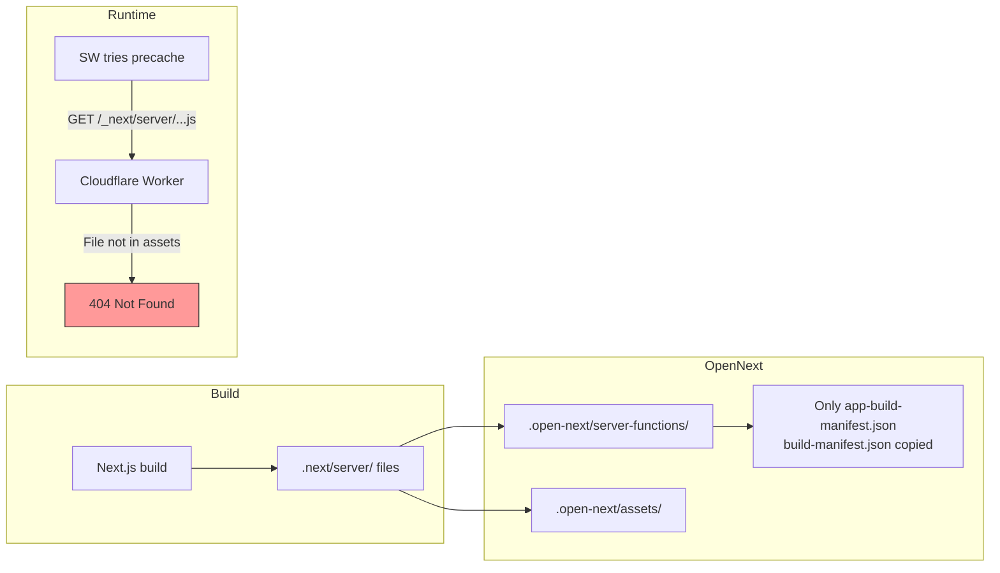

# Fix `page_client-reference-manifest.js` 404 on Cloudflare Pages

## Problem

Service Worker (sw.js) tries to precache `/_next/server/app/[locale]/about/page_client-reference-manifest.js` but gets 404.

## Why It Happens



**Root cause**: OpenNext splits build output into server-function (not publicly accessible) and assets (public). The `page_client-reference-manifest.js` files end up in server-function but are NOT copied to assets. The existing [`copy-manifests.sh`](../apps/frontend-blog/scripts/copy-manifests.sh) handles this but is **never called in CI**.

## Fix (Two Changes Required)

### Change 1: Exclude from SW precache in next.config.ts
**File**: [`apps/frontend-blog/next.config.ts:22`](../apps/frontend-blog/next.config.ts:22)

```diff
 exclude: [
   /\.map$/,
   /react-loadable-manifest\.json$/,
+  /\/_next\/server\/.*/,
 ],
```

**Effect**: SW will NOT try to cache any `_next/server/*` files → no 404 in SW console.

### Change 2: Copy server manifests to assets in CI
**File**: [`.github/workflows/deploy-blog-cloudflare.yml:200`](../.github/workflows/deploy-blog-cloudflare.yml:200)

Replace the current Step 6b (which only copies 2 root files) with a call to `copy-manifests.sh`:

```diff
       - name: 6b. Copy manifest files to assets (for Service Worker precache)
         working-directory: apps/frontend-blog
-        run: |
-          set -euo pipefail
-          if [ -f .next/app-build-manifest.json ]; then
-            cp -f .next/app-build-manifest.json .open-next/assets/_next/
-            echo "✅ app-build-manifest.json copied to assets"
-          else
-            echo "⚠️ app-build-manifest.json not found in .next/"
-          fi
-          if [ -f .next/build-manifest.json ]; then
-            cp -f .next/build-manifest.json .open-next/assets/_next/
-            echo "✅ build-manifest.json copied to assets"
-          else
-            echo "⚠️ build-manifest.json not found in .next/"
-          fi
+        run: bash scripts/copy-manifests.sh
```

**Effect**: All `*client-reference-manifest*` files AND root-level manifests are copied to assets. Browsers that need these files for client component hydration can access them.

## Why Both Are Needed

| Change | Solves |
|--------|--------|
| Exclude in next.config.ts | Prevents SW from requesting non-existent URLs |
| Run copy-manifests.sh in CI | Ensures files actually exist as public URLs when browsers need them |

Without Change 1, SW will still try to precache these files (just gets 404).
Without Change 2, browsers that need `page_client-reference-manifest.js` for client component hydration during normal navigation might also get 404 (depending on OpenNext Worker behavior).

## Verification

After deployment:
```bash
# This should return 200 (not 404)
curl -s -o /dev/null -w "%{http_code}" \
  "https://blog.joyminis.com/_next/server/app/ja/about/page_client-reference-manifest.js"
```
