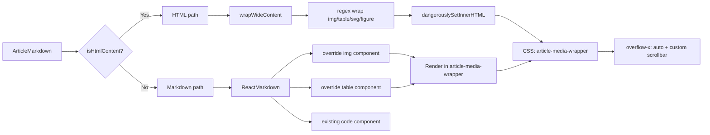

# Fix: Wide Flowchart/Diagram Overflow on H5 Article Detail Pages

## Problem

On mobile article detail pages, wide content (flowcharts, diagrams, tables, SVGs) overflows the viewport. The user wants them to behave like code blocks — keep natural width with a horizontal scrollbar.

## Root Cause

[`ArticleMarkdown.tsx`](apps/frontend-blog/src/components/blog/ArticleMarkdown.tsx) has two content paths:

1. **HTML path** (line 73-90): `dangerouslySetInnerHTML` — no overflow handling for any element type
2. **Markdown path** (line 94-153): `ReactMarkdown` — only `pre` (code blocks) has `overflow-x: auto`

Other potentially wide elements (`img`, `svg`, `table`, `figure`) have no scrollable wrapper.

## Solution

Wrap ALL potentially wide content types in a scrollable container, in both content paths.

### Changes

#### 1. [`ArticleMarkdown.tsx`](apps/frontend-blog/src/components/blog/ArticleMarkdown.tsx) — Add helper

Add a helper function to wrap wide HTML elements in scrollable containers:

```typescript
/** Elements that typically contain wide content (diagrams, images, tables) */
const WIDE_TAGS = /^<(img|svg|table|figure)\s/i;

function wrapWideContent(html: string): string {
  // Wrap <table>...</table> blocks (including full rows/cols)
  let result = '';
  let lastIndex = 0;
  const tableRegex = /<table[\s>][\s\S]*?<\/table>/gi;
  let match;

  // Process sequentially to handle nested HTML correctly
  // Strategy: process block-level elements first, then inline elements
  result = html;

  // Wrap <table> elements
  result = result.replace(
    /(<table[\s>][\s\S]*?<\/table>)/gi,
    (match) => `<div class="article-media-wrapper">${match}</div>`
  );

  // Wrap <figure> elements (often contain img + figcaption)
  result = result.replace(
    /(<figure[\s>][\s\S]*?<\/figure>)/gi,
    (match) => `<div class="article-media-wrapper">${match}</div>`
  );

  // Wrap standalone  tags (not already inside a wrapper)
  result = result.replace(
    /]*>/gi,
    (match) => `<div class="article-media-wrapper">${match}</div>`
  );

  // Wrap <svg> blocks
  result = result.replace(
    /(<svg[^>]*>[\s\S]*?<\/svg>)/gi,
    (match) => `<div class="article-media-wrapper">${match}</div>`
  );

  return result;
}
```

#### 2. [`ArticleMarkdown.tsx`](apps/frontend-blog/src/components/blog/ArticleMarkdown.tsx) — HTML path (line 73-90)

Apply the helper before `dangerouslySetInnerHTML`:

```tsx
<article
  className="prose prose-slate dark:prose-invert max-w-none break-words
    ...existing classes..."
  dangerouslySetInnerHTML={{ __html: wrapWideContent(content) }}
/>
```

#### 3. [`ArticleMarkdown.tsx`](apps/frontend-blog/src/components/blog/ArticleMarkdown.tsx) — Markdown path (line 111-148)

Override `img` and `table` components in ReactMarkdown:

```tsx
<ReactMarkdown
  remarkPlugins={[remarkGfm]}
  rehypePlugins={[rehypeRaw]}
  components={{
    hr() {
      return <hr className="border-0 !border-none h-0 m-0 p-0 !hidden" />;
    },
    code({ className, children, ...props }) {
      // ...existing code block implementation...
    },
    img({ src, alt, ...props }) {
      return (
        <div className="article-media-wrapper">
          
        </div>
      );
    },
    table({ children, ...props }) {
      return (
        <div className="article-media-wrapper">
          <table {...props}>{children}</table>
        </div>
      );
    },
  }}
>
  {content}
</ReactMarkdown>
```

#### 4. [`globals.css`](apps/frontend-blog/src/app/globals.css) — Add wrapper class

```css
/* Scrollable wrapper for wide article content (images, tables, SVGs, figures) */
.article-media-wrapper {
  overflow-x: auto;
  -webkit-overflow-scrolling: touch;
  max-width: 100%;
  margin: 1.5em 0;
  border-radius: 0.5rem;
}

.article-media-wrapper > img,
.article-media-wrapper > svg,
.article-media-wrapper > table {
  max-width: none;   /* allow natural width */
  height: auto;
  display: block;
}
```

The custom scrollbar styles already exist at `globals.css:159-172`.

### Coverage Matrix

| Element | HTML Path | Markdown Path | Behavior |
|---------|-----------|---------------|----------|
| `` | ✅ regex wrap | ✅ component override | Natural width, horizontal scrollbar on overflow |
| `<svg>` | ✅ regex wrap | N/A (inline in markdown) | Natural width, horizontal scrollbar on overflow |
| `<table>` | ✅ regex wrap | ✅ component override | Natural width, horizontal scrollbar on overflow |
| `<figure>` | ✅ regex wrap | N/A (inline HTML) | Natural width, horizontal scrollbar on overflow |
| `<pre>` (code) | ✅ already has `prose-pre:overflow-x-auto` | ✅ already handled | Working correctly today |
| `<div>` | Not wrapped (too generic, risk of false positives) | N/A | Falls through to normal prose styling |

### Flow



### Verification

1. `yarn workspace @lucky/frontend-blog tsc --noEmit` — zero errors
2. Test on mobile viewport with articles containing:
   - Wide flowchart images
   - Tables with many columns
   - SVG diagrams
   - Code blocks (regression check — should still work)
3. Confirm each wide element has its own scrollbar, no page-level horizontal scroll
