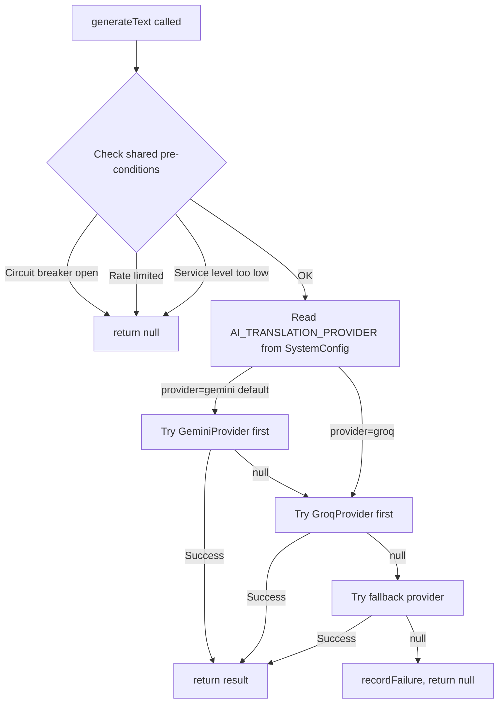

# Groq AI Provider Integration + UI Model Selection + Daily Usage Monitoring

## Problem

Gemini 2.5 Flash free tier has a **20 requests/day** quota per Google Cloud project. All 4 API keys share this project-level limit. Once exhausted, the translation system stops working until midnight UTC.

## Requirements

1. **Backward compatibility** — existing `GOOGLE_GEMINI_API_KEY` env var must continue working without changes
2. **Groq integration** — add Groq as a secondary AI provider with its own API key (`GROQ_API_KEY`)
3. **UI model selection** — admin can choose which provider/model to use for translation via dropdown
4. **Daily usage monitoring** — show per-provider daily token/request usage in the AI Status card

---

## Architecture Overview

### Current Architecture (Gemini Only)

```
AiService
  ├── keyInstances: GeminiKeyInstance[]  (GoogleGenerativeAI SDK)
  ├── generateText() → calls currentKey.model.generateContent()
  ├── generateContentFromImage() → calls currentKey.model.generateContent()
  ├── translateText() → calls generateText()
  ├── translateMarkdown() → calls generateText()
  ├── moderateComment() → calls generateText() with responseMimeType: 'application/json'
  └── generateAutoReply() → calls generateText()
```

### Proposed Architecture (Provider Abstraction)

```
AiService
  ├── Shared Infrastructure (unchanged):
  │   ├── Circuit Breaker (consecutiveFailures >= 5 → 15min open)
  │   ├── Rate Limiter (RPM/TPM per-minute)
  │   ├── Service Level Degradation (FULL→ESSENTIAL→MINIMAL→DISABLED)
  │   └── Midnight Reset (all counters reset at UTC 00:00)
  │
  ├── providers: AiProviderInstance[]
  │   ├── [0] GeminiProvider
  │   │   ├── keys: GeminiKeyInstance[]  (extracted from ai.service.ts)
  │   │   ├── activeKeyIndex
  │   │   ├── generateText() → GoogleGenerativeAI SDK
  │   │   └── generateContentFromImage() → GoogleGenerativeAI SDK (vision)
  │   │
  │   └── [1] GroqProvider
  │       ├── keys: GroqKeyInstance[]
  │       ├── activeKeyIndex
  │       └── generateText() → axios POST to api.groq.com/openai/v1/chat/completions
  │
  └── Provider Selection (from SystemConfig):
      1. Read AI_TRANSLATION_PROVIDER config from DB
      2. If set to "groq", try Groq first, fallback to Gemini
      3. If set to "gemini" (default), try Gemini first, fallback to Groq
```

### Provider Selection Flow



---

## Files to Create

### 1. `apps/api/src/common/ai/interfaces/ai-provider.interface.ts`

```typescript
export interface AiKeyInstance {
  keySuffix: string;
  dailyTokens: number;
  dailyRequests: number;
  blocked: boolean;
  blockedReason: string | null;
  blockedUntil: number;
}

export interface AiProviderInstance {
  readonly name: string;          // 'gemini' | 'groq'
  readonly displayName: string;   // 'Google Gemini' | 'Groq'
  readonly models: string[];      // available models for this provider
  readonly activeModel: string;   // currently selected model

  keys: AiKeyInstance[];
  activeKeyIndex: number;

  generateText(prompt: string, options?: AiGenerationOptions): Promise<string | null>;
  isAvailable(): boolean;
  getUsageStats(): AiProviderUsageStats;
  rotateToNextKey(): boolean;
  resetDailyCounters(): void;
}

export interface AiProviderUsageStats {
  name: string;
  displayName: string;
  activeModel: string;
  activeKeyIndex: number;
  keys: {
    index: number;
    keySuffix: string;
    dailyTokens: number;
    dailyRequests: number;
    dailyLimit: number;
    blocked: boolean;
    blockedReason: string | null;
    isActive: boolean;
  }[];
}
```

### 2. `apps/api/src/common/ai/providers/gemini.provider.ts`

Extract existing Gemini logic from `ai.service.ts` into a standalone class implementing `AiProviderInstance`:

- Constructor reads `GOOGLE_GEMINI_API_KEY` from ConfigService
- `generateText()` — uses `@google/generative-ai` SDK (same as current code)
- `generateContentFromImage()` — vision/OCR support (Gemini-only feature)
- Key rotation, daily budget tracking, 429 cooldown (same as current)
- Model: `gemini-2.5-flash` (hardcoded, Gemini only has one free model)

**Lines**: ~300 (extracted from ai.service.ts)

### 3. `apps/api/src/common/ai/providers/groq.provider.ts`

New provider using OpenAI-compatible API via axios:

```typescript
export class GroqProvider implements AiProviderInstance {
  name = 'groq';
  displayName = 'Groq';
  models = ['mixtral-8x7b-32768', 'llama-3.3-70b-versatile', 'llama3-70b-8192'];
  activeModel = 'mixtral-8x7b-32768';  // default, can be changed via SystemConfig

  async generateText(prompt: string, options?: AiGenerationOptions): Promise<string | null> {
    // 1. Check if any key is available
    // 2. POST to https://api.groq.com/openai/v1/chat/completions
    // 3. Handle 429 → block key for 60s, rotate
    // 4. Return response.data.choices[0].message.content
  }
}
```

**Key differences from Gemini**:
- No `responseMimeType: 'application/json'` support (Gemini-only)
- No vision/image support
- Uses axios instead of Google SDK
- Multiple keys via comma-separated `GROQ_API_KEY` env var

**Lines**: ~200

---

## Files to Modify

### 4. `apps/api/src/common/ai/ai.service.ts` (Refactor)

**Changes**:
- Remove direct `GoogleGenerativeAI` imports and Gemini-specific code
- Add `providers: AiProviderInstance[]` array
- `generateText()` becomes an orchestrator that:
  1. Checks shared pre-conditions (circuit breaker, rate limit, service level)
  2. Reads `AI_TRANSLATION_PROVIDER` from SystemConfig to determine primary provider
  3. Tries primary provider first, then fallback
  4. Records success/failure on shared circuit breaker
- `generateContentFromImage()` → only Gemini supports this, route directly
- `getUsageStats()` → aggregate stats from ALL providers (Gemini + Groq)
- Keep all shared infrastructure: circuit breaker, rate limiter, service level, midnight reset

**Key change in `generateText()`**:
```typescript
async generateText(prompt: string, options?: AiGenerationOptions, requiredLevel?: AiServiceLevel): Promise<string | null> {
  // 1. Check shared pre-conditions
  if (!this.checkPreConditions(requiredLevel)) return null;

  // 2. Determine provider order from SystemConfig
  const config = await this.getProviderConfig();
  const primaryProvider = this.providers.find(p => p.name === config.provider) || this.providers[0];
  const fallbackProvider = this.providers.find(p => p.name !== config.provider);

  // 3. Set active model on primary provider
  if (config.model && primaryProvider.models.includes(config.model)) {
    primaryProvider.activeModel = config.model;
  }

  // 4. Try primary provider
  const result = await primaryProvider.generateText(prompt, options);
  if (result !== null) {
    this.recordSuccess(estimatedTokens);
    return result;
  }

  // 5. Try fallback
  if (fallbackProvider) {
    const fallbackResult = await fallbackProvider.generateText(prompt, options);
    if (fallbackResult !== null) {
      this.recordSuccess(estimatedTokens);
      return fallbackResult;
    }
  }

  // 6. All failed
  this.recordFailure();
  return null;
}
```

**Lines changed**: ~200

### 5. `apps/api/src/common/ai/ai.module.ts`

```typescript
@Global()
@Module({
  providers: [AiService, GeminiProvider, GroqProvider],
  exports: [AiService],
})
export class AiModule {}
```

**Lines changed**: ~5

### 6. `apps/api/src/blog/blog.controller.ts` — Add Provider Config Endpoints

Add two new endpoints to the existing `BlogController`:

```typescript
// GET /admin/blog/ai/providers — list available providers and their models
@Get('ai/providers')
async getAiProviders() {
  return this.aiService.getAvailableProviders();
}

// GET /admin/blog/ai/provider-config — get current provider/model selection
@Get('ai/provider-config')
async getProviderConfig() {
  const config = await this.systemConfigService.get<string>(
    'AI_TRANSLATION_PROVIDER',
    JSON.stringify({ provider: 'gemini', model: 'gemini-2.5-flash' }),
  );
  return JSON.parse(config);
}

// PATCH /admin/blog/ai/provider-config — update provider/model selection
@Patch('ai/provider-config')
async updateProviderConfig(@Body() dto: { provider: string; model: string }) {
  await this.systemConfigService.update('AI_TRANSLATION_PROVIDER', {
    value: JSON.stringify(dto),
  });
  return { success: true };
}
```

**Note**: `SystemConfigModule` is already imported in `blog.module.ts`, so `SystemConfigService` can be injected.

**Lines added**: ~40

### 7. `apps/api/src/common/ai/ai.service.ts` — Enhanced `getUsageStats()`

Update to return per-provider stats:

```typescript
getUsageStats() {
  const providerStats = this.providers.map(p => p.getUsageStats());
  
  return {
    serviceLevel: AiServiceLevel[this.serviceLevel],
    serviceLevelValue: this.serviceLevel,
    available: this.isAvailable(),
    circuitBreaker: {
      open: this.circuitBreaker.openUntil > Date.now(),
      resetAfter: this.circuitBreaker.openUntil,
      consecutiveFailures: this.circuitBreaker.consecutiveFailures,
    },
    limits: {
      RPM: this.LIMITS.RPM,
      TPM: this.LIMITS.TPM,
      TPD: this.LIMITS.DAILY_PER_KEY,
    },
    providers: providerStats,
    total: {
      requests: this.usageCounter.requests,
      tokens: this.usageCounter.tokens,
      successRate: this.calculateSuccessRate(),
    },
  };
}
```

**Lines changed**: ~30

### 8. `apps/admin-blog/src/api/index.ts` — Add Provider Config API Methods

```typescript
// Inside blogApi.translation:
getAiProviders: async () => {
  return await http.get('/v1/admin/blog/ai/providers');
},

getAiProviderConfig: async () => {
  return await http.get('/v1/admin/blog/ai/provider-config');
},

updateAiProviderConfig: async (data: { provider: string; model: string }) => {
  return await http.patch('/v1/admin/blog/ai/provider-config', data);
},
```

**Lines added**: ~15

### 9. `apps/admin-blog/src/views/blog/BlogTranslationProgress.tsx` — UI Changes

#### a. Add Provider Selector Component

A new section in the translation page (or inside AiServiceStatusCard) that shows:

```
┌─────────────────────────────────────┐
│ 🤖 AI Translation Provider          │
│                                     │
│ Provider: [Gemini ▼]                │
│ Model:    [gemini-2.5-flash ▼]      │
│                                     │
│ [Save Configuration]                │
└─────────────────────────────────────┘
```

- Provider dropdown: Gemini / Groq
- Model dropdown: dynamically populated based on selected provider
- Save button persists to SystemConfig via PATCH endpoint
- Shows current config on load

#### b. Enhanced AiServiceStatusCard — Daily Usage Monitoring

Add per-provider usage section below the existing API Keys section:

```
┌─────────────────────────────────────┐
│ 🤖 AI Service Status                │
│                                     │
│ Service Level: FULL                 │
│ Health: ● Healthy                   │
│                                     │
│ ─── Providers ───                   │
│                                     │
│ Gemini (active)                     │
│  Key #1: ████████░░ 640k/800k      │
│  Key #2: ██░░░░░░░░ 120k/800k      │
│  Daily Requests: 12                 │
│                                     │
│ Groq                                 │
│  Key #1: ░░░░░░░░░░ 0k/500k        │
│  Daily Requests: 0                  │
│                                     │
│ ─── Total Usage ───                 │
│  Requests: 12 | Tokens: 760k        │
│  Success Rate: 100%                 │
│                                     │
│ Rate Limits: RPM:12 | TPM:800k      │
└─────────────────────────────────────┘
```

**Lines changed**: ~150

---

## Environment Variables

Add to `.env` and `.env.example`:

```bash
# Existing (unchanged)
GOOGLE_GEMINI_API_KEY=AIzaSyXXX1,AIzaSyXXX2,AIzaSyXXX3,AIzaSyXXX4

# New
GROQ_API_KEY=gsk_xxx1,gsk_xxx2  # multiple keys supported, comma-separated
```

---

## SystemConfig Keys

| Key | Value Format | Default | Description |
|-----|-------------|---------|-------------|
| `AI_TRANSLATION_PROVIDER` | `{"provider":"gemini","model":"gemini-2.5-flash"}` | Gemini | Selected provider and model for translation |

---

## Groq API Key Application Guide

Create file: `docs/blog/groq-api-key-guide.md`

### How to Get a Groq API Key (Free)

1. Go to [console.groq.com](https://console.groq.com)
2. Sign up with Google/GitHub account (free)
3. Navigate to **API Keys** page
4. Click **Create API Key**
5. Copy the key (starts with `gsk_...`)
6. Add to your `.env` file: `GROQ_API_KEY=gsk_your_key_here`
7. Multiple keys supported: `GROQ_API_KEY=gsk_key1,gsk_key2`

### Groq Free Tier Limits

| Limit | Value |
|-------|-------|
| Requests per minute | 30 |
| Requests per day | 14,400 |
| Tokens per day | 500,000 |
| Available models | `mixtral-8x7b-32768`, `llama-3.3-70b-versatile`, `llama3-70b-8192` |

---

## What Groq CANNOT Do (Gemini-Only Features)

| Feature | Provider | Notes |
|---------|----------|-------|
| Text generation (translation) | Both | Groq works as fallback |
| Image generation (KYC OCR) | Gemini only | `generateContentFromImage()` stays on Gemini |
| `responseMimeType: 'application/json'` | Gemini only | Already removed from batch translation; moderation uses prompt-based JSON extraction |
| Comment moderation | Both | Falls back to Groq if Gemini unavailable |
| Auto-reply | Both | Falls back to Groq if Gemini unavailable |

---

## Implementation Order

### Phase 1: Provider Abstraction (Backend)

1. **Create `ai-provider.interface.ts`** — define `AiProviderInstance`, `AiKeyInstance`, `AiProviderUsageStats`
2. **Create `gemini.provider.ts`** — extract Gemini logic from `ai.service.ts` (no behavior change, just extraction)
3. **Refactor `ai.service.ts`** — use provider array, keep shared infrastructure, add provider selection logic
4. **Create `groq.provider.ts`** — implement Groq API client with key rotation and rate limiting
5. **Update `ai.module.ts`** — register `GeminiProvider` and `GroqProvider`
6. **Add provider config endpoints** — `GET/PATCH /admin/blog/ai/provider-config`
7. **Update `getUsageStats()`** — return per-provider stats

### Phase 2: Frontend (Admin UI)

8. **Add API methods** — `getAiProviders`, `getAiProviderConfig`, `updateAiProviderConfig`
9. **Add Provider Selector UI** — dropdown for provider/model selection with save button
10. **Enhance AiServiceStatusCard** — show per-provider daily usage (tokens, requests)

### Phase 3: Documentation

11. **Create Groq API key guide** — `docs/blog/groq-api-key-guide.md`
12. **Update `.env.example`** — add `GROQ_API_KEY`

---

## Code Change Summary

| File | Action | Lines |
|------|--------|-------|
| `apps/api/src/common/ai/interfaces/ai-provider.interface.ts` | **CREATE** | ~60 |
| `apps/api/src/common/ai/providers/gemini.provider.ts` | **CREATE** | ~300 |
| `apps/api/src/common/ai/providers/groq.provider.ts` | **CREATE** | ~200 |
| `apps/api/src/common/ai/ai.service.ts` | **MODIFY** | ~230 changed |
| `apps/api/src/common/ai/ai.module.ts` | **MODIFY** | ~5 |
| `apps/api/src/blog/blog.controller.ts` | **MODIFY** | ~40 |
| `apps/admin-blog/src/api/index.ts` | **MODIFY** | ~15 |
| `apps/admin-blog/src/views/blog/BlogTranslationProgress.tsx` | **MODIFY** | ~150 |
| `docs/blog/groq-api-key-guide.md` | **CREATE** | ~50 |
| `.env.example` | **MODIFY** | ~2 |
| **Total** | | **~1052 lines** |

---

## Risk Assessment

| Risk | Mitigation |
|------|-----------|
| Groq API changes | OpenAI-compatible API is stable, widely adopted |
| Groq free tier changes | Can add more providers (DeepSeek, Claude, etc.) with same interface |
| Translation quality differs | Groq's Mixtral/Llama models are comparable to Gemini 2.5 Flash |
| Code refactoring introduces bugs | Extract Gemini logic first (no behavior change), then add Groq |
| `responseMimeType: 'application/json'` not supported | Already removed from batch translation; moderation uses `extractJsonObject()` fallback |
| SystemConfig read on every generateText() is slow | Cache the config in memory with 30s TTL to avoid DB reads on every request |
