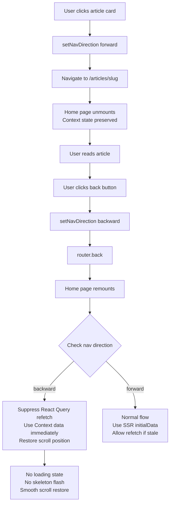

# Plan: Fix Home Page Re-render When Returning from Article Detail

## Problem

When navigating from the home page (`/`) to an article detail page (`/articles/[slug]`) and then returning via `router.back()`, the home page **re-renders completely** — losing scroll position, showing a brief loading/skeleton state, and re-fetching data.

## Root Cause Analysis

The current architecture has a **KeepAlive mechanism** via [`HomePageStateProvider`](../apps/frontend-blog/src/lib/providers/HomePageStateProvider.tsx) that lives in [`[locale]/layout.tsx`](../apps/frontend-blog/src/app/[locale]/layout.tsx:191). This provider persists across route changes because the layout stays mounted. However, there are **three distinct issues** that cause the perceived re-render:

### Issue 1: `AnimatePresence mode="wait"` causes full component unmount/remount

[`PageTransition`](../apps/frontend-blog/src/components/PageTransition.tsx:81) wraps children with:
```tsx
<AnimatePresence mode="wait" initial={false}>
  <motion.div key={pathname}>
    {children}
  </motion.div>
</AnimatePresence>
```

When `pathname` changes from `/` to `/articles/slug`, the home page component fully unmounts. When navigating back, it fully remounts. While the Context state survives, **all local component state is reset**:
- `initialSeedDone` ref resets to `false`
- `selectedCategoryId` re-initialized from URL params
- Scroll tracking refs reset

### Issue 2: React Query refetch on re-mount

When [`HomePageClientContent`](../apps/frontend-blog/src/app/[locale]/page.client.tsx:57) re-mounts, [`useFrontendArticles`](../apps/frontend-blog/src/app/[locale]/page.client.tsx:172) re-initializes. Even though React Query cache may still be fresh (5min `staleTime`), the `queryFn` is async and tries IndexedDB first. If the cache was garbage collected (default `gcTime` is 5min), it triggers a network fetch, causing a loading state.

Additionally, the **SSR `initialData` prop** is passed fresh from the server component on every navigation. This `initialData` is used by React Query, potentially overriding the cached data or causing a hydration mismatch between SSR data and the accumulated Context data.

### Issue 3: Scroll position restoration timing

The scroll restoration effect at [`page.client.tsx:212`](../apps/frontend-blog/src/app/[locale]/page.client.tsx:212) depends on `allArticles.length > 0`. On re-mount, `allArticles` is populated from Context (non-empty), so the effect runs. However, the DOM may not be fully painted yet, and `requestAnimationFrame` may not be sufficient to wait for images to load. The scroll position can appear "jumpy" — briefly at top, then jumping to saved position.

## Solution Architecture

### Approach: Navigation-Direction-Aware KeepAlive Enhancement

Rather than restructuring the entire page architecture (which would be too invasive), we'll enhance the existing KeepAlive mechanism to be **navigation-direction-aware**. When the user navigates **backward** (article → home), we suppress refetching and loading states. When navigating **forward** (home → article), behavior remains unchanged.



### Detailed Changes

#### Change 1: Add `isBackNavigation` to HomePageStateProvider

**File:** [`apps/frontend-blog/src/lib/providers/HomePageStateProvider.tsx`](../apps/frontend-blog/src/lib/providers/HomePageStateProvider.tsx)

Add a new state field `isBackNavigation` that tracks whether the current mount is a backward navigation (returning from article detail). This flag is set by the home page component on mount when it detects backward navigation.

```typescript
interface HomePageState {
  allArticles: FrontendArticle[];
  page: number;
  isInitialCategory: boolean;
  isBackNavigation: boolean;  // NEW
  
  setAllArticles: ...;
  setPage: ...;
  setIsInitialCategory: ...;
  setIsBackNavigation: (v: boolean) => void;  // NEW
  resetState: () => void;
}
```

#### Change 2: Detect backward navigation on home page mount

**File:** [`apps/frontend-blog/src/app/[locale]/page.client.tsx`](../apps/frontend-blog/src/app/[locale]/page.client.tsx)

In the seed effect (line 94-114), add detection of backward navigation by checking `sessionStorage` for the `homeNavigatedTo` flag (already set in the scroll save effect at line 164). If the flag exists and contains `/articles/`, set `isBackNavigation = true`.

```typescript
useEffect(() => {
  // ... existing seed logic ...
  
  // NEW: Detect backward navigation from article detail
  const navigatedTo = sessionStorage.getItem('homeNavigatedTo');
  if (navigatedTo?.includes('/articles/')) {
    setIsBackNavigation(true);
  }
  
  // Clean up session storage
  sessionStorage.removeItem('homeScrollY');
  sessionStorage.removeItem('homeNavigatedTo');
}, []);
```

#### Change 3: Skip SSR initialData on backward navigation

**File:** [`apps/frontend-blog/src/app/[locale]/page.client.tsx`](../apps/frontend-blog/src/app/[locale]/page.client.tsx)

Modify the `useFrontendArticles` call to skip passing `initialData` when `isBackNavigation` is true. This prevents React Query from using fresh SSR data that might differ from the accumulated Context data.

```typescript
const { data, isLoading, error, refetch, isFetching } = useFrontendArticles({
  page,
  pageSize: PAGE_SIZE,
  categoryId: selectedCategoryId,
  // Only use SSR initialData for forward navigation or fresh load
  initialData: !isBackNavigation && isInitialCategory ? initialData : undefined,
  queryKeyPrefix: 'homeArticles',
});
```

#### Change 4: Suppress loading state during backward navigation

**File:** [`apps/frontend-blog/src/app/[locale]/page.client.tsx`](../apps/frontend-blog/src/app/[locale]/page.client.tsx)

When `isBackNavigation` is true and `allArticles` already has data, suppress the loading skeleton and error states. The articles from Context should be displayed immediately.

```typescript
// Skip skeleton/loading states when returning from article detail
if (isBackNavigation && allArticles.length > 0) {
  // Don't show skeleton — data is already in Context
} else if (isLoading && !hasInitialData && !hasCurrentData) {
  return <HomePageSkeleton />;
}
```

#### Change 5: Improve scroll restoration with `useLayoutEffect`

**File:** [`apps/frontend-blog/src/app/[locale]/page.client.tsx`](../apps/frontend-blog/src/app/[locale]/page.client.tsx)

Replace the `useEffect` for scroll restoration with `useLayoutEffect` to ensure scroll position is set **before** the browser paints. Also add a `MutationObserver` fallback to wait for images to load before scrolling.

```typescript
import { useLayoutEffect } from 'react';

// Use useLayoutEffect for scroll restoration to avoid flash of wrong position
useLayoutEffect(() => {
  if (allArticles.length > 0 && isBackNavigation) {
    const savedScrollY = sessionStorage.getItem('homeScrollY');
    if (savedScrollY) {
      // Immediate scroll to prevent flash
      window.scrollTo(0, Number(savedScrollY));
    }
  }
}, [allArticles, isBackNavigation]);
```

#### Change 6: Reset `isBackNavigation` after mount

**File:** [`apps/frontend-blog/src/app/[locale]/page.client.tsx`](../apps/frontend-blog/src/app/[locale]/page.client.tsx)

After the backward navigation is handled (articles displayed, scroll restored), reset `isBackNavigation` to `false` so subsequent interactions (category switch, load more) work normally.

```typescript
useEffect(() => {
  if (isBackNavigation) {
    // Reset after a short delay to ensure smooth transition
    const timer = setTimeout(() => setIsBackNavigation(false), 100);
    return () => clearTimeout(timer);
  }
}, [isBackNavigation, setIsBackNavigation]);
```

### Files to Modify

| File | Changes |
|------|---------|
| [`apps/frontend-blog/src/lib/providers/HomePageStateProvider.tsx`](../apps/frontend-blog/src/lib/providers/HomePageStateProvider.tsx) | Add `isBackNavigation` state and `setIsBackNavigation` to context |
| [`apps/frontend-blog/src/app/[locale]/page.client.tsx`](../apps/frontend-blog/src/app/[locale]/page.client.tsx) | Detect backward nav, skip SSR initialData, suppress loading, improve scroll restoration |

### Files NOT Modified

- [`apps/frontend-blog/src/app/[locale]/layout.tsx`](../apps/frontend-blog/src/app/[locale]/layout.tsx) — No changes needed; provider already wraps children correctly
- [`apps/frontend-blog/src/components/PageTransition.tsx`](../apps/frontend-blog/src/components/PageTransition.tsx) — Animation behavior is fine; we work around the unmount/remount
- [`apps/frontend-blog/src/components/blog/ArticleCard.tsx`](../apps/frontend-blog/src/components/blog/ArticleCard.tsx) — No changes needed
- [`apps/frontend-blog/src/lib/hooks/useFrontendArticles.ts`](../apps/frontend-blog/src/lib/hooks/useFrontendArticles.ts) — No changes needed; hook behavior is correct
- [`apps/frontend-blog/src/app/[locale]/articles/[slug]/page.client.tsx`](../apps/frontend-blog/src/app/[locale]/articles/[slug]/page.client.tsx) — No changes needed

### Edge Cases Considered

1. **Direct URL entry to home page** (no backward navigation): `sessionStorage` won't have `homeNavigatedTo`, so `isBackNavigation` stays `false`. Normal flow.

2. **Browser back button vs. custom back button**: Both trigger `popstate` event. The `homeNavigatedTo` sessionStorage flag is set by the scroll save effect on unmount, which runs for both cases.

3. **Forward navigation after returning**: After `isBackNavigation` is reset, category switches and load more work normally.

4. **Long absence (>5min)**: If user spends >5min on article page, React Query cache may be garbage collected. With `isBackNavigation`, we skip `initialData` but the `queryFn` will still run. However, the IndexedDB fallback in `useFrontendArticles` should provide instant data. The loading state suppression ensures no skeleton flash.

5. **Multiple back/forward navigations**: The `isBackNavigation` flag resets after each backward navigation, so subsequent navigations work correctly.

6. **Category filter active when navigating away**: `selectedCategoryId` is re-initialized from URL search params on re-mount. Since the URL is preserved during SPA navigation, the category filter state is restored correctly.

## Verification Steps

1. Navigate home → article → back → verify no loading flash
2. Navigate home → article → back → verify scroll position restored
3. Navigate home → article → back → verify articles are immediately visible
4. Navigate home → article → back → switch category → verify normal behavior
5. Navigate home → article → back → load more → verify normal behavior
6. Direct URL entry to home → verify normal first-load behavior
7. Hard refresh on home → verify normal SSR behavior
