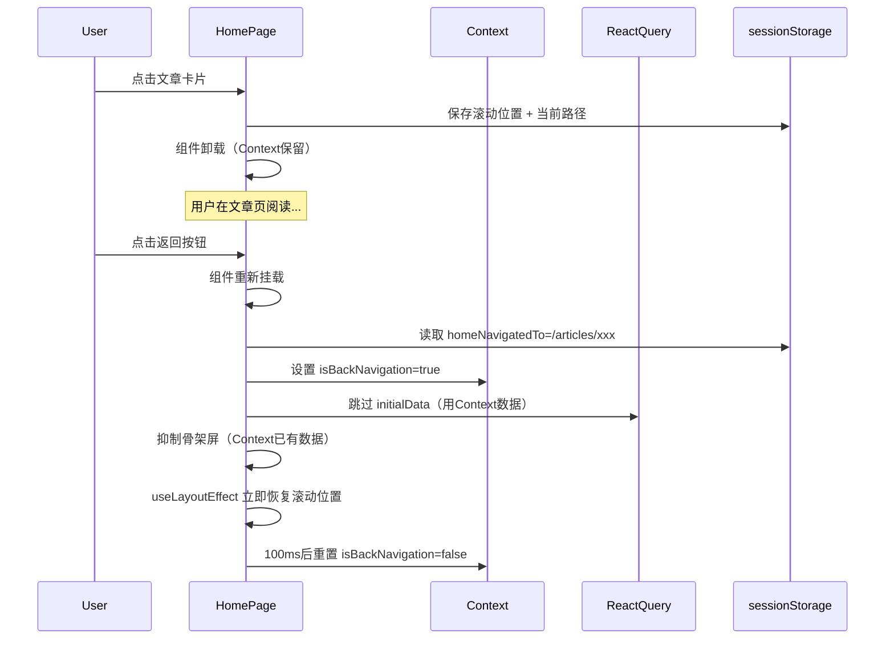
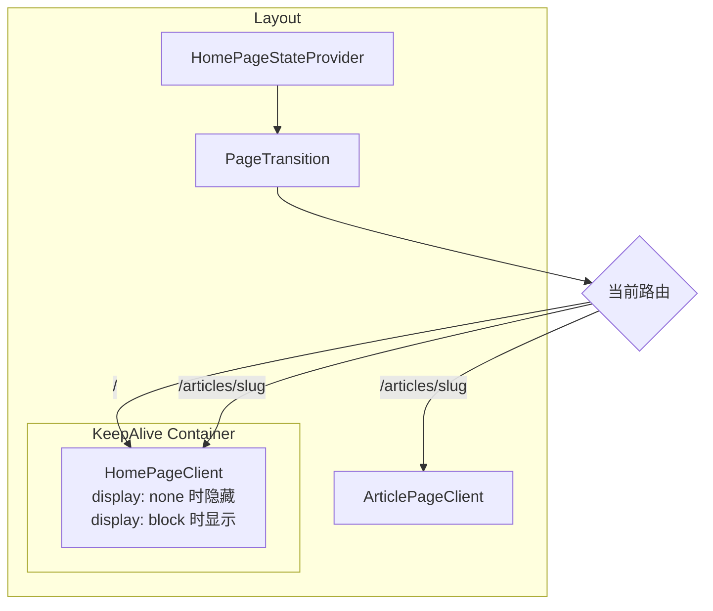

# KeepAlive 机制详解

## 当前架构

```
[locale]/layout.tsx
├── Header
├── Sidebar
├── <main>
│   └── <HomePageStateProvider>        ← ① 状态提供者（保持挂载）
│       └── <PageTransition>           ← ② 动画包装器
│           └── {children}             ← ③ 页面内容（会卸载/重挂）
│               ├── 首页时: <HomePageClient>
│               └── 文章时: <ArticlePageClient>
└── BottomNavigation
```

### 已经做到的 KeepAlive（Context 级别）

[`HomePageStateProvider`](apps/frontend-blog/src/lib/providers/HomePageStateProvider.tsx) 放在 layout 层，它包裹着 `{children}`。当从首页导航到文章详情时：

- **Layout 保持挂载** ✅ → Provider 保持挂载 → Context 状态（`allArticles`、`page`）**保留**
- **PageTransition 的 children 切换** ❌ → 首页组件卸载，文章组件挂载 → **组件内所有局部状态丢失**

### 为什么还会重新渲染

虽然 Context 保留了文章数据，但组件重新挂载时：

1. **`initialSeedDone` ref 重置** → seed effect 重新运行（但条件判断 `allArticles.length > 0` 阻止了重复填充）
2. **React Query 重新初始化** → 检查缓存是否过期，可能触发网络请求
3. **SSR initialData 重新传入** → 服务端组件重新 fetch 数据，通过 props 传入
4. **滚动位置丢失** → 需要从 sessionStorage 恢复

## 方案对比

### 方案 A：我的方案 — 导航方向感知增强（推荐）

不改动组件挂载/卸载架构，而是让重挂载过程对用户**无感知**：



**优点**：改动小（只改2个文件）、风险低、不影响现有逻辑
**缺点**：组件仍然会重挂载，只是让用户感知不到

### 方案 B：真正的 DOM KeepAlive（更彻底但更复杂）

让首页组件在导航到文章详情时**不卸载**，而是隐藏：



**实现方式**：在 layout 层用一个包装组件，根据当前路由决定是否渲染首页：

```tsx
// 在 layout.tsx 中
function PageShell({ children }: { children: React.ReactNode }) {
  const pathname = usePathname();
  const isHomePage = pathname === `/${locale}` || pathname === `/${locale}/`;
  
  return (
    <>
      {/* 首页始终保持挂载，导航到文章时隐藏 */}
      <div style={{ display: isHomePage ? 'block' : 'none' }}>
        <HomePageClient ... />
      </div>
      {/* 文章页正常渲染 */}
      {!isHomePage && children}
    </>
  );
}
```

**优点**：真正的 KeepAlive，DOM 不卸载，滚动位置、组件状态、图片加载状态全部保留
**缺点**：
- 需要重构 layout 结构，把首页组件提升到 layout 层
- 首页和文章页会同时存在于 DOM 中（内存开销）
- 与 `PageTransition` 动画冲突（需要改造动画逻辑）
- 需要处理首页数据更新问题（长时间在文章页，首页数据可能过时）
- 改动较大，影响面广

## 推荐方案 A 的原因

| 维度 | 方案 A（方向感知） | 方案 B（DOM KeepAlive） |
|------|-------------------|----------------------|
| 改动文件数 | 2个 | 4-5个 |
| 代码复杂度 | 低 | 高 |
| 风险 | 低 | 中（可能引入新 bug） |
| 内存占用 | 正常 | 较高（双页面 DOM） |
| 与 PageTransition 兼容 | ✅ 完全兼容 | ❌ 需要改造 |
| 数据新鲜度 | ✅ 返回时可选择刷新 | ❌ 可能显示过时数据 |
| 用户体验效果 | 几乎无感知 | 完全无感知 |

你觉得哪种方案更合适？如果选方案 A，我切换到 Code 模式来实现。
