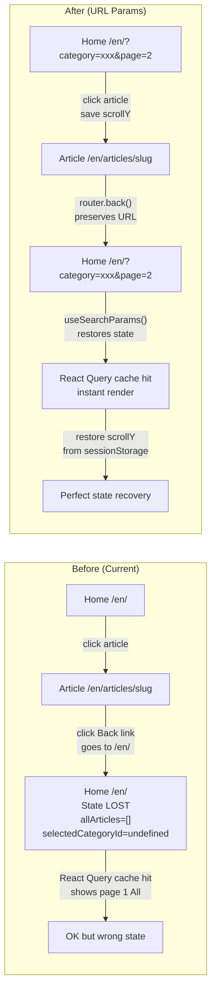

# Plan: Preserve Home Page State via URL Search Params

## Goal

When navigating from the blog home page (article list) to an article detail page, and then clicking "Back", the home page should preserve:
- Selected category filter tab
- Current page number
- Scroll position

## Architecture



## Files to Modify

### 1. `apps/frontend-blog/src/app/[locale]/page.client.tsx`

The main changes. All in one file.

#### Change A: Add imports

```typescript
import { useSearchParams, useRouter } from 'next/navigation';
```

#### Change B: Initialize state from URL search params

Replace:
```typescript
const [selectedCategoryId, setSelectedCategoryId] = useState<string | undefined>(undefined);
const [page, setPage] = useState(1);
```

With:
```typescript
const searchParams = useSearchParams();
const router = useRouter();

const [selectedCategoryId, setSelectedCategoryId] = useState<string | undefined>(
  searchParams.get('category') || undefined,
);
const [page, setPage] = useState(
  (() => {
    const p = searchParams.get('page');
    return p ? Math.max(1, Number(p)) : 1;
  })(),
);
```

#### Change C: Sync state to URL (one-way, with loop prevention)

Add this `useEffect` after the state declarations:

```typescript
// Sync filter state → URL search params (one-way, prevents loop)
useEffect(() => {
  const params = new URLSearchParams(searchParams.toString());

  if (selectedCategoryId) {
    params.set('category', selectedCategoryId);
  } else {
    params.delete('category');
  }

  if (page > 1) {
    params.set('page', String(page));
  } else {
    params.delete('page');
  }

  const newSearch = params.toString();
  const currentSearch = searchParams.toString();

  // Only update if actually changed (prevents infinite loop)
  if (newSearch !== currentSearch) {
    router.replace(`?${newSearch}`, { scroll: false });
  }
}, [selectedCategoryId, page, searchParams, router]);
```

#### Change D: Save scroll position on unmount (navigation away)

```typescript
// Save scroll position when navigating away from home page
useEffect(() => {
  return () => {
    sessionStorage.setItem('homeScrollY', String(window.scrollY));
  };
}, []);
```

#### Change E: Restore scroll position after articles render

```typescript
// Restore scroll position after articles are rendered
useEffect(() => {
  if (allArticles.length > 0) {
    const savedScrollY = sessionStorage.getItem('homeScrollY');
    if (savedScrollY) {
      // Use requestAnimationFrame to ensure DOM is fully painted
      requestAnimationFrame(() => {
        window.scrollTo(0, Number(savedScrollY));
        sessionStorage.removeItem('homeScrollY');
      });
    }
  }
}, [allArticles]);
```

#### Change F: Wrap component with Suspense (required by useSearchParams)

The component using `useSearchParams()` needs a Suspense boundary. The cleanest way is to split into a wrapper + content component within the same file:

```typescript
import { Suspense } from 'react';

// Wrapper with Suspense boundary
export default function HomePageClient(props: HomePageClientProps) {
  return (
    <Suspense fallback={<HomePageSkeleton />}>
      <HomePageClientContent {...props} />
    </Suspense>
  );
}

// Rename existing component to HomePageClientContent
function HomePageClientContent({
  initialData,
  ...props
}: HomePageClientProps) {
  // ... all existing logic stays here, with useSearchParams + useRouter added
}
```

### 2. `apps/frontend-blog/src/app/[locale]/articles/[slug]/page.client.tsx`

#### Change: Use router.back() for the "Back" button

Replace the `<Link>` back button with a `<button>` that uses `router.back()`:

```typescript
import { useRouter } from 'next/navigation';

// Inside the component:
const router = useRouter();

// Replace the Link back button:
<button
  onClick={() => router.back()}
  className="inline-flex items-center gap-2 text-sm text-gray-500 dark:text-gray-400 hover:text-primary transition-colors"
>
  <ArrowLeft className="h-4 w-4" />
  {tc('backToArticles') || 'Back to Articles'}
</button>
```

This ensures that when the user clicks back, the browser navigates to the previous URL which includes the search params (e.g., `/en/?category=xxx&page=2`).

#### Fallback for direct entry

If the user lands directly on the article page (no history from home page), `router.back()` would leave the site. Add a fallback using `window.history.length`:

```typescript
const handleBack = useCallback(() => {
  if (window.history.length > 1) {
    router.back();
  } else {
    router.push(`/${locale}`);
  }
}, [router, locale]);
```

## Data Flow Summary

```
User Action                          URL                        State
─────────────────────────────────────────────────────────────────────────
Initial load                         /en/                       All, page 1
Select category "Tech"               /en/?category=tech         Tech, page 1
Load more articles                   /en/?category=tech&page=2  Tech, page 2
Click article → detail page          /en/articles/some-slug     (scroll saved)
Click Back (router.back())           /en/?category=tech&page=2  Tech, page 2 ← RESTORED!
                                      ↳ React Query cache hit → instant render
                                      ↳ sessionStorage scrollY → restore position
```

## Potential Risks & Mitigations

| Risk | Mitigation |
|------|-----------|
| Infinite loop: state ↔ URL | `newSearch !== currentSearch` check before `router.replace()` |
| SSR mismatch: server renders page 1, client has page 2 | React Query cache serves instant data, no visual flash |
| `useSearchParams()` hydration warning | `<Suspense>` boundary wrapping the component |
| `router.back()` leaves site for direct entries | `window.history.length` check + fallback to `router.push()` |
| Scroll restore fires before articles render | `useEffect` depends on `allArticles.length > 0` |

## Verification Steps

1. Load home page → URL should be clean (`/en/`)
2. Select a category tab → URL should update (`/en/?category=xxx`)
3. Load more articles → URL should update (`/en/?category=xxx&page=2`)
4. Click an article → navigate to detail page
5. Scroll down the article
6. Click "Back" → should return to home page with same category, same page
7. Scroll position should be preserved (near the article you clicked)
8. Click "All" tab → URL should remove `category` param
9. Refresh the page → URL params should be read correctly
