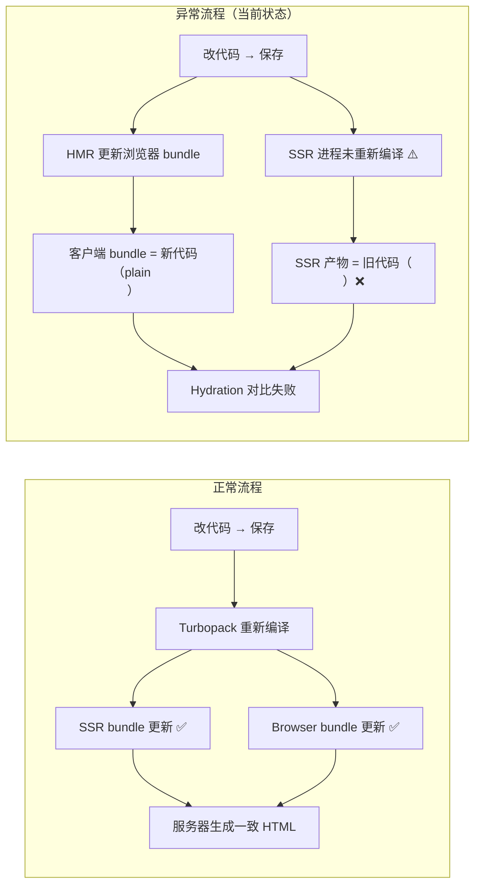

# About Page Hydration Error — 根因分析与修复方案

## 1. 错误现象

当访问 `/en/about` 时，React 18/19 报告 hydration mismatch：

```
` 组件的专属产物**。普通 `` 永远不会生成这些属性。

- **服务器 HTML** 没有 `data-nimg` → SSR 使用当前代码（plain `` 分支）
- **客户端虚拟 DOM** 有 `data-nimg="fill"` → 客户端 bundle 使用旧代码（Next.js `<Image>` 分支）

**结论：SSR 进程和浏览器 bundle 使用了不同的编译产物。**

### 2.2 为什么会发生

Next.js 的 Turbopack 对 `'use client'` 组件会生成两个编译产物：

| 产物         | 运行位置 | 用途                 |
| ------------ | -------- | -------------------- |
| SSR bundle   | Node.js  | 服务端渲染生成 HTML  |
| Browser bundle | 浏览器   | 客户端水合接管 DOM  |

当代码变更时（比如从 `<Image>` 改为 ``）：
1. **HMR** 会更新浏览器中的 bundle
2. **SSR 进程**可能没有同步重新编译
3. 如果 dev server 重启不彻底（子进程存活），旧缓存会污染新编译



### 2.3 为什么清除缓存有时不生效

查看当前的 [`dev-clean.sh`](../apps/frontend-blog/scripts/dev-clean.sh)：

```bash
pkill -f "next dev"           # 杀主进程
rm -rf .next .turro node_modules/.cache  # 删缓存
```

**问题：** `pkill -f "next dev"` 杀死主进程后，Turbopack 的子进程（文件监听器、编译 worker）可能残留在内存中。这些子进程继续持有旧的编译模块缓存。当新 `next dev` 启动时，Turbopack 从这些残存的 worker 进程中恢复缓存 → 仍然是旧编译产物。

## 3. 修复方案（三层防御）

### Layer 1：彻底清除进程 + 缓存

**修改 [`dev-clean.sh`](../apps/frontend-blog/scripts/dev-clean.sh)**：
- 使用 `pkill -9 -f "next"` 强制杀死所有相关进程
- 增加 `sleep 3` 等待进程完全释放
- 新增清除 `node_modules/.cache` 的内容

**手动执行命令（如果 dev-clean.sh 不生效）：**

```bash
# 1. 强制杀死所有 node 进程（谨慎：会影响其他项目）
pkill -9 -f "next" 2>/dev/null; sleep 3

# 2. 删除所有缓存
rm -rf apps/frontend-blog/.next apps/frontend-blog/.turbo apps/frontend-blog/node_modules/.cache
rm -rf apps/frontend-blog/.next

# 3. 重启
yarn workspace @lucky/frontend-blog dev
```

### Layer 2：代码修复 — 给 plain `` 添加 `suppressHydrationWarning`

**修改 [`BlurhashImage.tsx`](../apps/frontend-blog/src/components/blog/BlurhashImage.tsx)**：

1. **给 plain `` 添加 `suppressHydrationWarning`**（第 182-207 行）
   - 当前 fill 分支的 `` 没有 `suppressHydrationWarning`
   - 添加后，即使 server/client bundle 不一致，React 也不会报错

2. **给外层 wrapper `<div>` 添加 `suppressHydrationWarning`**（第 169 行）
   - 双重防护

```tsx
// 修改前（约第 182-207 行）：


// 修改后：

```

### Layer 3：消除双代码路径（可选加固）

当前组件有两个渲染分支（`fill ? img : Image`）。如果 server/client bundle 不同步，不同分支会产生完全不同的 HTML 结构（`` vs `<Image>` → `` + data 属性）。

**方案：将 `<Image>` 分支也改为 plain ``**，统一使用 `getOptimizedImageUrl` 生成 URL。

但注意：这样会失去 Next.js `<Image>` 的自动 `srcSet` 响应式优化。如果该图像的显示尺寸固定（如 About 头像 256px），影响不大。

**评估**：Layer 2 的 `suppressHydrationWarning` 已经足够防御 bundle 不同步问题。Layer 3 作为可选加固，优先级较低。

## 4. 修改文件清单

| 文件 | 修改内容 | 优先级 |
|------|---------|--------|
| [`apps/frontend-blog/src/components/blog/BlurhashImage.tsx`](../apps/frontend-blog/src/components/blog/BlurhashImage.tsx) | 给 `` 元素添加 `suppressHydrationWarning` | P0 |
| [`apps/frontend-blog/src/components/blog/BlurhashImage.tsx`](../apps/frontend-blog/src/components/blog/BlurhashImage.tsx) | 给 wrapper `<div>` 添加 `suppressHydrationWarning` | P0 |
| [`apps/frontend-blog/scripts/dev-clean.sh`](../apps/frontend-blog/scripts/dev-clean.sh) | 增强进程杀死逻辑（`pkill -9` + 更长的等待） | P1 |

## 5. 验证步骤

1. 执行修复后，运行完整的清除流程
2. 打开 `http://localhost:3000/en/about`
3. 打开浏览器控制台（F12）
4. 确认没有 hydration mismatch 警告
5. 确认 AboutFounderAvatar 头像正常显示
6. 刷新页面 3-5 次，确认错误不复发

## 6. 预防：更新 Hydration 指南

在 [`docs/HYDRATION_MISMATCH_GUIDE.md`](../docs/HYDRATION_MISMATCH_GUIDE.md) 中添加一条案例记录：

| 问题 | 根因 | 修复方式 | 文件 |
|------|------|---------|------|
| `AboutFounderAvatar` 的 `` data-nimg/srcSet 属性不同 | Turbopack server/client bundle 不同步，导致 fill 分支 plain `` vs `<Image>` 不一致 | `suppressHydrationWarning` 防御 + 增强 dev-clean.sh 杀死进程逻辑 | `BlurhashImage.tsx` + `dev-clean.sh` |
