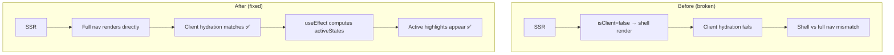
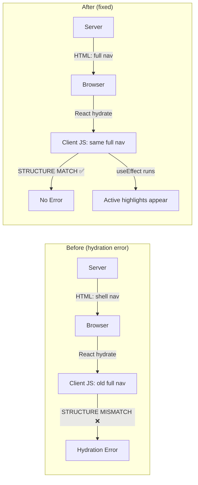

# Hydration Error Fix: BottomNavigation SSR/CSR Mismatch

## Problem

Hydration error on homepage (`/en/`) traced to [`BottomNavigation.tsx`](../apps/frontend-blog/src/components/BottomNavigation.tsx).

### Error Diff

```
Server (expected):
  <nav style="padding-bottom: env(safe-area-inset-bottom, 0px)">
    <div class="h-14" />

Client (actual):
  <nav>                                            ← missing style
    <div>
      <div style="height: var(--safe-area-bottom)">  ← extra spacer
```

### Root Cause

The component uses a **dual-render pattern** with `isClient` state to avoid rendering browser-dependent content during SSR:

```tsx
// Line 14-15
const [isClient, setIsClient] = useState(false);

// Line 125-126
useEffect(() => {
  setIsClient(true);
```

**SSR renders** (lines 247-256): A hydration-safe shell with `<div className="h-14" />`
**Client re-renders** (lines 362-451): Full nav with items, different `<div>` structure

**The problem:** The server HTML and client-first-render HTML are structurally different:

- Server `<div className="h-14" />` (self-closing, no children, one class)
- Client `<div className="h-14 px-4 flex items-center justify-around">` (children, 4 classes)
- Server `<nav>` has `style` → client `<nav>` does NOT (according to error diff)

This structural mismatch causes React hydration to fail.

But looking at the **current code**, BOTH branches have identical `<nav>` with the same `style`. The error diff shows a `<div style="height: var(--safe-area-bottom)">` spacer that was **removed** in the previous refactor (see [`bottom-nav-refactor.md`](./bottom-nav-refactor.md)). This means the **client-side JavaScript bundle is stale** — the browser is loading old compiled JS while the server generates fresh HTML.

### Why Cache Clearing Didn't Help

The user deleted `.next/` directory but:

1. The old `next dev` process (Turbopack) wasn't fully killed — it holds an **in-memory compilation cache**
2. Turbopack can recreate `.next/` files from its in-memory cache after deletion
3. The `dev-clean.sh` script only kills port 3000, but other Node.js children may survive

## Solution

### Approach: Eliminate the Dual-Render Pattern Entirely

The `isClient` guard is unnecessary here. The nav items (SVG icons, labels) are **static React elements** that render identically on server and client. The only client-dependent logic is:

- `activeStates` — computed from `pathname`, only affects the **active highlight** (cosmetic)
- `useTranslations()` — works fine during SSR via next-intl

**Strategy:** Always render the full nav structure on both server and client. Use a single `useEffect` (post-hydration) to compute active states. No `isClient` guard, no SSR shell.



### Changes Required

#### 1. [`BottomNavigation.tsx`](../apps/frontend-blog/src/components/BottomNavigation.tsx)

| Change                           | Lines   | Description                               |
| -------------------------------- | ------- | ----------------------------------------- |
| Remove `isClient` state          | 14-15   | No longer needed                          |
| Keep `activeStates` state        | 13      | Still needed for post-hydration highlight |
| Remove `!isClient` shell branch  | 247-256 | Delete the SSR shell                      |
| Keep the full nav return         | 362-451 | This becomes the ONLY render path         |
| Keep `setActiveStates` useEffect | 125-238 | Still runs post-hydration                 |

**Before** (simplified):

```tsx
export default function BottomNavigation() {
  const [isClient, setIsClient] = useState(false);
  // ...
  useEffect(() => {
    setIsClient(true); /* calc activeStates */
  }, [pathname]);

  if (isDeepPage) return null;
  if (!isClient) return <nav shell />; // ← hydration mismatch source
  return <nav full />;
}
```

**After** (simplified):

```tsx
export default function BottomNavigation() {
  // isClient removed
  useEffect(() => {
    /* calc activeStates */
  }, [pathname]);

  if (isDeepPage) return null;
  return <nav full />; // ← always same structure
}
```

#### 2. [`globals.css`](../apps/frontend-blog/src/app/globals.css)

No changes needed. The CSS `:has()` rules and variable chain will continue working since the nav structure is unchanged for the client view.

#### 3. Child pages (`articles/[slug]`, `categories/[slug]`, `tags/[slug]`)

No changes needed. The `data-no-nav` attribute approach from [`bottom-nav-refactor.md`](./bottom-nav-refactor.md) was already implemented.

## Verification

1. **TypeScript check**: `yarn workspace @lucky/frontend-blog type-check`
2. **Kill ALL Node.js processes**: `pkill -f "next dev"` or use Activity Monitor
3. **Full cache clean**: `rm -rf apps/frontend-blog/.next node_modules/.cache`
4. **Restart dev**: `yarn workspace @lucky/frontend-blog dev`
5. **Test in incognito**: Open `/en/` in private window, check console for hydration errors
6. **Verify nav renders**: Confirm nav items display with correct active states

## Edge Cases

| Scenario                        | Expected Behavior                                                  |
| ------------------------------- | ------------------------------------------------------------------ |
| Homepage `/en/`                 | Full nav, home icon active after hydration                         |
| Category page `/en/categories`  | Full nav, categories icon active                                   |
| Child page `/en/articles/slug`  | Nav returns null, `data-no-nav` triggers CSS                       |
| SPA navigation (home → article) | Nav hides via `isDeepPage`, CSS adjusts padding                    |
| Slow network / JS not loaded    | Server renders full nav HTML, visible immediately                  |
| iOS Safari safe-area            | `env(safe-area-inset-bottom)` on `<nav>` works identically SSR/CSR |

## Mermaid: Before vs After



## Implementation Order

| #   | Step                                  | File                                                                                        | Detail                                                   |
| --- | ------------------------------------- | ------------------------------------------------------------------------------------------- | -------------------------------------------------------- |
| 1   | Remove `isClient` state               | [`BottomNavigation.tsx:14-15`](../apps/frontend-blog/src/components/BottomNavigation.tsx)   | Delete `const [isClient, setIsClient] = useState(false)` |
| 2   | Remove `setIsClient(true)`            | [`BottomNavigation.tsx:126`](../apps/frontend-blog/src/components/BottomNavigation.tsx)     | Delete from the useEffect                                |
| 3   | Delete SSR shell branch               | [`BottomNavigation.tsx:247-256`](../apps/frontend-blog/src/components/BottomNavigation.tsx) | Remove the entire `if (!isClient) { return ... }` block  |
| 4   | Move `isDeepPage` guard before return | [`BottomNavigation.tsx:242-244`](../apps/frontend-blog/src/components/BottomNavigation.tsx) | Keep as-is, it precedes the full nav return              |
| 5   | Force-kill all dev processes          | Terminal                                                                                    | `pkill -f "next dev"`                                    |
| 6   | Clean caches                          | Terminal                                                                                    | `rm -rf apps/frontend-blog/.next node_modules/.cache`    |
| 7   | Restart & verify                      | Terminal + Browser                                                                          | `yarn workspace @lucky/frontend-blog dev`                |
