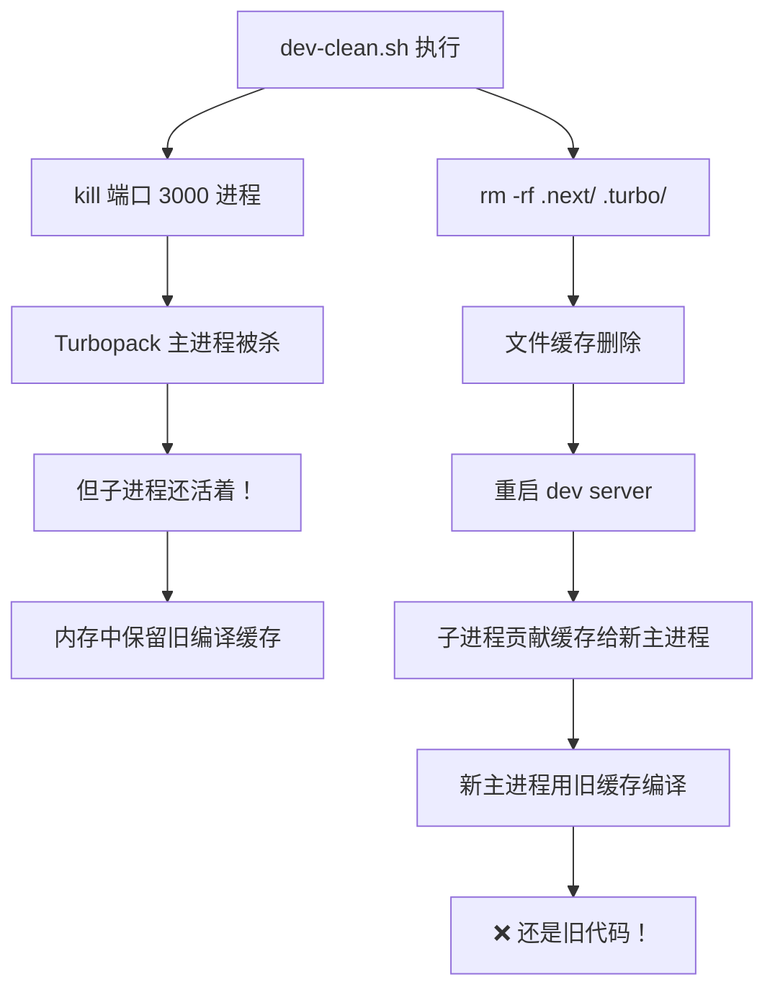
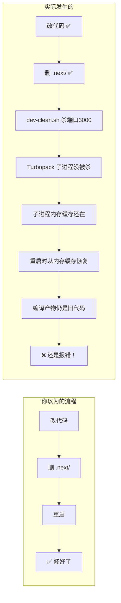

# BottomNavigation Hydration Error — 根因分析

## 1. 错误现象

打开 `/en/` 首页时，React 报 hydration mismatch：

```
Server (SSR 生成的 HTML):
  <nav style="padding-bottom: env(safe-area-inset-bottom, 0px)">
    <div className="h-14" />          ← 只有 h-14，空的，没有子元素
  </nav>

Client (浏览器 JS 渲染):
  <div className="h-14 px-4 flex items-center justify-around">  ← 类名不同！
    <div style="cursor:pointer" tabindex="0">  ← 5个导航项
    <div style="cursor:pointer" tabindex="0">
    <div style="cursor:pointer" tabindex="0">
    <a href="/en/bookmarks/">
    <div style="cursor:pointer" tabindex="0">
  </div>
```

**关键差异：**

- Server 的 `<div>` 只有 `className="h-14"`（无子元素）
- Client 的 `<div>` 有 `className="h-14 px-4 flex items-center justify-around"`（有5个子元素）

React hydration 要求 SSR HTML 和客户端首次渲染**完全一致**，否则报错。

---

## 2. 根源：Turbopack 缓存了旧代码

### 2.1 当前源代码已经修好了

查看 [`BottomNavigation.tsx`](../apps/frontend-blog/src/components/BottomNavigation.tsx) 当前代码：

```tsx
// 第 347 行：只有一个渲染路径，没有 isClient 判断
return (
  <nav className="..." style={{ paddingBottom: "env(...)" }}>
    <div className="h-14 px-4 flex items-center justify-around">
      {" "}
      ← 始终渲染完整结构
      {navItems.map((item) => {
        // 完整的5个导航项
      })}
    </div>
  </nav>
);
```

**没有** `isClient` 状态，**没有** SSR 空壳分支，Server 和 Client 应该渲染**完全相同**的 HTML。

### 2.2 那为什么 Server 还是渲染空的 `<div className="h-14">` ？

因为 **Turbopack（Next.js 的开发服务器）内存中缓存了旧的编译产物**。

旧代码的结构是（参考 [`hydration-error-bottom-nav.md`](./hydration-error-bottom-nav.md) 记录的旧代码）：

```tsx
// ❌ 旧代码（已从源码删除，但 Turbopack 缓存中还在）
const [isClient, setIsClient] = useState(false);
useEffect(() => {
  setIsClient(true);
}, []);

if (!isClient) {
  return (
    <nav>
      <div className="h-14" />
    </nav>
  ); // ← SSR 空壳
}
return (
  <nav>
    <div className="h-14 px-4 flex ...">...</div>
  </nav>
); // ← 客户端完整渲染
```

这就是 Server HTML 中 `<div className="h-14" />` 的来源——它是旧代码中 `isClient=false` 时渲染的空壳。

### 2.3 为什么清过 `.next/` 没用？

之前的操作：删了 `.next/` 目录，用 `dev-clean.sh` 重启。

三个问题：

1. **`dev-clean.sh` 只杀端口 3000 的进程**（[`dev-clean.sh:14`](../apps/frontend-blog/scripts/dev-clean.sh:14)：`lsof -ti:3000`）
   - Turbopack 可能 spawn 子进程，不监听 3000 端口，杀不掉
   - 子进程存活 → 内存中的编译缓存存活

2. **没删 `node_modules/.cache/`**
   - 某些 loader/plugin 的缓存在这里
   - 删了 `.next/` 后 Turbopack 可能从这里恢复

3. **Turbopack 内部有内存缓存**
   - 即使删了文件，如果进程没完全杀掉，内存中的 AST/模块图还在
   - 重启时从内存恢复，不重新编译



---

## 3. 组件依赖链分析

```
BottomNavigation.tsx
├── NavLink (AnimatedLink.tsx)
│   └── motion.div (framer-motion)
│       ├── style={{ cursor: 'pointer' }}   ← SSR/CSR 一致
│       ├── tabindex="0"                     ← 仅客户端添加！
│       └── suppressHydrationWarning         ← 压制警告但不修复根源
│       └── Link (@/navigation)
│           └── next-intl createNavigation
│               └── usePathname() ← SSR/CSR 一致（next-intl 保证）
├── ProtectedLink (auth/ProtectedLink.tsx)
│   └── Link (@/navigation)
│       └── useAuth() → isAuthenticated ← SSR 时为 false
└── motion.div layoutId="bottom-nav-active"  ← 仅 active 时渲染
```

### 3.1 `AnimatedLink` 的潜在风险

[`AnimatedLink.tsx:66-76`](../apps/frontend-blog/src/components/AnimatedLink.tsx:66)：

```tsx
<motion.div
  initial={false}
  whileHover={{ scale: 1.05 }}
  whileTap={{ scale: 0.95 }}
  style={{ cursor: 'pointer' }}
  suppressHydrationWarning    // ← 掩盖了 tabindex 差异！
>
  <Link ...>{children}</Link>
</motion.div>
```

- SSR 时 `motion.div` 渲染为普通 `<div style="cursor:pointer">`
- 客户端 framer-motion 水合后添加 `tabindex="0"`（手势处理器需要键盘可访问性）
- `suppressHydrationWarning` 压制了 React 警告，但**不修复 HTML 差异**
- 如果父级 HTML 结构完全一致，这个差异通常不致命；但配合旧缓存就放大了问题

### 3.2 `ProtectedLink` 分析

[`ProtectedLink.tsx:39-82`](../apps/frontend-blog/src/components/auth/ProtectedLink.tsx:39)：

```tsx
<Link href={href} onClick={handleClick} className={className} prefetch={false}>
  {children}
</Link>
```

- 直接渲染 `Link` 组件（无额外包装层）
- SSR 安全：`onClick` 在 SSR 时只是字符串属性，客户端水合后绑定事件
- `isAuthenticated` 在 SSR 时为 false，但 `handleClick` 中的 `isProtectedRoute` 检查只在用户点击时执行

---

## 4. 修复方案

### 步骤 1：彻底清除缓存（治本）

```bash
# 杀掉所有 Next.js/Turbopack 进程（不只是 3000 端口）
pkill -f "next dev"

# 等2秒确保进程完全退出
sleep 2

# 删除所有缓存
rm -rf apps/frontend-blog/.next
rm -rf apps/frontend-blog/.turbo
rm -rf apps/frontend-blog/node_modules/.cache

# 重启
yarn workspace @lucky/frontend-blog dev
```

### 步骤 2：加固 `dev-clean.sh`（防止复发）

修改 [`dev-clean.sh`](../apps/frontend-blog/scripts/dev-clean.sh)，将：

```bash
# 旧：只杀 3000 端口
PID=$(lsof -ti:3000 2>/dev/null || true)
```

改为：

```bash
# 新：杀所有 next dev 进程
pkill -f "next dev" 2>/dev/null || true
sleep 2
```

并在 Step 2 增加 `node_modules/.cache` 的删除。

### 步骤 3：合并重复的 `navItems` 数组

[`BottomNavigation.tsx`](../apps/frontend-blog/src/components/BottomNavigation.tsx) 中 `navItems` 定义了两次：

- 第 127-229 行：在 `useEffect` 中计算 `activeStates`
- 第 243-345 行：在 `return` 中渲染

两份内容**完全相同**，合并为一份，放在组件顶部。

### 步骤 4（可选）：加固 `AnimatedLink`

如果清除缓存后仍有 hydration 警告，考虑将 `motion.div` 的 `style={{cursor:'pointer'}}` 改为 CSS class，避免 framer-motion 客户端添加的 `tabindex` 属性导致差异。

---

## 5. 为什么"改了一天"还没好



**每一步源代码改动都是对的**，但 Turbopack 的进程没被杀干净，一直在用旧的编译结果。

---

## 6. 验证方法

清除缓存重启后，在浏览器 incognito 窗口打开 `/en/`：

1. **F12 → Console**：不应该有红色的 hydration error
2. **View Page Source**（Ctrl+U）：应该能看到完整的 5 个导航项 HTML（不是空的 `<div class="h-14">`）
3. **React DevTools**：Server 和 Client 的组件树应该一致
