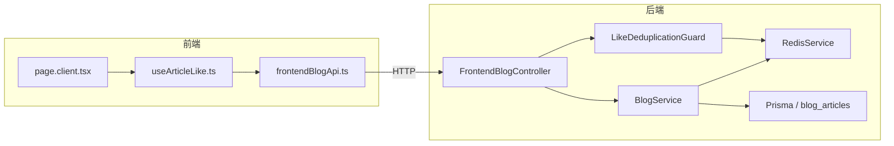

# Like (点赞) 功能实施计划

## 概述
为博客添加点赞功能，遵循现有的 `addBookmark` 模式（后端 Controller + Service → 前端 API + Hook）。

后端 `BlogService` 中已有 `likeArticle()` / `unlikeArticle()` / `checkLikeStatus()` 方法，
`LikeDeduplicationGuard` 也已存在但未使用。需要将它们连接起来。

---

## 步骤 1：后端 — 实现 `checkLikeStatus` 指纹检查

**文件：** [`apps/api/src/blog/blog.service.ts`](apps/api/src/blog/blog.service.ts:1794)

当前 `checkLikeStatus()` 只是返回 `{ liked: false }` 的存根。需要注入 `RedisService` 并实际检查 Redis 中的指纹键是否存在。

```typescript
// 改动点：
// 1. 在 BlogService constructor 中注入 RedisService
// 2. checkLikeStatus() 中生成同样的指纹（复用 LikeDeduplicationGuard 的算法）
//    并检查 Redis 中是否存在该键
// 3. 返回 { liked: boolean }
```

---

## 步骤 2：后端 — 在 FrontendBlogController 中添加点赞路由

**文件：** [`apps/api/src/blog/frontend/frontend-blog.controller.ts`](apps/api/src/blog/frontend/frontend-blog.controller.ts)

新增 3 个端点（注意使用 `:slug` 匹配 `BlogService` 的方法签名）：

| 端点 | 方法 | Guard | 说明 |
|---|---|---|---|
| `POST /frontend/blog/articles/:slug/like` | `likeArticle(slug)` | `LikeDeduplicationGuard` | 点赞（带去重） |
| `POST /frontend/blog/articles/:slug/unlike` | `unlikeArticle(slug)` | 无 | 取消点赞 |
| `GET /frontend/blog/articles/:slug/like-status` | `checkLikeStatus(slug)` | 无 | 检查点赞状态 |

由于 `FrontendBlogController` 已经注入了 `BlogService`，只需要添加方法，无需额外注入。

**注意：** `LikeDeduplicationGuard` 需要取 `request.params.slug`，所以端点参数名必须是 `slug`。

---

## 步骤 3：后端 — 在 BlogModule 中注册 LikeDeduplicationGuard

**文件：** [`apps/api/src/blog/blog.module.ts`](apps/api/src/blog/blog.module.ts)

```typescript
// 改动点：
// 1. 导入 RedisModule（从 @api/common/redis 或类似路径）
// 2. 在 providers 数组中添加 LikeDeduplicationGuard
```

检查 `RedisService` 的暴露方式——它可能已经是全局的或在 `RedisModule` 中提供。

---

## 步骤 4：前端 — 添加点赞相关类型

**文件：** [`apps/frontend-blog/src/lib/types/frontend-blog.ts`](apps/frontend-blog/src/lib/types/frontend-blog.ts)

```typescript
// 新增类型：
export interface LikeResponse {
  likeCount: number;
}

export interface LikeStatusResponse {
  liked: boolean;
}
```

`FrontendArticle` 已经包含 `likes: number` 字段，无需修改。

---

## 步骤 5：前端 — 在 frontendBlogApi 中添加点赞 API 函数

**文件：** [`apps/frontend-blog/src/lib/api/frontendBlogApi.ts`](apps/frontend-blog/src/lib/api/frontendBlogApi.ts)

```typescript
// 新增方法（遵循 addBookmark 模式）：
likeArticle: (slug: string) =>
  http.post<LikeResponse>(`/v1/frontend/blog/articles/${slug}/like`),

unlikeArticle: (slug: string) =>
  http.post<LikeResponse>(`/v1/frontend/blog/articles/${slug}/unlike`),

checkLikeStatus: (slug: string) =>
  http.get<LikeStatusResponse>(`/v1/frontend/blog/articles/${slug}/like-status`),
```

---

## 步骤 6：前端 — 创建 useArticleLike Hook

**文件：** [`apps/frontend-blog/src/lib/hooks/useArticleLike.ts`](apps/frontend-blog/src/lib/hooks/useArticleLike.ts)（新建）

遵循 [`useComments.ts`](apps/frontend-blog/src/lib/hooks/useComments.ts) 的 `useMutation` 模式：

```typescript
// 导出：
// 1. useArticleLikeStatus(slug) — useQuery，获取点赞状态
// 2. useLikeArticle(slug) — useMutation，执行点赞/取消点赞
//    - 带乐观更新：立即更新缓存中的 likeCount
//    - onSuccess: 更新 likeStatus 缓存
//    - onError: 回滚乐观更新 + Toast 提示
```

---

## 步骤 7：可选 — UI 集成

**文件：** [`apps/frontend-blog/src/app/[locale]/articles/[slug]/page.client.tsx`](apps/frontend-blog/src/app/[locale]/articles/[slug]/page.client.tsx)

在文章详情页添加点赞按钮，集成 `useArticleLike` hook。

---

## 架构图



---

## 文件改动清单

| # | 文件 | 改动类型 | 说明 |
|---|---|---|---|
| 1 | `apps/api/src/blog/blog.service.ts` | 修改 | 实现 `checkLikeStatus()` 指纹检查 |
| 2 | `apps/api/src/blog/frontend/frontend-blog.controller.ts` | 修改 | 添加 3 个 like 端点 |
| 3 | `apps/api/src/blog/blog.module.ts` | 修改 | 注册 LikeDeduplicationGuard |
| 4 | `apps/frontend-blog/src/lib/types/frontend-blog.ts` | 修改 | 添加 LikeResponse / LikeStatusResponse |
| 5 | `apps/frontend-blog/src/lib/api/frontendBlogApi.ts` | 修改 | 添加 likeArticle/unlikeArticle/checkLikeStatus |
| 6 | `apps/frontend-blog/src/lib/hooks/useArticleLike.ts` | 新建 | 点赞 mutation + status query hook |
