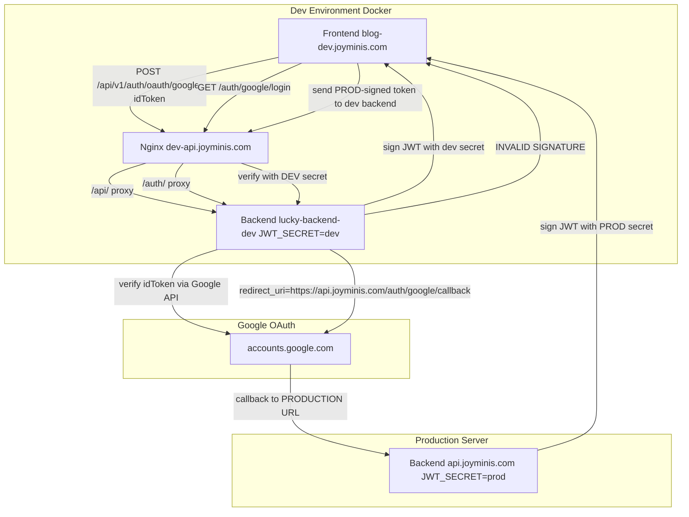

# JWT `invalid signature` Root Cause Analysis & Fix Plan

## Current Situation

The user is running a **Docker development environment** (`docker compose --env-file deploy/.env.dev up`) and getting `invalid signature` errors on freshly issued JWT tokens. The error occurs on both `accessToken` and `refreshToken`.

## Root Cause

There are **two separate issues** causing JWT `invalid signature`:

---

### Issue 1: `GOOGLE_REDIRECT_URI` points to PRODUCTION in dev env

**File:** [`deploy/.env.dev`](../deploy/.env.dev:156)

```env
GOOGLE_REDIRECT_URI=https://api.joyminis.com/auth/google/callback
```

This is the **production** API domain. In dev environment, it should point to the dev API domain.

#### How this causes `invalid signature`:

1. User clicks "Login with Google" on `blog-dev.joyminis.com`
2. The frontend redirects to `GET /auth/google/login` on the **dev backend** (via nginx dev proxy)
3. The dev backend constructs a Google OAuth URL with `redirect_uri=https://api.joyminis.com/auth/google/callback` (production!)
4. User authenticates with Google
5. Google redirects to `https://api.joyminis.com/auth/google/callback` — **production server**
6. The **production** server exchanges the code, gets user info, calls `authService.loginWithOauth()`, and issues JWT tokens signed with **PROD `JWT_SECRET`**
7. The production server redirects back to the frontend with tokens signed by PROD secret
8. Frontend stores these tokens and sends them to the **dev** backend (via nginx dev proxy)
9. Dev backend tries to verify with **DEV `JWT_SECRET`** → `invalid signature`!

**Dev `JWT_SECRET`:** `your-super-secret-jwt-key-change-in-production`
**Prod `JWT_SECRET`:** `k8Tz4vQm9XpL2wNj7Hc6YfRd0AeS5bUi3oMgKxJn1BrW8yCqDlFhEtGsPaZuVOI`

These are completely different, so any token signed by production will fail verification in dev.

---

### Issue 2: The `oauth-deeplink.controller.ts` uses `ConfigService` for `GOOGLE_REDIRECT_URI` but the `auth.module.ts` uses `process.env.JWT_SECRET` directly

**File:** [`apps/api/src/client/auth/oauth-deeplink.controller.ts`](../apps/api/src/client/auth/oauth-deeplink.controller.ts:61-63)

```typescript
const redirectUriConfig = this.configService.get<string>(
  'GOOGLE_REDIRECT_URI',
  'https://api.luna.com/auth/google/callback',
);
```

This reads from `ConfigService` which loads from `.env` file. The default fallback `https://api.luna.com/auth/google/callback` is a placeholder domain that was never updated.

**File:** [`apps/api/src/client/auth/auth.module.ts`](../apps/api/src/client/auth/auth.module.ts:22-24)

```typescript
JwtModule.register({
  secret: process.env.JWT_SECRET || 'please_change_me_very_secret',
})
```

This reads `process.env` directly at module initialization time. In Docker, `JWT_SECRET` is injected via `env_file` before Node.js starts, so this works correctly. But it's inconsistent with the rest of the codebase which uses `ConfigService`.

---

## The Two Google Login Flows

### Flow A: Client-side (Google One Tap / Credential Manager) — ✅ Works

```
Frontend (JS) → Google Identity Services → gets idToken
Frontend → POST /api/v1/auth/oauth/google { idToken }
Backend verifies idToken via Google API → issues JWT
```

This flow works because the frontend directly calls the dev backend's `POST /auth/oauth/google` endpoint. The idToken is verified by Google's servers, and the JWT is signed by the dev backend with dev `JWT_SECRET`.

### Flow B: Server-side redirect (OAuth Deep Link) — ❌ Broken

```
Frontend → GET /auth/google/login → 302 to Google
User authenticates → Google redirects to GOOGLE_REDIRECT_URI
GOOGLE_REDIRECT_URI = https://api.joyminis.com/auth/google/callback (PRODUCTION!)
Production server exchanges code → issues JWT with PROD secret
Production server redirects back to frontend with PROD-signed tokens
Frontend stores tokens → sends to dev backend → invalid signature!
```

---

## Fix Plan

### Fix 1: Update `GOOGLE_REDIRECT_URI` in dev env

**File:** [`deploy/.env.dev`](../deploy/.env.dev:156)

Change:
```env
GOOGLE_REDIRECT_URI=https://api.joyminis.com/auth/google/callback
```
To:
```env
GOOGLE_REDIRECT_URI=https://dev-api.joyminis.com/auth/google/callback
```

Also update the other redirect URIs:
```env
FACEBOOK_REDIRECT_URI=https://dev-api.joyminis.com/auth/facebook/callback
APPLE_REDIRECT_URI=https://dev-api.joyminis.com/auth/apple/callback
```

**Why `dev-api.joyminis.com`?** Looking at [`nginx/nginx.dev.conf`](../nginx/nginx.dev.conf:26), the dev nginx server_name includes `dev-api.joyminis.com`, and the `/auth/` location block (line 160-173) proxies to the dev backend. So `dev-api.joyminis.com/auth/google/callback` will correctly route to the dev backend.

### Fix 2: Update the default fallback in `oauth-deeplink.controller.ts`

**File:** [`apps/api/src/client/auth/oauth-deeplink.controller.ts`](../apps/api/src/client/auth/oauth-deeplink.controller.ts:63)

Change the default fallback from the placeholder `https://api.luna.com` to something more meaningful, or remove the default entirely so it fails fast if not configured:

```typescript
const redirectUriConfig = this.configService.get<string>(
  'GOOGLE_REDIRECT_URI',
);
```

Same for Facebook (line 100) and Apple (line 137).

### Fix 3 (Optional): Use `ConfigService` in `auth.module.ts` for consistency

**File:** [`apps/api/src/client/auth/auth.module.ts`](../apps/api/src/client/auth/auth.module.ts:22-24)

Currently uses `process.env.JWT_SECRET` directly. While this works in Docker (env vars are injected before Node.js starts), it's inconsistent. Consider using `ConfigModule.forFeature()` or `JwtModule.registerAsync()` with `ConfigService`:

```typescript
JwtModule.registerAsync({
  useFactory: (config: ConfigService) => ({
    secret: config.get<string>('JWT_SECRET'),
  }),
  inject: [ConfigService],
})
```

However, this is a **lower priority** change since the current approach works correctly in Docker.

### Fix 4: Verify the Google OAuth Console configuration

The `GOOGLE_REDIRECT_URI` in the Google Cloud Console must match what's in the env file. For dev, the authorized redirect URI in Google Cloud Console should be:
- `https://dev-api.joyminis.com/auth/google/callback`

For production:
- `https://api.joyminis.com/auth/google/callback`

---

## Testing the Fix

1. Update `deploy/.env.dev` with the correct dev redirect URIs
2. Restart Docker containers: `docker compose --env-file deploy/.env.dev down && docker compose --env-file deploy/.env.dev up -d --build`
3. Test Google OAuth login on `blog-dev.joyminis.com`
4. Verify the callback goes to `dev-api.joyminis.com/auth/google/callback`
5. Verify the JWT token is signed with dev `JWT_SECRET` and can be verified by the dev backend

---

## Architecture Diagram



## Todo List

- [ ] Fix 1: Update `GOOGLE_REDIRECT_URI` in [`deploy/.env.dev`](../deploy/.env.dev:156) from `api.joyminis.com` to `dev-api.joyminis.com`
- [ ] Fix 2: Update `FACEBOOK_REDIRECT_URI` and `APPLE_REDIRECT_URI` in [`deploy/.env.dev`](../deploy/.env.dev:159,162) similarly
- [ ] Fix 3: Update default fallback URIs in [`oauth-deeplink.controller.ts`](../apps/api/src/client/auth/oauth-deeplink.controller.ts:63,100,137) to remove placeholder defaults
- [ ] Fix 4 (optional): Refactor [`auth.module.ts`](../apps/api/src/client/auth/auth.module.ts:22-24) to use `ConfigService` instead of `process.env`
- [ ] Restart Docker containers and verify the fix
