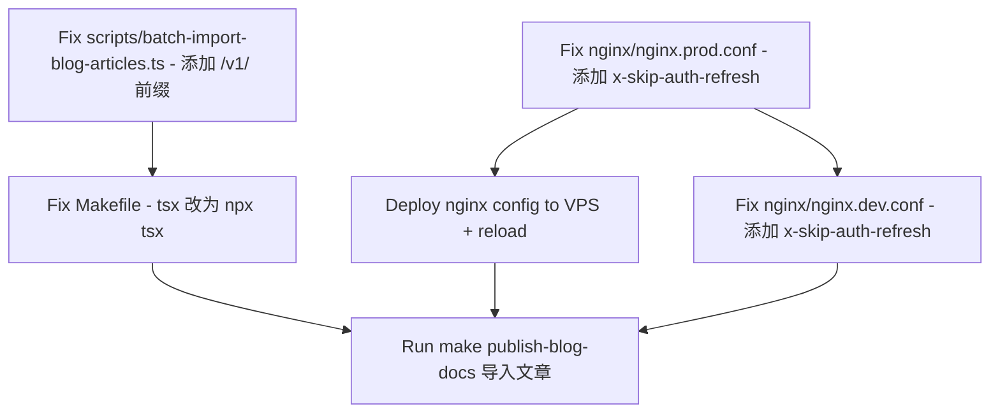

# 全面修复计划：Nginx CORS + 导入脚本 + Makefile

## 背景

线上 `admin.joyminis.com`（admin-next）和 `blog-admin.joyminis.com`（admin-blog）均无法登录，浏览器报 `AxiosError: Network Error`。经过全面分析，共发现 **3 个独立问题**，需一次性修复。

---

## 问题 1（CRITICAL — 阻塞登录）：Nginx CORS 响应缺少 `x-skip-auth-refresh` 头

### 根因

两个前端在登录、设置 Cookie、清除 Cookie 等请求中，都发送了自定义 HTTP 头 `x-skip-auth-refresh: '1'`：

- [`apps/admin-blog/src/api/index.ts:16`](../apps/admin-blog/src/api/index.ts:16) — `login()` 使用 `headers: { 'x-skip-auth-refresh': '1' }`
- [`apps/admin-blog/src/api/index.ts:28`](../apps/admin-blog/src/api/index.ts:28) — `setCookie()` 同样使用
- [`apps/admin-blog/src/api/index.ts:36`](../apps/admin-blog/src/api/index.ts:36) — `clearCookie()` 同样使用
- [`apps/admin-next/src/api/index.ts:550`](../apps/admin-next/src/api/index.ts:550) — `login()` 同样使用

浏览器发送跨域请求时，先发 `OPTIONS` 预检请求。Nginx 返回的 `Access-Control-Allow-Headers` 中**缺少 `x-skip-auth-refresh`**，因此浏览器（特别是 Safari/iPhone）**阻止实际的 POST 请求**，抛出 `Network Error`。

Nginx access log 证实了这一点：只有 `OPTIONS /api/v1/auth/admin/login` 返回 204，**没有任何 POST 请求到达服务器**。

### 需要修改的文件

#### [`nginx/nginx.prod.conf`](../nginx/nginx.prod.conf) — 2 个 location 块

**Location 1**：行 174 — `location ~ ^/api/v1/(frontend/blog|client/system-config)` 内的 OPTIONS 处理块

```nginx
# 当前（行 174）：
add_header Access-Control-Allow-Headers "DNT,User-Agent,X-Requested-With,If-Modified-Since,Cache-Control,Content-Type,Range,Authorization,x-lang,x-csrf-token,x-xsrf-token" always;

# 修复后：追加 x-skip-auth-refresh
add_header Access-Control-Allow-Headers "DNT,User-Agent,X-Requested-With,If-Modified-Since,Cache-Control,Content-Type,Range,Authorization,x-lang,x-csrf-token,x-xsrf-token,x-skip-auth-refresh" always;
```

**Location 2**：行 238 — `location /api/` 内的 OPTIONS 处理块，同上。

```nginx
# 当前（行 238）：
add_header Access-Control-Allow-Headers "DNT,User-Agent,X-Requested-With,If-Modified-Since,Cache-Control,Content-Type,Range,Authorization,x-lang,x-csrf-token,x-xsrf-token" always;

# 修复后：追加 x-skip-auth-refresh
add_header Access-Control-Allow-Headers "DNT,User-Agent,X-Requested-With,If-Modified-Since,Cache-Control,Content-Type,Range,Authorization,x-lang,x-csrf-token,x-xsrf-token,x-skip-auth-refresh" always;
```

#### [`nginx/nginx.dev.conf`](../nginx/nginx.dev.conf) — 1 个 location 块

**Location**：行 144-145 — `location /api/` 内的 OPTIONS 处理块

```nginx
# 当前（行 144-145）：
add_header Access-Control-Allow-Headers 'Authorization, Content-Type, X-Requested-With' always;

# 修复后：
add_header Access-Control-Allow-Headers 'Authorization, Content-Type, X-Requested-With, x-skip-auth-refresh' always;
```

---

## 问题 2：导入脚本 API URL 缺少 `/v1/` 前缀

### 根因

[`apps/api/src/main.ts:46`](../apps/api/src/main.ts:46) 启用了 URI 版本控制：
```typescript
app.enableVersioning({ type: VersioningType.URI, defaultVersion: '1' });
```

所有 API 路由必须在路径中包含 `/v1/`，但导入脚本在 5 处构造 URL 时都遗漏了。

### 需要修改的文件

#### [`scripts/batch-import-blog-articles.ts`](../scripts/batch-import-blog-articles.ts) — 5 处 URL

| 行号 | 当前代码 | 修复后 |
|------|---------|--------|
| 323 | ``${apiBase.replace(/\/+$/, "")}/auth/admin/login`` | ``${apiBase.replace(/\/+$/, "")}/v1/auth/admin/login`` |
| 371 | ``${apiBase.replace(/\/+$/, "")}/admin/blog/articles/slug/${...}`` | ``${apiBase.replace(/\/+$/, "")}/v1/admin/blog/articles/slug/${...}`` |
| 408 | ``${baseUrl}/admin/blog/tags?search=...`` | ``${baseUrl}/v1/admin/blog/tags?search=...`` |
| 430 | ``${baseUrl}/admin/blog/tags`` | ``${baseUrl}/v1/admin/blog/tags`` |
| 479 | ``${apiBase.replace(/\/+$/, "")}/admin/blog/articles`` | ``${apiBase.replace(/\/+$/, "")}/v1/admin/blog/articles`` |

---

## 问题 3：Makefile 使用 bare `tsx` 而非 `npx tsx`

### 根因

`tsx` CLI 不在系统 PATH 中，必须通过 `npx` 调用。

### 需要修改的文件

#### [`Makefile`](../Makefile:282) — 行 282

```makefile
# 当前：
tsx scripts/batch-import-blog-articles.ts

# 修复后：
npx tsx scripts/batch-import-blog-articles.ts
```

---

## 问题 4：部署 Nginx 配置到生产环境并重新加载

修改 `nginx/nginx.prod.conf` 后，需要将文件同步到 VPS 并重新加载 Nginx。

---

## 执行顺序



1. **先修复 Nginx（修复登录）** — 修改 prod + dev conf，部署到 VPS 并 reload
2. **修复导入脚本 + Makefile** — 修改 URL 和 tsx 调用
3. **验证生产登录恢复正常**
4. **运行导入脚本发布文章**

---

## 影响范围

| 问题 | 影响 | 严重程度 |
|------|------|---------|
| Nginx CORS 缺少 `x-skip-auth-refresh` | `admin.joyminis.com` 和 `blog-admin.joyminis.com` 完全无法登录 | 🔴 **CRITICAL** |
| 导入脚本缺少 `/v1/` | `make publish-blog-docs` 全部 API 调用失败 | 🟡 HIGH |
| Makefile bare `tsx` | 命令找不到 tsx，脚本无法运行 | 🟡 HIGH |
