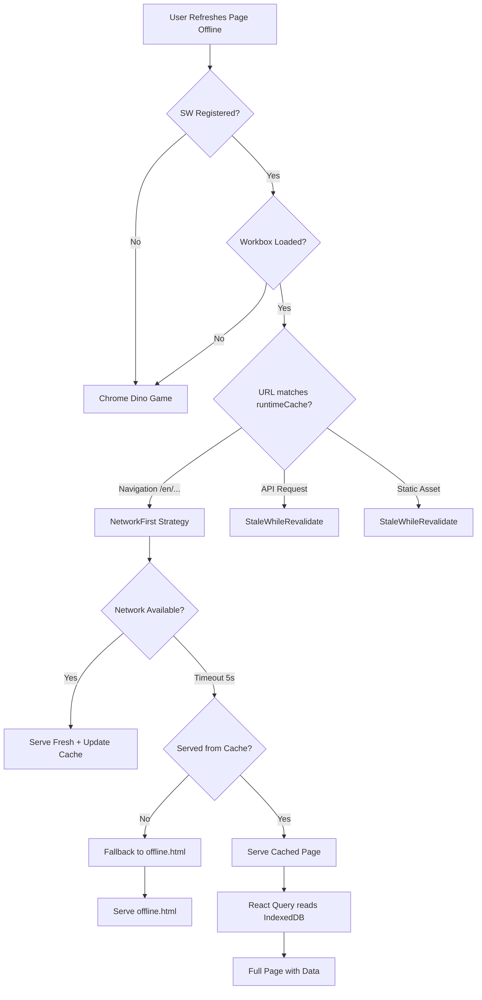

# Offline PWA Fix Plan

## Problem Summary

When offline, the blog pages (home, categories, tags, about) display correctly on first load but refreshing the page shows Chrome's offline dinosaur game.

## Current Architecture

The project already has comprehensive PWA infrastructure:

```
frontend-blog/
  next.config.ts          ← next-pwa configured with runtime caching rules
  public/
    sw.js                 ← Service Worker (but broken - dev build)
    offline.html          ← Custom offline fallback page (exists but unused)
    manifest*.json        ← PWA manifests for en/zh/ja/ko
    icons/                ← PWA icons
  src/
    components/pwa/
      InstallPrompt.tsx
      OfflineIndicator.tsx
      UpdateAvailable.tsx
    lib/db/
      db.ts               ← IndexedDB setup (Dexie)
      sync.ts             ← Local-First sync logic
    hooks/
      useFrontendArticles.ts ← Local-First with IndexedDB + React Query
      useOffline.ts
```

## Root Cause Analysis

### Problem 1: Missing Workbox Dependency
[`sw.js`](apps/frontend-blog/public/sw.js:70) references `./workbox-ac3cf707` but this file **does not exist** in [`public/`](apps/frontend-blog/public/). The SW loader tries to `importScripts()` this module and fails, causing the entire SW registration to abort.

### Problem 2: Development Build of Service Worker
The existing [`sw.js`](apps/frontend-blog/public/sw.js) is a **development build** with critical deficiencies:

| Feature | Current (dev build) | Expected (production) |
|---------|-------------------|----------------------|
| Precached assets | Dev-only files (`_next/static/development/...`) | Production JS/CSS chunks |
| Root URL `/` | NetworkFirst | NetworkFirst |
| Navigation `/en/`, `/zh/about/` | **NetworkOnly** (catch-all) | **NetworkFirst** with timeout |
| API requests | **NetworkOnly** | StaleWhileRevalidate |
| Images/fonts | **NetworkOnly** | StaleWhileRevalidate/CacheFirst |
| Offline fallback | None | Serve `offline.html` |

### Why Pages Show Initially But Fail on Refresh

```
Timeline:
1. [Online]  User visits /en/ → Page loads normally
2. [Online]  Browser caches page in bfcache (in-memory)
3. [Offline] User sees page → Still visible from bfcache ✓
4. [Offline] User refreshes → New navigation request
             → SW tries to handle request
             → workbox-*.js missing → SW registration fails
             → No cached response available
             → Chrome shows T-Rex dinosaur ❌
```

Note: The IndexedDB local-first strategy ([`useFrontendArticles.ts`](apps/frontend-blog/src/lib/hooks/useFrontendArticles.ts:76-88)) and [`sync.ts`](apps/frontend-blog/src/lib/db/sync.ts) work independently for data caching, but the **navigation HTML** itself is not cached by the SW, so even with IndexedDB data available, the page shell can't be served.

### GitIgnore Confirms Auto-Generation

[`.gitignore`](.gitignore:73-76) shows:
```
apps/frontend-blog/public/sw.js
apps/frontend-blog/public/workbox-*.js
apps/frontend-blog/public/workbox-*.js.br
```

These are supposed to be auto-generated by `next-pwa` during `next build`. The current `sw.js` appears to be a leftover from a previous dev run.

## Proposed Fix

### Plan Overview

**Goal**: Make the blog fully functional offline (page shell + data content).

**Strategy**: Fix the SW generation pipeline so `next-pwa` produces a proper production SW with all runtime caching rules from [`next.config.ts`](apps/frontend-blog/next.config.ts:16-115).

### Step 1: Clean Up Stale Artifacts

Delete the stale development SW artifacts from `public/`:
- `public/sw.js`
- Any `public/workbox-*.js` if they exist (currently missing)

These are gitignored and regenerated by `next-pwa` during build.

### Step 2: Add offline.html as Navigation Fallback

Modify [`next.config.ts`](apps/frontend-blog/next.config.ts) to add the `fallbacks` option to the PWA configuration:

```typescript
const withPWA = require('next-pwa')({
  dest: 'public',
  // ... existing config ...
  fallbacks: {
    document: '/offline.html',  // Serves offline.html for failed navigation requests
  },
  // ... runtimeCaching stays the same ...
});
```

This ensures that when offline navigation fails (network unavailable and no cache), the custom [`offline.html`](apps/frontend-blog/public/offline.html) is served instead of the Chrome dino.

### Step 3: Verify IndexedDB Local-First Works Offline

The existing IndexedDB local-first strategy is already solid:
- [`useFrontendArticles.ts`](apps/frontend-blog/src/lib/hooks/useFrontendArticles.ts:76-88) reads from IndexedDB first
- [`networkMode: 'offlineFirst'`](apps/frontend-blog/src/lib/hooks/useFrontendArticles.ts:94) allows React Query to work offline
- [`sync.ts`](apps/frontend-blog/src/lib/db/sync.ts) syncs data to IndexedDB when online

Once the SW properly caches navigation HTML (via `NetworkFirst` strategy), refreshing while offline will:
1. SW serves cached HTML page shell
2. React Query reads article data from IndexedDB
3. User sees full page content offline ✓

### Step 4: Rebuild and Deploy

Run the production build to regenerate SW:
```bash
cd apps/frontend-blog
NODE_ENV=production yarn build
```

This will generate:
- `public/sw.js` (with proper runtime caching rules)
- `public/workbox-<hash>.js` (Workbox library)

Then deploy normally.

### Step 5: Verify (Browser DevTools)

After deployment, verify in Chrome DevTools > Application > Service Workers:
1. SW is registered and active
2. Cache storage contains navigation pages
3. Test offline mode: Go to a page → DevTools > Network > Offline → Refresh → Page loads from cache

## Mermaid Diagram: Offline Request Flow



## Summary of Files to Modify

| File | Change |
|------|--------|
| [`apps/frontend-blog/public/sw.js`](apps/frontend-blog/public/sw.js) | Delete (will be regenerated) |
| [`apps/frontend-blog/next.config.ts`](apps/frontend-blog/next.config.ts) | Add `fallbacks: { document: '/offline.html' }` to PWA config |
| [`apps/frontend-blog/public/offline.html`](apps/frontend-blog/public/offline.html) | Update styling/messaging if desired (optional) |

## Key Insight

**This is NOT normal behavior** — the blog is designed for offline support (PWA + IndexedDB local-first), but the SW build is broken. Once the SW is properly rebuilt, refreshing while offline will serve cached pages with data from IndexedDB.
