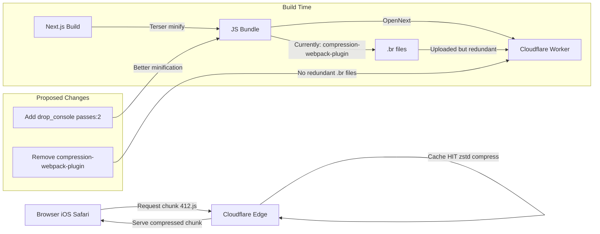

# Blog Frontend Compression Optimization Plan

## Current State Analysis

The public blog at [`blog.joyminis.com`](https://blog.joyminis.com) uses Cloudflare Workers via `@opennextjs/cloudflare`.

### What's Already Working ✅

| Feature | Status | Details |
|---------|--------|---------|
| Cloudflare edge compression (zstd) | ✅ | Response shows `content-encoding: zstd` — excellent modern compression |
| Terser minification | ✅ | `minimize: true`, `drop_debugger: true`, `pure_funcs` for console methods |
| Brotli pre-compression | ✅ | `compression-webpack-plugin` at level 11 (max) for JS/CSS/HTML/SVG >10KB |
| Next.js `optimizePackageImports` | ✅ | Tree-shaking for `@repo/ui`, `lucide-react`, `lodash`, etc. |
| `outputFileTracingExcludes` | ✅ | Excludes webpack/build tools from standalone output |
| Wrangler `minify: true` | ✅ | Worker script itself is minified |
| Static asset cache headers | ✅ | `max-age=31536000, immutable` for `/_next/static/*` |

### Issues Found ⚠️

1. **`compression-webpack-plugin` missing from `package.json`**
   - Imported at line 6 of [`apps/frontend-blog/next.config.ts`](apps/frontend-blog/next.config.ts:6)
   - NOT listed in [`apps/frontend-blog/package.json`](apps/frontend-blog/package.json) dependencies
   - May resolve transitively via monorepo, but is an undeclared dependency

2. **Brotli pre-compression is redundant on Cloudflare Workers**
   - [`compression-webpack-plugin`](apps/frontend-blog/next.config.ts:314-324) generates `.br` files that are uploaded to Cloudflare
   - But Cloudflare edge **re-compresses** assets automatically with zstd or Brotli
   - The pre-compressed `.br` files add ~10-30% more upload size with no benefit
   - Cloudflare's own compression is already optimal for the client

3. **Terser could be more aggressive**
   - Current config uses `pure_funcs` (specific console methods) but not `drop_console: true` (catches all)
   - No `passes: 2` (multi-pass compression can reduce further)
   - No `ecma: 5` or `module: true` optimizations
   - See [`apps/frontend-blog/next.config.ts`](apps/frontend-blog/next.config.ts:285-310)

## Proposed Actions

### Action 1: Add `compression-webpack-plugin` as explicit devDependency

**File**: [`apps/frontend-blog/package.json`](apps/frontend-blog/package.json)

Add `"compression-webpack-plugin": "^11.1.0"` to `devDependencies`.

### Action 2: Enhance TerserPlugin with aggressive options

**File**: [`apps/frontend-blog/next.config.ts`](apps/frontend-blog/next.config.ts:285-310)

Replace the current Terser config:
```js
compress: {
  ...plugin.options?.terserOptions?.compress,
  drop_debugger: true,
  pure_funcs: [
    'console.log',
    'console.info',
    'console.debug',
    'console.trace',
  ],
},
```

With:
```js
compress: {
  ...plugin.options?.terserOptions?.compress,
  drop_debugger: true,
  drop_console: true,
  passes: 2,
  pure_getters: true,
  unsafe: true,
  unsafe_math: true,
  unsafe_methods: true,
  booleans_as_integers: true,
  hoist_funs: true,
  hoist_props: true,
  reduce_vars: true,
  toplevel: true,
},
```

**Note**: `drop_console: true` replaces the need for `pure_funcs` for console methods.

### Action 3: Remove redundant Brotli pre-compression

**File**: [`apps/frontend-blog/next.config.ts`](apps/frontend-blog/next.config.ts:313-326)

Remove the `compression-webpack-plugin` block entirely. Cloudflare edge handles compression natively:
- zstd (for modern browsers) — already seen in the response
- Brotli (fallback)
- gzip (legacy fallback)

If we still want `compression-webpack-plugin`, keep it but understand it won't improve edge delivery.

### Action 4: Verify Tailwind CSS purge

**File**: [`apps/frontend-blog/tailwind.config.ts`](apps/frontend-blog/tailwind.config.ts)

With Tailwind v3, `purge`/`content` config determines which classes are kept. Verify that all source paths are covered and no unnecessary CSS is included.

### Action 5: Additional webpack optimizations (optional)

- **`ModuleConcatenationPlugin`** (Scope Hoisting) — already enabled by default in production mode in webpack 5
- **`CssMinimizerPlugin`** — if not already configured, can further reduce CSS size
- **Review large dependencies** — check if any large libraries (e.g., `framer-motion`, `react-syntax-highlighter`) are tree-shaken properly

## Expected Impact

| Metric | Before | After (estimated) |
|--------|--------|-------------------|
| Chunk 412 raw size | ~XX KB | ~5-15% smaller |
| Chunk 412 zstd wire size | ~XX KB | ~5-10% smaller |
| Build time | ~current | ~slightly longer (passes: 2) |
| Deployment size | ~current | ~10-30% smaller (no .br files) |
| Undeclared dependency | ⚠️ compression-webpack-plugin | ✅ explicitly listed |

## Files to Modify

1. [`apps/frontend-blog/package.json`](apps/frontend-blog/package.json) — add `compression-webpack-plugin`
2. [`apps/frontend-blog/next.config.ts`](apps/frontend-blog/next.config.ts) — enhance Terser, remove Brotli

## Mermaid Diagram: Request Flow



## Verification Steps

1. Run `yarn workspace @lucky/frontend-blog build` and verify no errors
2. Check that chunk sizes are reduced via build output
3. Deploy to preview environment and verify with browser DevTools
4. Confirm `content-encoding: zstd` still present in response headers
5. Compare Lighthouse performance scores
