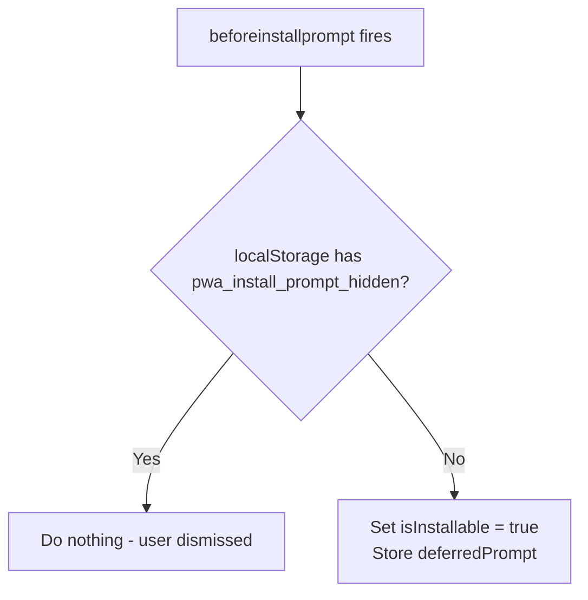
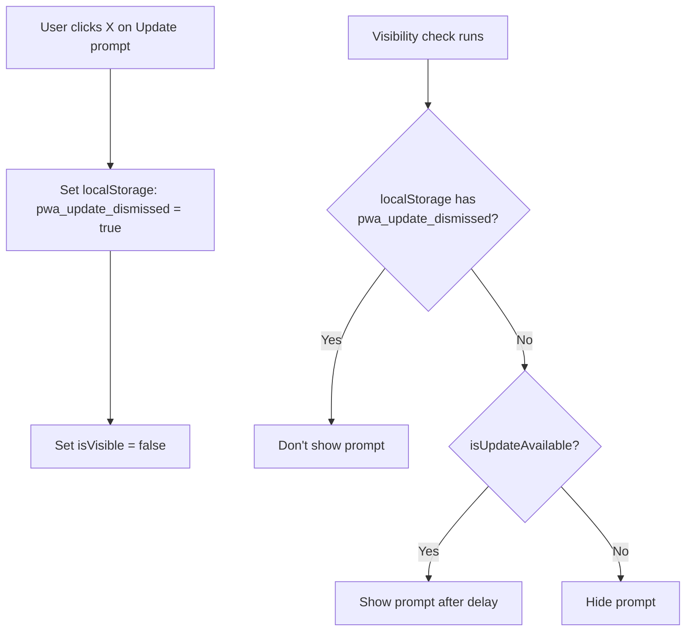
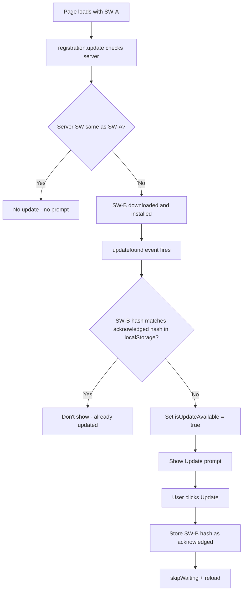

# PWA Bug Fix Plan

## Overview

Three PWA-related bugs reported on the frontend blog. All issues involve incorrect state management in the PWA UI components and hooks.

---

## Bug 1: "Don't show again" on InstallPrompt doesn't persist

### Root Cause

In [`usePWA.ts`](../apps/frontend-blog/src/hooks/usePWA.ts:46-59), the `beforeinstallprompt` event handler unconditionally sets `isInstallable = true`:

```ts
const handleBeforeInstallPrompt = (e: Event) => {
  e.preventDefault();
  setDeferredPrompt(e as BeforeInstallPromptEvent);
  setIsInstallable(true);  // <-- Always sets to true
};
```

The localStorage check in [`InstallPrompt.tsx`](../apps/frontend-blog/src/components/pwa/InstallPrompt.tsx:99-105) runs only once on mount:

```ts
useEffect(() => {
  const hidden = localStorage.getItem('pwa_install_prompt_hidden');
  if (hidden === 'true') {
    clearDeferredPrompt();  // Sets isInstallable = false
  }
}, []);
```

**Timing problem**: `beforeinstallprompt` fires AFTER mount, so even though the mount-time effect sets `isInstallable = false`, the event handler fires later and overrides it back to `true`.

### Fix Strategy

Add a localStorage check inside the `beforeinstallprompt` handler in [`usePWA.ts`](../apps/frontend-blog/src/hooks/usePWA.ts). Before setting `isInstallable = true`, check if the user has previously dismissed the prompt.

Additionally, add the same check in the `usePWA` hook's `showInstallPrompt` function so it also respects the dismissal.



---

## Bug 2: Close (X) button on UpdateAvailable doesn't close permanently

### Root Cause

In [`UpdateAvailable.tsx`](../apps/frontend-blog/src/components/pwa/UpdateAvailable.tsx:102-104), `handleDismiss` only sets `isVisible = false`:

```ts
const handleDismiss = () => {
  setIsVisible(false);  // <-- Only hides, doesn't prevent re-show
};
```

But the visibility `useEffect` ([line 71-83](../apps/frontend-blog/src/components/pwa/UpdateAvailable.tsx:71-83)) watches `isUpdateAvailable`:

```ts
useEffect(() => {
  if (!isUpdateAvailable) {
    setIsVisible(false);
    return;
  }
  const timer = setTimeout(() => {
    setIsVisible(true);  // <-- Re-shows after autoShowDelay (5000ms)!
  }, autoShowDelay);
  return () => clearTimeout(timer);
}, [isUpdateAvailable, autoShowDelay]);
```

Since `isUpdateAvailable` stays `true`, the prompt re-appears after 5 seconds.

### Fix Strategy

Make the dismiss permanent by:
1. Storing a `pwa_update_dismissed` flag in `localStorage` when the user clicks close
2. In the visibility effect, also check this localStorage flag before showing
3. When the user eventually clicks "Update" (reload), clear this flag so the next genuine update is shown



---

## Bug 3: Update prompt reappears after clicking "Update" + reload

### Root Cause

Multiple contributing factors:

1. **SW auto-activates**: The Workbox-generated [`sw.js`](../apps/frontend-blog/public/sw.js:1) calls `self.skipWaiting()` and `clientsClaim()` at the top level, so every new SW install immediately takes control.

2. **No `updatefound` event listener**: The [`usePWA` hook](../apps/frontend-blog/src/hooks/usePWA.ts:81-113) only checks `registration.waiting` on mount but doesn't listen for `updatefound` on the registration object, so reactive detection of new SW updates is missing.

3. **`registration.update()` re-triggers detection**: [`UpdateAvailable`'s effect](../apps/frontend-blog/src/components/pwa/UpdateAvailable.tsx:48-68) calls `checkForUpdates()` on mount which calls `registration.update()`. If the server returns a different SW content (common in dev with build hashes), it triggers another install cycle.

4. **No acknowledged flag**: After the user clicks "Update", there's no tracking that the current update was acknowledged, so any subsequent SW check that finds a "different" SW re-triggers the prompt.

### Fix Strategy

1. **Add `updatefound` listener** in `usePWA` hook to reactively detect new SW updates:
   - When `registration.update()` finds a new SW, the `updatefound` event fires
   - Listen for this event and set `isUpdateAvailable = true` only when `registration.waiting` is set

2. **Track acknowledged updates in localStorage**: When user clicks "Update", store the current SW version hash in localStorage. On subsequent checks, compare the new SW version hash against the acknowledged one. If they match, don't show the prompt.

3. **Clear acknowledged flag after genuine update cycle**: When a genuinely new update is found (different from the acknowledged one), clear the flag and show the prompt.



---

## Files to Modify

| File | Changes |
|------|---------|
| [`apps/frontend-blog/src/hooks/usePWA.ts`](../apps/frontend-blog/src/hooks/usePWA.ts) | 1. Add `updatefound` event listener on registration<br>2. Check localStorage in `beforeinstallprompt` handler<br>3. Export `swHash` or version tracking |
| [`apps/frontend-blog/src/components/pwa/UpdateAvailable.tsx`](../apps/frontend-blog/src/components/pwa/UpdateAvailable.tsx) | 1. Make dismiss permanent via localStorage<br>2. Track acknowledged updates in localStorage<br>3. Check dismissed flag in visibility effect |
| [`apps/frontend-blog/src/components/pwa/InstallPrompt.tsx`](../apps/frontend-blog/src/components/pwa/InstallPrompt.tsx) | 1. Remove redundant localStorage check (move to hook)<br>2. Simplify logic since hook handles it |
| [`apps/frontend-blog/src/types/pwa.ts`](../apps/frontend-blog/src/types/pwa.ts) | No changes needed |

---

## Detailed Implementation Steps

### Step 1: Fix `usePWA.ts` - Install prompt persistence + SW update detection

1. In the `beforeinstallprompt` handler, add a localStorage check:
   ```ts
   const handleBeforeInstallPrompt = (e: Event) => {
     e.preventDefault();
     const hidden = localStorage.getItem('pwa_install_prompt_hidden');
     if (hidden === 'true') return; // User dismissed, skip
     setDeferredPrompt(e as BeforeInstallPromptEvent);
     setIsInstallable(true);
   };
   ```

2. Add `updatefound` event listener on SW registration:
   - After getting the registration, add `registration.addEventListener('updatefound', ...)`
   - When `updatefound` fires, check `registration.waiting` and set `isUpdateAvailable = true`
   - Combine this with the existing `controllerchange` listener

3. Add `getSWVersionHash()` helper to compute a hash of the SW content for version comparison

### Step 2: Fix `UpdateAvailable.tsx` - Dismiss + update acknowledgment

1. Add localStorage keys:
   - `pwa_update_dismissed`: Set when user clicks X, check before showing
   - `pwa_update_acknowledged`: Set when user clicks Update, stores SW version hash

2. Modify `handleDismiss` to store dismissal timestamp:
   ```ts
   const handleDismiss = () => {
     localStorage.setItem('pwa_update_dismissed', Date.now().toString());
     setIsVisible(false);
   };
   ```

3. Modify visibility effect to check dismissed flag:
   - If `pwa_update_dismissed` exists and is recent (e.g., < 24h), don't show

4. Modify `handleUpdate` to store acknowledged hash:
   ```ts
   const handleUpdate = async () => {
     // ... existing code ...
     localStorage.setItem('pwa_update_acknowledged', swHash);
     // ... skipWaiting + reload ...
   };
   ```

### Step 3: Fix `InstallPrompt.tsx` - Clean up logic

1. Remove the standalone `useEffect` that checks localStorage (line 99-105), since this is now handled in the hook
2. The component just needs to listen to `isInstallable` from the hook, which already respects localStorage

---

## Verification

After implementation, verify:
1. [ ] `beforeinstallprompt` event does not override localStorage dismissal
2. [ ] Clicking X on UpdateAvailable permanently dismisses (or at least for 24h)
3. [ ] After clicking Update + reload, the prompt does not show again for the same SW version
4. [ ] A genuinely new SW update still shows the prompt
5. [ ] TypeScript compiles without errors
6. [ ] All existing PWA functionality (offline indicator, install prompt when not dismissed) still works
