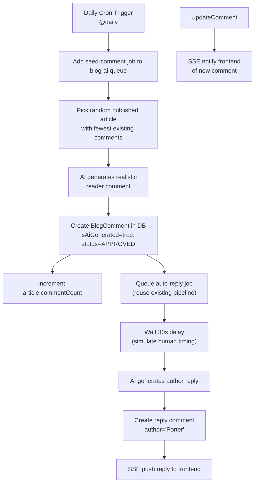

# Plan: Remove Published Date Display + AI Daily Comment Seeding

## Part 1: Remove Published Date Display from Blog Articles

### Background

The user wants to remove the published date display from blog articles on both the **admin blog** (internal management) and **frontend blog** (public-facing). The reasoning: showing dates makes older articles look outdated to visitors. The date should be hidden now but easily restorable later.

### Files to Modify

#### Frontend Blog (public-facing) — 5 files

| # | File | Lines | What to Change |
|---|------|-------|----------------|
| 1 | [`apps/frontend-blog/src/components/blog/ArticleCard.tsx`](../apps/frontend-blog/src/components/blog/ArticleCard.tsx) | 5-6, 135-136, 311-336 | Remove the `formatDistanceToNow` time display ("X time ago") from article cards. Remove the clock icon SVG and the `<span>` containing `formatDistanceToNow(...)`. Keep the `publishedDate` variable assignment (may be needed elsewhere) but remove its usage in JSX. |
| 2 | [`apps/frontend-blog/src/components/blog/HeroSection.tsx`](../apps/frontend-blog/src/components/blog/HeroSection.tsx) | 155-157 | Remove the date `<span>` showing `new Date(mainArticle.publishedAt).toLocaleDateString()` and the adjacent `·` separator. |
| 3 | [`apps/frontend-blog/src/components/blog/PopularArticles.tsx`](../apps/frontend-blog/src/components/blog/PopularArticles.tsx) | 110-117 | Remove the date `<span>` showing `new Date(article.publishedAt).toLocaleDateString()` and the adjacent `·` separator. |
| 4 | [`apps/frontend-blog/src/components/blog/FeaturedProjects.tsx`](../apps/frontend-blog/src/components/blog/FeaturedProjects.tsx) | 459-461 | Remove the date `<span>` showing `new Date(currentArticle.publishedAt).toLocaleDateString()` and the adjacent `·` separator. |
| 5 | [`apps/frontend-blog/src/app/[locale]/articles/[slug]/page.client.tsx`](../apps/frontend-blog/src/app/[locale]/articles/[slug]/page.client.tsx) | 229-236 | Remove the date `<div>` with Calendar icon and `<time>` element showing `formatDate(article.publishedAt)`. |

#### Admin Blog (internal management) — 3 files

| # | File | Lines | What to Change |
|---|------|-------|----------------|
| 6 | [`apps/admin-blog/src/app/(dashboard)/blog/page.tsx`](../apps/admin-blog/src/app/(dashboard)/blog/page.tsx) | 312-322 | Remove the date `<td>` cell showing `new Date(article.publishedAt).toLocaleDateString(...)`. |
| 7 | [`apps/admin-blog/src/app/(dashboard)/blog/articles/page.tsx`](../apps/admin-blog/src/app/(dashboard)/blog/articles/page.tsx) | 384-401 | Remove the `publishedAt` column definition from the SmartTable columns array. |
| 8 | [`apps/admin-blog/src/app/(dashboard)/blog/articles/[slug]/page.tsx`](../apps/admin-blog/src/app/(dashboard)/blog/articles/[slug]/page.tsx) | 342-356 | Remove the date block with Calendar icon and `<span>` showing `new Date(article.publishedAt).toLocaleDateString(...)`. |

### Approach

For each change:
1. **Comment out** the date display code rather than deleting it, with a clear `TODO` comment marker like `// TODO: Restore published date display` so it's easy to find and re-enable later.
2. Remove any unused imports that were solely for date formatting (e.g., `formatDistanceToNow`, `getDateFnsLocale` in ArticleCard.tsx).
3. Ensure the layout still looks good without the date — the remaining elements (views, comments, category, reading time) should still be properly spaced.

---

## Part 2: AI Daily Comment Seeding

### Background

Since there are currently no comments on articles, the user wants AI to automatically generate realistic reader comments daily to make the blog look active and engaged.

### Architecture

The system already has:
- **BullMQ queue** (`blog-ai`) for async AI processing
- **BlogAiProcessor** handling job types: `moderate-comment`, `auto-reply`, `translate-article`, etc.
- **AiService** with multiple AI providers (DeepSeek, Gemini, Groq)
- **AutoReplyService** for generating natural replies to comments
- **BlogComment** Prisma model with `isAiGenerated` flag

We will add:
1. A new **BullMQ job type** `seed-comment` in `BlogAiProcessor`
2. A **cron/scheduler** (using `@nestjs/schedule` or BullMQ repeatable jobs) that runs daily
3. The `seed-comment` handler will:
   - Pick a random published article
   - Use AI to generate a realistic reader comment (different personas, languages)
   - Create the comment in DB with `isAiGenerated = true` and `status = APPROVED`
   - Optionally trigger the existing auto-reply pipeline to generate a reply

### New/Modified Files

| # | File | Action | Description |
|---|------|--------|-------------|
| 1 | [`apps/api/src/blog/processors/blog-ai.processor.ts`](../apps/api/src/blog/processors/blog-ai.processor.ts) | Modify | Add `seed-comment` case in `process()` method + new handler method |
| 2 | [`apps/api/src/blog/blog.module.ts`](../apps/api/src/blog/blog.module.ts) | Modify | Import `ScheduleModule` if not already present |
| 3 | [`apps/api/src/blog/blog.service.ts`](../apps/api/src/blog/blog.service.ts) | Modify | Add `seedDailyComment()` method that creates the comment via Prisma |
| 4 | [`apps/api/src/blog/comment/comment.module.ts`](../apps/api/src/blog/comment/comment.module.ts) | Modify | Add cron/schedule provider |
| 5 | [`apps/api/package.json`](../apps/api/package.json) | Modify | Add `@nestjs/schedule` dependency if not present |

### Flow Diagram



### AI Comment Generation Prompt Strategy

The AI prompt should instruct the model to:
- Generate comments in **different languages** (mix of Chinese and English, matching article language)
- Use **different reader personas** (beginner asking questions, experienced dev sharing insights, someone thanking the author)
- Keep comments **natural and realistic** (not overly praising, not generic)
- Vary comment length (short to medium)
- Never mention being an AI

### Comment Personas (randomly selected each run)

1. **Curious Beginner**: Asks a question about the topic, shows they're learning
2. **Experienced Peer**: Shares their own experience or alternative approach
3. **Appreciative Reader**: Thanks the author, mentions a specific point they liked
4. **Constructive Feedback**: Suggests an improvement or asks for clarification
5. **Real-world Use Case**: Describes how they applied the technique in their project

### Configuration

- **Frequency**: Once daily (configurable via env var `AI_COMMENT_SEED_CRON`)
- **Max per day**: 1-3 comments (configurable)
- **Target articles**: Published articles with fewest existing comments first
- **Author name**: Random from a pool of realistic names (e.g., "Alex", "Jamie", "Sam", "Taylor", "Jordan", "Casey")

---

## Execution Order

1. Remove dates from frontend blog (5 files) — most visible to users
2. Remove dates from admin blog (3 files)
3. Verify no broken imports or layout issues
4. Implement AI comment seeding feature
5. Type-check to ensure no TypeScript errors

## Restore Strategy (Dates)

Each removed date block is wrapped with a comment:
```tsx
{/* TODO: Restore published date display — hidden to avoid showing outdated dates */}
{/* ... original date code ... */}
```

To restore later, simply uncomment these blocks and re-add any removed imports.
