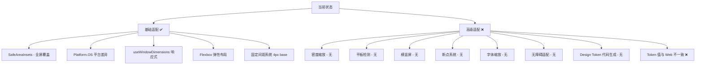
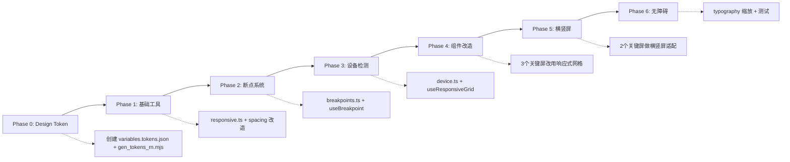

# React Native 企业级多机型适配方案

## 现状评估

当前 RN 应用已具备基础适配能力，但缺少企业级所需的完整适配体系。



---

## 0. Design Token 体系 (新增)

### 目标
建立与 Flutter 项目同等规格的 Design Token 体系，Token 值从 `frontend-blog` 的 Tailwind CSS 变量提取，确保 RN 与 Web 视觉一致。

### 架构

```
apps/frontend-blog/src/app/globals.css  ← Token 值来源
        │  提取
        ▼
frontend-blog-mobile/assets/variables.tokens.json  ← 单一事实源 (JSON)
        │
        ▼
tool/gen_tokens_rn.mjs  ← 代码生成器 (Node.js)
        │
        ▼
src/lib/theme/design_tokens.g.ts  ← 自动生成
  ├── TokensLight (Light 主题色)
  └── TokensDark (Dark 主题色)
```

### Token 值来源

从 [`apps/frontend-blog/src/app/globals.css`](../apps/frontend-blog/src/app/globals.css:5) 提取：

| Token 名 | Light | Dark | 来源 CSS 变量 |
|----------|-------|------|-------------|
| `textPrimary900` | #0a0d12 | #f7f7f7 | `--foreground` |
| `textSecondary700` | #414651 | #cecfd2 | - |
| `textTertiary600` | #535862 | #94979c | - |
| `textWhite` | #ffffff | #ffffff | - |
| `borderSecondary` | #e9eaeb | #22262f | `--border` |
| `borderPrimary` | #d5d7da | #373a41 | - |
| `bgPrimary` | #ffffff | #22262f | `--background` |
| `bgSecondary` | #fafafa | #13161b | - |
| `bgTertiary` | #f5f5f5 | #0c0e12 | - |
| `bgBrandSolid` | #fc7701 | #fc7701 | `--primary` |
| `buttonPrimaryBg` | #fc7701 | #fc7701 | primary |
| `buttonPrimaryBgHover` | #e04f16 | #e04f16 | - |

### 生成规则

```
variables.tokens.json 中的路径 → 驼峰命名 getter

TokensLight.textPrimary900    = 路径 _Primitives.Colors.* → text.primary.900
TokensLight.borderSecondary   = 路径 _Primitives.Colors.* → border.secondary
TokensLight.bgPrimary         = 路径 _Primitives.Colors.* → bg.primary
TokensLight.buttonPrimaryBg   = 路径 Components.* → button.primary.bg
```

### Token 分类 (与 Flutter 项目一致)

| 前缀 | 用途 | 示例 |
|------|------|------|
| `text` | 文字颜色 | `textPrimary900`, `textSecondary700` |
| `border` | 边框颜色 | `borderSecondary`, `borderPrimary` |
| `bg` | 背景颜色 | `bgPrimary`, `bgBrandSolid` |
| `fg` | 前景/图标色 | `fgSecondary700`, `fgBrandPrimary` |
| `button` | 按钮组件色 | `buttonPrimaryBg`, `buttonPrimaryFg` |
| `shadow` | 阴影颜色 | `shadowSm`, `shadowLg` |
| `utility` | 语义色 | `utilityBrand500`, `utilityError600` |

---

## 1. 响应式缩放工具

### 目标
在不同屏幕密度和尺寸下保持 UI 比例一致。

### 方案: react-native-size-matters

安装:
```bash
yarn workspace frontend-blog-mobile add react-native-size-matters
```

### 核心工具函数

```typescript
// src/lib/utils/responsive.ts

import { scale, moderateScale, verticalScale } from 'react-native-size-matters';
import { Dimensions, PixelRatio } from 'react-native';

// 基于设计稿宽度 375 iPhone 的标准缩放
export { scale, moderateScale, verticalScale };

// 智能缩放：小屏不缩小太多，大屏不放大太多
export const responsiveFontSize = (size: number): number => {
  return moderateScale(size, 0.3); // 0.3 = 缩放因子，越接近0变化越小
};

// 获取当前设备密度等级
export const getPixelDensity = (): number => {
  return PixelRatio.get();
};

// 是否为高密度屏幕 iPhone Plus/Pro Max
export const isHighDensity = (): boolean => {
  return PixelRatio.get() >= 3;
};

// 根据密度返回图片 URL 后缀
export const getImageSuffix = (): string => {
  const density = PixelRatio.get();
  if (density >= 3) return '@3x';
  if (density >= 2) return '@2x';
  return '';
};
```

### 替换 spacing 系统

```typescript
// src/lib/theme/spacing.ts

import { scale, verticalScale, moderateScale } from '@/lib/utils/responsive';

export const spacing = {
  xxs: scale(2),
  xs: scale(4),
  sm: scale(8),
  md: scale(12),
  lg: scale(16),
  xl: scale(20),
  xxl: scale(24),
  '3xl': scale(32),
  '4xl': scale(40),
  '5xl': scale(48),
} as const;

export const borderRadius = {
  none: 0,
  sm: scale(4),
  md: scale(8),
  lg: scale(12),
  xl: scale(16),
  full: 9999,
} as const;
```

---

## 2. 设备检测系统

### 目标
精确识别设备类型，为不同形态提供差异化布局。

```typescript
// src/lib/utils/device.ts

import { Dimensions, Platform, PixelRatio } from 'react-native';

const { width, height } = Dimensions.get('window');

// 设备分类
export const DeviceType = {
  PHONE_SMALL: 'phone_small',     // iPhone SE / 小于 375
  PHONE_NORMAL: 'phone_normal',    // iPhone 标准 375-430
  PHONE_LARGE: 'phone_large',      // iPhone Pro Max / 大于 430
  TABLET_SMALL: 'tablet_small',    // iPad mini / 7-9寸
  TABLET_LARGE: 'tablet_large',    // iPad Pro / 10+寸
  FOLDABLE: 'foldable',            // 折叠屏展开状态
} as const;

export type DeviceType = typeof DeviceType[keyof typeof DeviceType];

// 判断是否为平板
export const isTablet = (): boolean => {
  const pixelDensity = PixelRatio.get();
  const adjustedWidth = width * pixelDensity;
  const adjustedHeight = height * pixelDensity;
  
  // 苹果：iPad 返回 true
  if (Platform.isPad) return true;
  
  // Android：基于物理尺寸判断 > 600dp
  if (Platform.OS === 'android') {
    const dpWidth = width / pixelDensity;
    const dpHeight = height / pixelDensity;
    const diagonalInches = Math.sqrt(dpWidth ** 2 + dpHeight ** 2) / 160;
    return diagonalInches >= 7;
  }
  
  return false;
};

// 获取设备类型
export const getDeviceType = (): DeviceType => {
  if (isTablet()) {
    return width < 600 ? DeviceType.TABLET_SMALL : DeviceType.TABLET_LARGE;
  }
  if (width <= 375) return DeviceType.PHONE_SMALL;
  if (width <= 430) return DeviceType.PHONE_NORMAL;
  return DeviceType.PHONE_LARGE;
};

// 获取安全区域底部高度 (用于适配小白条)
export const getBottomInset = (insets: { bottom: number }): number => {
  // > 20 表示有 Home Indicator (iPhone X+)
  return insets.bottom > 20 ? insets.bottom : insets.bottom;
};

// 是否为刘海屏
export const hasNotch = (insets: { top: number }): boolean => {
  return insets.top > 24;
};
```

---

## 3. 断点系统

### 目标
提供类似 Web Tailwind 的断点能力，实现精确的响应式布局。

```typescript
// src/lib/utils/breakpoints.ts

import { useState, useEffect } from 'react';
import { Dimensions, ScaledSize } from 'react-native';

export const breakpoints = {
  xs: 320,   // iPhone SE
  sm: 375,   // iPhone 标准
  md: 430,   // iPhone Pro Max
  lg: 600,   // iPad mini 竖屏
  xl: 834,   // iPad 竖屏
  '2xl': 1024, // iPad 横屏
} as const;

export type Breakpoint = keyof typeof breakpoints;

// Hook: 返回当前活跃的断点
export const useBreakpoint = (): Breakpoint => {
  const [breakpoint, setBreakpoint] = useState<Breakpoint>(() => {
    return getActiveBreakpoint(Dimensions.get('window').width);
  });

  useEffect(() => {
    const handler = ({ window }: { window: ScaledSize }) => {
      setBreakpoint(getActiveBreakpoint(window.width));
    };
    const subscription = Dimensions.addEventListener('change', handler);
    return () => subscription.remove();
  }, []);

  return breakpoint;
};

// 获取当前宽度所属断点
const getActiveBreakpoint = (width: number): Breakpoint => {
  if (width < breakpoints.xs) return 'xs';
  if (width < breakpoints.sm) return 'xs';
  if (width < breakpoints.md) return 'sm';
  if (width < breakpoints.lg) return 'md';
  if (width < breakpoints.xl) return 'lg';
  if (width < breakpoints['2xl']) return 'xl';
  return '2xl';
};

// 判断当前窗口是否为移动端 (非平板)
export const useIsMobile = (): boolean => {
  const bp = useBreakpoint();
  return bp === 'xs' || bp === 'sm' || bp === 'md';
};

// 判断当前窗口是否为平板横屏
export const useIsLandscapeTablet = (): boolean => {
  const { width, height } = Dimensions.get('window');
  const bp = useBreakpoint();
  return (bp === 'lg' || bp === 'xl' || bp === '2xl') && width > height;
};
```

---

## 4. 自适应布局组件

### 目标
根据设备类型自动切换网格列数、卡片尺寸、布局方向。

```typescript
// src/lib/hooks/useResponsiveGrid.ts

import { useWindowDimensions } from 'react-native';

interface GridConfig {
  numColumns: number;
  cardWidth: number;
  spacing: number;
  isTablet: boolean;
}

// 根据屏幕宽度计算网格配置
export const useResponsiveGrid = (): GridConfig => {
  const { width } = useWindowDimensions();
  
  // 平板: 3-4列, 手机: 1-2列
  const isTabletMode = width >= 600;
  const numColumns = isTabletMode ? (width >= 834 ? 4 : 3) : (width >= 430 ? 2 : 1);
  
  const spacing = 12;
  const containerPadding = 16 * 2;
  const totalSpacing = spacing * (numColumns - 1);
  const cardWidth = (width - containerPadding - totalSpacing) / numColumns;

  return { numColumns, cardWidth, spacing, isTablet: isTabletMode };
};
```

### 使用示例

```typescript
// 在 CategoryListScreen 中使用
const { numColumns, cardWidth } = useResponsiveGrid();

<FlatList
  numColumns={numColumns}
  columnWrapperStyle={numColumns > 1 ? { gap: spacing.md } : undefined}
  renderItem={({ item }) => (
    <View style={{ width: cardWidth }}>
      <CategoryCard category={item} />
    </View>
  )}
/>
```

---

## 5. 横竖屏适配

### 目标
屏幕旋转时自动调整布局。

```typescript
// src/lib/hooks/useOrientation.ts

import { useState, useEffect } from 'react';
import { Dimensions, ScaledSize } from 'react-native';

export type Orientation = 'portrait' | 'landscape';

export const useOrientation = (): {
  orientation: Orientation;
  isLandscape: boolean;
  screenWidth: number;
  screenHeight: number;
} => {
  const [dimensions, setDimensions] = useState(() => Dimensions.get('window'));

  useEffect(() => {
    const handler = ({ window }: { window: ScaledSize }) => {
      setDimensions(window);
    };
    const subscription = Dimensions.addEventListener('change', handler);
    return () => subscription.remove();
  }, []);

  const isLandscape = dimensions.width > dimensions.height;

  return {
    orientation: isLandscape ? 'landscape' : 'portrait',
    isLandscape,
    screenWidth: dimensions.width,
    screenHeight: dimensions.height,
  };
};
```

### 应用场景

| 场景 | 横屏处理 |
|---|---|
| ArticleDetail | 横屏时 Markdown 内容区加宽，评论滑入侧边栏 |
| HomeScreen | 横屏时 Featured 卡片变高，网格从2列变3列 |
| AuthScreen | 横屏时表单居中，左右分栏 |
| TabBar | 横屏时 iPhone 自动隐藏 TabBar 留更多空间 |

---

## 6. 字体缩放与无障碍

### 目标
尊重系统字体缩放设置，符合 WCAG 标准。

```typescript
// src/lib/utils/typography.ts

import { PixelRatio, Platform } from 'react-native';

// 最大字体缩放倍数 (防止超大字体破坏布局)
export const MAX_FONT_SCALE = Platform.OS === 'ios' ? 1.5 : 1.3;

// 获取当前系统字体缩放
export const getFontScale = (): number => {
  const scale = PixelRatio.getFontScale();
  return Math.min(scale, MAX_FONT_SCALE);
};

// 响应式字体大小
export const rf = (size: number): number => {
  const fontScale = getFontScale();
  return Math.round(size * fontScale);
};

// 用于可读性要求高的内容 (文章正文)
export const rfContent = (size: number): number => {
  return Math.round(size * getFontScale());
};

// 用于 UI 元素 (按钮、标签)，限制最大缩放
export const rfUI = (size: number): number => {
  const scale = Math.min(getFontScale(), 1.2);
  return Math.round(size * scale);
};
```

### 在主题中集成 (使用 Flutter 风格命名)

```typescript
// src/lib/theme/typography.ts

import { rf, rfContent, rfUI } from '@/lib/utils/typography';
import { TextStyle } from 'react-native';

const lineHeight = (fontSize: number, multiplier: number): number => {
  return Math.round(fontSize * multiplier);
};

export const typography: Record<string, TextStyle> = {
  displayLg: {
    fontSize: rfUI(36),
    lineHeight: lineHeight(36, 1.2),
    fontWeight: '700',
    letterSpacing: -0.5,
  },
  headlineXl: {
    fontSize: rfUI(28),
    lineHeight: lineHeight(28, 1.3),
    fontWeight: '700',
    letterSpacing: -0.3,
  },
  headlineLg: {
    fontSize: rfUI(24),
    lineHeight: lineHeight(24, 1.3),
    fontWeight: '600',
    letterSpacing: -0.2,
  },
  headlineMd: {
    fontSize: rfUI(20),
    lineHeight: lineHeight(20, 1.4),
    fontWeight: '600',
  },
  headlineSm: {
    fontSize: rfUI(18),
    lineHeight: lineHeight(18, 1.4),
    fontWeight: '600',
  },
  titleLg: {
    fontSize: rfUI(16),
    lineHeight: lineHeight(16, 1.5),
    fontWeight: '600',
  },
  bodyLg: {
    fontSize: rfContent(16),
    lineHeight: lineHeight(16, 1.5),
    fontWeight: '400',
  },
  bodyMd: {
    fontSize: rfContent(15),
    lineHeight: lineHeight(15, 1.5),
    fontWeight: '400',
  },
  bodySm: {
    fontSize: rfContent(13),
    lineHeight: lineHeight(13, 1.4),
    fontWeight: '400',
  },
  labelLg: {
    fontSize: rfUI(14),
    lineHeight: lineHeight(14, 1.4),
    fontWeight: '500',
  },
  labelMd: {
    fontSize: rfUI(12),
    lineHeight: lineHeight(12, 1.4),
    fontWeight: '500',
    letterSpacing: 0.5,
    textTransform: 'uppercase',
  },
  caption: {
    fontSize: rfUI(12),
    lineHeight: lineHeight(12, 1.4),
    fontWeight: '400',
  },
};
```

---

## 7. Design Token 实现细节

### 7.1 variables.tokens.json 结构

```json
{
  "_Primitives": {
    "Colors": {
      "Base": {
        "white": { "value": "#ffffff", "type": "color" },
        "black": { "value": "#000000", "type": "color" },
        "transparent": { "value": "rgba(255,255,255,0)", "type": "color" }
      }
    }
  },
  "Tokens": {
    "text": {
      "primary": {
        "900": { "value": { "Lightmode": "#0a0d12", "Darkmode": "#f7f7f7" }, "type": "color" }
      },
      "secondary": {
        "700": { "value": { "Lightmode": "#414651", "Darkmode": "#cecfd2" }, "type": "color" }
      }
    },
    "border": {
      "secondary": { "value": { "Lightmode": "#e9eaeb", "Darkmode": "#22262f" }, "type": "color" }
    },
    "bg": {
      "primary": { "value": { "Lightmode": "#ffffff", "Darkmode": "#22262f" }, "type": "color" },
      "brand": {
        "solid": { "value": "#fc7701", "type": "color" }
      }
    },
    "button": {
      "primary": {
        "bg": { "value": "#fc7701", "type": "color" },
        "bgHover": { "value": "#e04f16", "type": "color" },
        "fg": { "value": "#000000", "type": "color" }
      }
    }
  }
}
```

### 7.2 代码生成器

```javascript
// tool/gen_tokens_rn.mjs
// 用法: node tool/gen_tokens_rn.mjs
// 读取 assets/variables.tokens.json → 生成 src/lib/theme/design_tokens.g.ts

import fs from 'fs';
import path from 'path';

// ... (解析 JSON, 展平路径, 解析引用, 生成 TS 代码)
```

### 7.3 生成输出示例

```typescript
// GENERATED CODE - DO NOT MODIFY BY HAND
// Source: assets/variables.tokens.json

export class TokensLight {
  static readonly textPrimary900 = '#0a0d12';
  static readonly textSecondary700 = '#414651';
  static readonly borderSecondary = '#e9eaeb';
  static readonly bgPrimary = '#ffffff';
  static readonly bgBrandSolid = '#fc7701';
  static readonly buttonPrimaryBg = '#fc7701';
  // ...
}

export class TokensDark {
  static readonly textPrimary900 = '#f7f7f7';
  static readonly textSecondary700 = '#cecfd2';
  static readonly borderSecondary = '#22262f';
  static readonly bgPrimary = '#22262f';
  static readonly bgBrandSolid = '#fc7701';
  static readonly buttonPrimaryBg = '#fc7701';
  // ...
}
```

---

## 8. 平台特定组件

### 目标
利用 React Native 平台扩展名机制，自动加载平台优化版本。

```
src/components/blog/ArticleCard/
├── index.tsx           # 统一导出
├── ArticleCard.tsx     # 默认实现
├── ArticleCard.ios.tsx # iOS 优化 (毛玻璃效果、3D Touch)
└── ArticleCard.android.tsx # Android 优化 (Ripple、原生阴影)
```

### 使用场景

| 平台差异点 | iOS | Android |
|---|---|---|
| 导航栏高度 | 44pt | 56dp |
| 阴影 | shadowColor/shadowOffset | elevation |
| 字体 | San Francisco | Roboto |
| 回弹效果 | Spring | OverScroll |
| 键盘行为 | padding | resize |

---

## 9. 图片资源适配

### 目标
根据密度加载合适分辨率图片，节省流量和内存。

```typescript
// src/lib/utils/image.ts

import { PixelRatio } from 'react-native';

interface ImageSource {
  uri: string;
  width: number;
  height: number;
  scale?: number;
}

// 基于 API 返回的 URL 自动拼接密度后缀
export const getDensityAwareUrl = (baseUrl: string): string => {
  const density = PixelRatio.get();
  if (density >= 3) return `${baseUrl}?dpr=3`;
  if (density >= 2) return `${baseUrl}?dpr=2`;
  return `${baseUrl}?dpr=1`;
};

// 计算图片展示尺寸 (根据屏幕密度)
export const getDisplaySize = (
  intrinsicWidth: number,
  intrinsicHeight: number,
  maxWidth: number,
): { width: number; height: number } => {
  const ratio = intrinsicHeight / intrinsicWidth;
  const width = Math.min(intrinsicWidth, maxWidth);
  return { width, height: width * ratio };
};
```

---

## 10. 实施路线图



### Phase 0: Design Token 体系 (新增)
- 创建 `assets/variables.tokens.json` (从 frontend-blog 提取)
- 创建 `tool/gen_tokens_rn.mjs` (代码生成器)
- 运行生成器 → `src/lib/theme/design_tokens.g.ts`
- 更新 `ThemeContext.tsx` 使用 generated tokens
- 更新 `colors.ts` 映射到 generated tokens

### Phase 1: 基础设施
- 安装 `react-native-size-matters`
- 创建 `src/lib/utils/responsive.ts`
- 改造 `src/lib/theme/spacing.ts` 使用 scale
- 改造 `src/lib/theme/typography.ts` 使用 rf + Flutter 风格命名

### Phase 2: 断点 + 设备检测
- 创建 `src/lib/utils/breakpoints.ts`
- 创建 `src/lib/utils/device.ts`
- 创建 `src/lib/hooks/useOrientation.ts`
- 创建 `src/lib/hooks/useResponsiveGrid.ts`

### Phase 3: 关键屏幕改造
- HomeScreen: 使用 useResponsiveGrid + featured 横屏适配
- CategoryListScreen: 自适应网格列数
- ArticleDetailScreen: 横屏布局调整
- TagListScreen: 自适应 tag 排列

### Phase 4: 无障碍 + 图片
- typography 集成字体缩放
- 图片 URL 密度感知
- WCAG 颜色对比度检查

---

## 11. 工作量评估

| Phase | 文件数 | 涉及修改 | 风险 |
|---|---|---|---|
| P0: Design Token | 2 新建 + 1 生成 + 3 修改 | colors/ThemeContext/index | 低 - 纯新增 + 替换引用 |
| P1: 基础工具 | 2 新建 + 2 修改 | spacing/typography 引用 | 低 - 纯工具函数 |
| P2: 断点系统 | 4 新建 | 无现有代码 | 低 - 纯新增 |
| P3: 设备检测 | 1 新建 | 无现有代码 | 低 - 纯新增 |
| P4: 屏幕改造 | 5 修改 | Home/CategoryList/ArticleDetail/TagList | 中 - 需视觉验证 |
| P5: 横竖屏 | 2 修改 | ArticleDetail/AuthScreen | 中 - 需测试 |
| P6: 无障碍 | 1 修改 | typography | 低 - 纯工具函数 |
