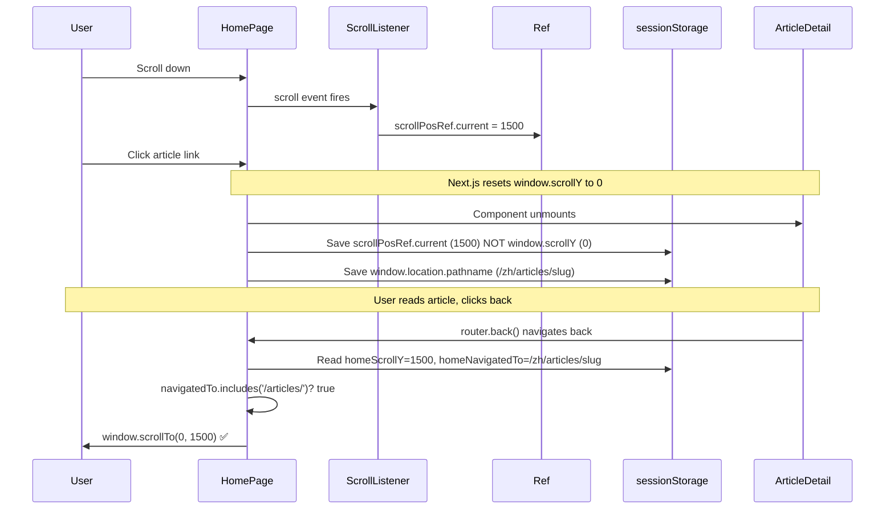

# Fix: Scroll Restoration Broken After Category Switch Fix

## Root Cause

When the user scrolls on the home page and then clicks an article:

1. `window.scrollY` holds the scroll position (e.g., 1500px)
2. Next.js `<Link>` click triggers client-side navigation
3. Next.js resets `window.scrollY` to 0 (URL changes, browser/nav resets scroll)
4. React unmounts the Home component
5. Cleanup effect runs → **`window.scrollY` is already 0** → saves `scrollY: '0'` to sessionStorage
6. On return from article, scroll restore reads `scrollY: '0'` → scrolls to top

**The bug:** `window.scrollY` is read too late — Next.js resets it before the React cleanup effect runs.

## Fix: Track Scroll Position in Real-Time via Event Listener

Replace the cleanup-only save approach with a scroll event listener that continuously updates a ref, then saves the ref value in cleanup.

### Before (broken):
```typescript
useEffect(() => {
  return () => {
    // ❌ window.scrollY is 0 here because Next.js reset it
    sessionStorage.setItem('homeScrollY', String(window.scrollY));
    sessionStorage.setItem('homeNavigatedTo', window.location.pathname);
  };
}, []);
```

### After (fixed):
```typescript
// Track latest scroll position in real-time
const scrollPosRef = useRef(0);

useEffect(() => {
  const handleScroll = () => {
    scrollPosRef.current = window.scrollY;
  };
  window.addEventListener('scroll', handleScroll, { passive: true });
  return () => {
    window.removeEventListener('scroll', handleScroll);
    // ✅ Use ref value from scroll listener (real-time, not reset by Next.js)
    sessionStorage.setItem('homeScrollY', String(scrollPosRef.current));
    sessionStorage.setItem('homeNavigatedTo', window.location.pathname);
  };
}, []);
```

### Why this works:
- `scrollPosRef` is updated on every scroll event (passive listener, no perf impact)
- Ref updates don't trigger re-renders
- At cleanup time, `scrollPosRef.current` holds the last known scroll position
- This value was captured BEFORE Next.js reset `window.scrollY`

## Files to Modify

Only one file: `apps/frontend-blog/src/app/[locale]/page.client.tsx`

### Changes:

1. **Add `useRef` import** (already present, but verify `scrollPosRef` variable is added)
2. **Add `scrollPosRef`** after existing refs (around line 81)
3. **Replace the scroll-save effect** (lines 121-129) — add scroll listener + use ref in cleanup
4. **Remove all `console.log` debug statements** added during investigation

## Data Flow



## Verification Steps

1. Hard refresh home page
2. Scroll down (at least 500px)
3. Click an article
4. On article detail, verify scroll position was NOT 0 when saving (check console if debug logs remain)
5. Click back button
6. Verify scroll position is restored to where you were

## Edge Cases

- **User doesn't scroll**: `scrollPosRef.current` = 0, saves 0, restores to top — correct behavior
- **User scrolls then Load More appears**: listener captures new scroll position, correct
- **Multiple rapid scrolls**: passive listener, performs fine
- **Category switch**: scroll listener still active, position tracked correctly
- **Browser refresh (not navigation)**: sessionStorage empty, no scroll restoration — correct
- **Direct URL entry (not router.back())**: sessionStorage has stale data? But scroll restore only triggers if `allArticles.length > 0` and the navigatedTo check passes
