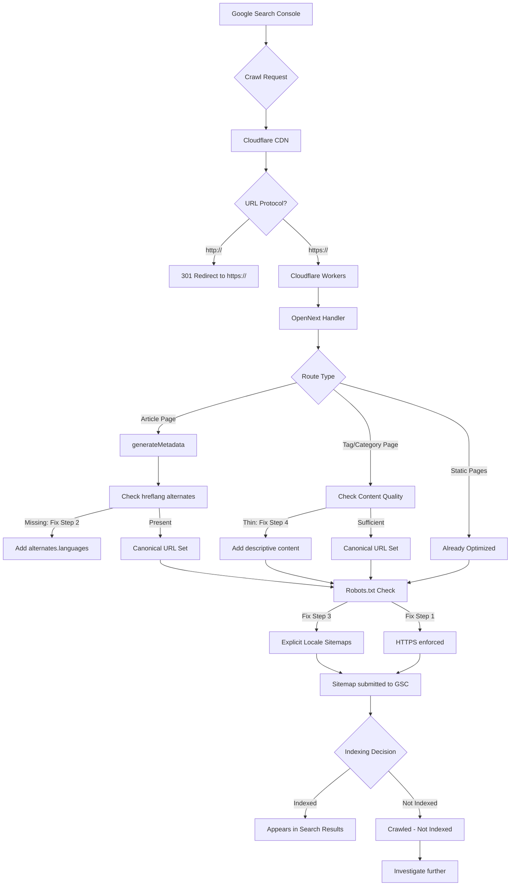

# SEO Indexing Optimization Plan for blog.joyminis.com

## Current Situation Analysis

Based on the Google Search Console "Page Indexing" report and codebase audit:

| Status | Count | Implication |
|--------|-------|-------------|
| Crawled - Not Indexed | 40 | Google crawled but deemed pages not valuable enough |
| Discovered - Not Indexed | 7 | Known but not yet crawled (normal for new sites) |
| Excluded by noindex | 1 | Intentional (likely `/login/` or `/oauth/`) |

The 40 unindexed URLs include:
- **Article pages** across zh/en/ja locales (e.g., `/zh/articles/redis-distributed-lock-system/`)
- **Tag pages** (e.g., `/zh/tags/token/`, `/ja/tags/docker/`)
- **Category pages** (e.g., `/zh/categories/architecture/`)
- **Some URLs use `http://` instead of `https://`** (e.g., `http://blog.joyminis.com/zh/articles/cloudflare-103-early-hints/`)

## Root Causes Identified

### Issue #1: HTTP vs HTTPS Mixed Crawling
Several URLs in the report use `http://blog.joyminis.com` instead of `https://blog.joyminis.com`. This splits crawling budget and dilutes page authority.

**Where**: Cloudflare edge configuration (not nginx — blog is on Cloudflare Workers/Pages)
**Fix**: Configure Cloudflare "Always Use HTTPS" rule + ensure all internal links use `https://`

### Issue #2: Missing hreflang on Article Pages
The root layout has `alternates.languages`, but `[locale]/articles/[slug]/page.tsx:generateMetadata` only sets `alternates.canonical` — **NO** `alternates.languages`. Google sees the same article in zh/en/ja as duplicate content rather than translated versions.

**Where**: [`apps/frontend-blog/src/app/[locale]/articles/[slug]/page.tsx`](apps/frontend-blog/src/app/[locale]/articles/[slug]/page.tsx:99)
**Fix**: Add `alternates.languages` with all locale variants for each article

### Issue #3: Tag/Category Pages = Thin Content
Tag pages like `/zh/tags/token/` with only 1-2 articles are considered "thin content" by Google. Same for category pages with few articles.

**Where**: `[locale]/tags/[slug]/page.tsx` and `[locale]/categories/[slug]/page.tsx`
**Fix**: Add descriptive content, related tags, article count indicators, or consolidate sparse tags

### Issue #4: Sitemap Chain — robots.txt only points to root sitemap
The [`robots.ts`](apps/frontend-blog/src/app/robots.ts:34) only references `/sitemap.xml`, which is a sitemap index pointing to `/[locale]/sitemap.xml` files. While Google follows this chain, explicitly listing all locale sitemaps would be more direct.

**Where**: [`apps/frontend-blog/src/app/robots.ts`](apps/frontend-blog/src/app/robots.ts)
**Fix**: Add all locale sitemaps to robots.txt

### Issue #5: Missing canonical URLs on listing pages
The `/categories/`, `/tags/`, `/search/`, `/categories/[slug]/`, `/tags/[slug]/` pages don't seem to set explicit `canonical` or `alternates.languages` metadata (need to verify).

### Issue #6: Very new site (data since May 5, 2026)
The site is only ~2 weeks old. Google needs time to build trust. Content quality and consistency over time is the primary solution.

---

## Implementation Plan

### Step 1: Fix HTTP→HTTPS (Cloudflare Edge Rule)
**Rationale**: 16 of the 40 unindexed URLs use `http://`. This is the highest-impact fix.

**Action**: Add Cloudflare "Always Use HTTPS" Page Rule or configure in Cloudflare Dashboard:
- Rule: `http://blog.joyminis.com/*` → `https://blog.joyminis.com/*` (301 redirect)
- Or enable "Always Use HTTPS" in Cloudflare SSL/TLS settings

**Also**: Ensure `NEXT_PUBLIC_SITE_URL` is set to `https://blog.joyminis.com` in all environments (verify in build config).

### Step 2: Add hreflang Alternates to Article Pages
**Rationale**: Without hreflang, Google treats zh/en/ja versions of the same article as duplicate content, not translations. This is likely the #1 reason articles are not indexed.

**Where**: [`apps/frontend-blog/src/app/[locale]/articles/[slug]/page.tsx`](apps/frontend-blog/src/app/[locale]/articles/[slug]/page.tsx) — `generateMetadata()`

**Current code** (lines 98-101):
```typescript
alternates: {
  canonical: `${baseUrl}/${locale}/articles/${slug}`,
},
```

**Required change**: Add API call to fetch article's available locales and generate hreflang links:
```typescript
alternates: {
  canonical: `${baseUrl}/${locale}/articles/${slug}`,
  languages: {
    en: `${baseUrl}/en/articles/${slug}`,
    zh: `${baseUrl}/zh/articles/${slug}`,
    ja: `${baseUrl}/ja/articles/${slug}`,
    ko: `${baseUrl}/ko/articles/${slug}`,
    // ... etc for all enabled locales
  },
},
```

**Note**: The slug is the same across locales (blog uses shared slugs), so this is straightforward. Add `x-default` as well.

### Step 3: Improve robots.txt Sitemap References
**Where**: [`apps/frontend-blog/src/app/robots.ts`](apps/frontend-blog/src/app/robots.ts)

**Current**:
```typescript
sitemap: `${baseUrl}/sitemap.xml`,
```

**Change**: List all locale-specific sitemaps explicitly:
```typescript
sitemap: [
  `${baseUrl}/sitemap.xml`,
  `${baseUrl}/en/sitemap.xml`,
  `${baseUrl}/zh/sitemap.xml`,
  `${baseUrl}/ja/sitemap.xml`,
  `${baseUrl}/ko/sitemap.xml`,
  `${baseUrl}/fr/sitemap.xml`,
  `${baseUrl}/de/sitemap.xml`,
],
```

### Step 4: Enhance Tag/Category Pages with Content
**Where**: Tag and category listing page components

**What to add**:
- Brief description text (1-2 sentences) about the tag/category
- Article count display
- "Related tags" suggestions
- If a tag has < 2 articles, consider adding `noindex` meta tag via `generateMetadata` to prevent thin content issues

### Step 5: Add Missing Canonical/Alternates to Listing Pages
**Where**: `/categories/`, `/tags/`, `/categories/[slug]/`, `/tags/[slug]/` pages

**Action**: Add `generateMetadata` to each page with:
- `canonical` URL
- `alternates.languages` for all enabled locales

### Step 6: Submit Sitemap to Google Search Console
**Action**: In Google Search Console:
1. Go to Sitemaps section
2. Submit `https://blog.joyminis.com/sitemap.xml`
3. Verify Google reads the sitemap chain correctly

### Step 7: Request Indexing for Priority Pages
**After** deploying all code fixes:
1. Use Google Search Console URL Inspection tool
2. Enter the homepage URL
3. Click "Request Indexing"
4. Repeat for top 5-10 most important article URLs

### Step 8: Monitor and Iterate
- Check Google Search Console weekly for indexing status changes
- Monitor "Crawled - Not Indexed" count decreasing
- If specific pages remain unindexed after 4 weeks, investigate further

---

## Architecture Diagram



---

## Files to Modify

| # | File | Change Description |
|---|------|-------------------|
| 1 | [`apps/frontend-blog/src/app/robots.ts`](apps/frontend-blog/src/app/robots.ts) | Add all locale sitemaps, verify disallow rules |
| 2 | [`apps/frontend-blog/src/app/[locale]/articles/[slug]/page.tsx`](apps/frontend-blog/src/app/[locale]/articles/[slug]/page.tsx) | Add `alternates.languages` in `generateMetadata` |
| 3 | [`apps/frontend-blog/src/app/[locale]/tags/[slug]/page.tsx`](apps/frontend-blog/src/app/[locale]/tags/[slug]/page.tsx) | Add `generateMetadata` with canonical + alternates + maybe conditional noindex for thin content |
| 4 | [`apps/frontend-blog/src/app/[locale]/categories/[slug]/page.tsx`](apps/frontend-blog/src/app/[locale]/categories/[slug]/page.tsx) | Add `generateMetadata` with canonical + alternates |
| 5 | [`apps/frontend-blog/src/app/[locale]/tags/page.tsx`](apps/frontend-blog/src/app/[locale]/tags/page.tsx) | Add `generateMetadata` with canonical + alternates |
| 6 | [`apps/frontend-blog/src/app/[locale]/categories/page.tsx`](apps/frontend-blog/src/app/[locale]/categories/page.tsx) | Add `generateMetadata` with canonical + alternates |
| 7 | Cloudflare Dashboard | Configure "Always Use HTTPS" rule or SSL/TLS setting |
