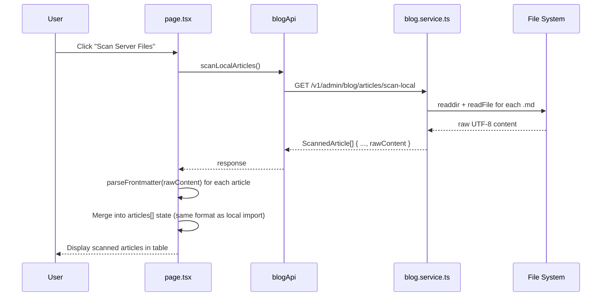

# Plan: Restore Server File Scanning with Frontend YAML Frontmatter Parsing

## Problem

The endpoint `GET /admin/blog/articles/scan-local` uses the backend's [`parseMarkdownFile()`](apps/api/src/blog/blog.service.ts:424) parser, which only handles the old `# Title` + `> excerpt` + `Tags:` format. The actual article files in [`docs/blog/articles/`](docs/blog/articles/) now use **YAML frontmatter** format (or a mix). If we call `scanLocalArticles` directly, the parsed `title`, `excerpt`, `content`, `tags` would be wrong.

## Solution Overview

Keep the backend parsing lightweight — just read raw file content and expose it as `rawContent`. Let the frontend re-parse using the existing [`parseFrontmatter()`](apps/admin-blog/src/lib/utils/frontmatter.ts:61) function, which already handles YAML frontmatter correctly.

## Data Flow



## Changes Required

### 1. Backend DTO — [`apps/api/src/blog/dto/batch-import.dto.ts`](apps/api/src/blog/dto/batch-import.dto.ts:18)

Add `rawContent` field to the `ScannedArticle` class (API response model, not request DTO):

```typescript
// Add after line 52 (lastModified)
@ApiPropertyOptional({ description: '文件原始内容（UTF-8），供前端自行解析 frontmatter' })
rawContent?: string;
```

### 2. Backend Service — [`apps/api/src/blog/blog.service.ts`](apps/api/src/blog/blog.service.ts:219)

Modify `scanLocalMarkdownFiles()` to read raw file content and pass it through instead of (or in addition to) calling `parseMarkdownFile()`.

**Key change**: In the file-reading loop (line 244-255), read raw content alongside the old parse. Then in the results builder (line 268-285), include `rawContent`.

The old `parseMarkdownFile()` results for `title`, `excerpt`, `content`, `tags` will still be populated but the frontend will override them using `rawContent` + `parseFrontmatter()`.

```typescript
// Pseudocode for the modified loop:
for (const filepath of mdFiles) {
  try {
    const rawContent = fs.readFileSync(filepath, 'utf-8');
    const parsed = this.parseMarkdownFile(filepath); // keep for backward compat
    const slug = this.filenameToSlug(parsed.filename);
    allSlugs.add(slug);
    parsedFiles.push({ filepath, parsed, rawContent });
  } catch (err) { ... }
}

// In results builder:
results.push({
  ...existing fields,
  rawContent, // new field
});
```

### 3. Frontend Page — [`apps/admin-blog/src/app/(dashboard)/blog/import/page.tsx`](apps/admin-blog/src/app/(dashboard)/blog/import/page.tsx:78)

**3a.** Update local `ScannedArticle` interface (line 29-40) to add `rawContent`:

```typescript
interface ScannedArticle {
  // ... existing fields
  rawContent?: string;  // Add this
}
```

**3b.** Add server scan handler using `useRequest` from ahooks:

```typescript
const { run: scanServerFiles, loading: scanningServer } = useRequest(
  blogApi.scanLocalArticles,
  {
    manual: true,
    onSuccess: (serverArticles: any[]) => {
      const parsed = serverArticles.map((article) => {
        const frontmatter = parseFrontmatter(article.rawContent || '');
        return {
          filename: article.filename,
          slug: frontmatter.slug || article.slug,
          title: frontmatter.title || article.title,
          excerpt: frontmatter.excerpt || article.excerpt,
          content: frontmatter.content || article.content,
          tags: frontmatter.tags || article.tags,
          subDir: article.subdir || null,
          exists: article.exists,
          fileSize: article.fileSize,
          lastModified: article.lastModified,
        } as ScannedArticle;
      });
      
      // Merge with existing articles (replace duplicates by slug)
      setArticles((prev) => mergeArticles(prev, parsed));
      setSelectedSlugs(new Set(parsed.map((a) => a.slug)));
      setSelectAll(true);
      
      if (parsed.length > 0) {
        addToast('success', `扫描到 ${parsed.length} 篇服务器文章`);
      } else {
        addToast('info', '服务器上没有找到新的 Markdown 文件');
      }
    },
    onError: () => {
      addToast('error', t('blog_import_scanFailed'));
    },
  },
);
```

**3c.** Add "Scan Server Files" button in the UI. Two placement options:

- **Option A**: In the `PageHeader` `action` slot alongside the "Import Selected" button
- **Option B**: In the stats bar area

Placement: Add a secondary/outline button in the PageHeader's action area, positioned before the "Import Selected" button:

```tsx
// In the PageHeader action slot:
action={
  <div className="flex items-center gap-2">
    <Button
      variant="outline"
      onClick={scanServerFiles}
      disabled={scanningServer}
    >
      {scanningServer ? (
        <Loader2 className="h-4 w-4 animate-spin mr-2" />
      ) : (
        <Search size={18} className="mr-2" />
      )}
      {t('blog_import_scanServer') || '扫描服务器文件'}
    </Button>
    {articles.length > 0 && !importResult && (
      <Button
        variant="success"
        onClick={handleImport}
        disabled={importing || selectedSlugs.size === 0}
      >
        ...
      </Button>
    )}
  </div>
}
```

### 4. i18n — Add new translation keys

Add to all 6 locale files ([`zh.json`](apps/admin-blog/src/i18n/zh.json), [`en.json`](apps/admin-blog/src/i18n/en.json), [`ja.json`](apps/admin-blog/src/i18n/ja.json), [`ko.json`](apps/admin-blog/src/i18n/ko.json), [`fr.json`](apps/admin-blog/src/i18n/fr.json), [`de.json`](apps/admin-blog/src/i18n/de.json)):

| Key | zh | en | ja | ko | fr | de |
|-----|----|----|----|----|----|----|
| `blog_import_scanServer` | 扫描服务器文件 | Scan Server Files | サーバーファイルをスキャン | 서버 파일 스캔 | Analyser les fichiers serveur | Server-Dateien scannen |
| `blog_import_scanServerResult` | 扫描到 {count} 篇服务器文章 | Found {count} server articles | {count} 件のサーバー記事を見つけました | 서버에서 {count}개의 문서를 찾았습니다 | {count} articles serveur trouvés | {count} Server-Artikel gefunden |
| `blog_import_scanServerEmpty` | 服务器上没有找到新的文章 | No new articles found on server | サーバーに新しい記事はありません | 서버에 새 문서가 없습니다 | Aucun nouvel article trouvé sur le serveur | Keine neuen Artikel auf dem Server gefunden |

## Execution Order

1. **batch-import.dto.ts** — Add `rawContent` field to `ScannedArticle`
2. **blog.service.ts** — Read raw content in `scanLocalMarkdownFiles()`, pass through as `rawContent`
3. **page.tsx** — Add `rawContent` to local interface, add server scan handler + button
4. **i18n files** — Add translation keys (all 6 locales)
5. **Verify** — Type-check + lint

## Edge Cases & Risks

- **Empty directory**: `scanLocalMarkdownFiles()` already returns `[]` if dir doesn't exist (line 223-225). Frontend should handle empty array gracefully.
- **Files without YAML frontmatter**: `parseFrontmatter()` falls back to `parseNonYamlMarkdown()` (line 77-78) which handles the old `# Title` format. So mixed formats are supported.
- **Concurrent local + server import**: If user imports local files first, then scans server, the `mergeArticles` function should deduplicate by `slug`. If same slug exists locally, server version takes precedence (or vice versa — TBD).
- **Large files**: `rawContent` could be large for long articles. This is fine since it's the same data the frontend already handles with local file reader.
- **API already exists**: The `GET /admin/blog/articles/scan-local` endpoint and `blogApi.scanLocalArticles()` call already exist — no controller or API client changes needed.
