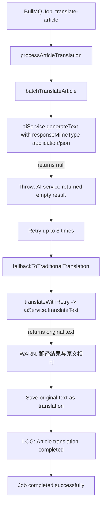

# Translation System Debug & Fix Plan

## Problem Summary

The BlogAiProcessor translation pipeline is running but producing **silently broken translations**: articles are saved as "COMPLETED" with the **original Chinese text** stored under the target language keys (`ko`, `fr`).

## Translation Pipeline Flow



## Root Cause Analysis

### `AiService.generateText()` returns `null` consistently

The Gemini API calls are failing silently. In [`AiService.generateText()`](apps/api/src/common/ai/ai.service.ts:429), `null` is returned in these scenarios:

| Scenario | Code Path | Likelihood |
|----------|-----------|------------|
| **No API keys configured** | Line 436-438 | Unlikely - some jobs complete |
| **Service level below FULL** | Line 441-443 | Possible - rate limiting degrades level |
| **Rate limited (RPM/TPM exceeded)** | Line 448-450 | Possible - 12 RPM / 800K TPM limits |
| **All keys daily budget exhausted** | Line 350-366 | **Most likely** - 800K tokens/day/key |
| **API response has no candidates** | Line 464-471 | Could indicate blocked content |
| **API call throws exception** | Line 475-487 | Caught and returns null |

**Key evidence from logs:**
- The `RedisLockService` logs show normal operation (other services healthy)
- Batch translation fails with "AI service returned empty result" → `generateText()` returns `null`
- Fallback `translateText()` returns input text → `generateText()` returns `null`, so `result || text` returns `text`
- No 429 errors are logged, suggesting it's NOT rate limiting
- The translation "completes" because the code doesn't verify translation actually changed the text before saving

### Critical Bug: Silent Data Corruption

In [`translateWithRetry()`](apps/api/src/blog/processors/blog-ai.processor.ts:130):
- Line 175-176: On the last retry, if `result === text`, it **returns `text`** (original) instead of throwing
- This means the calling code thinks translation succeeded
- The `processArticleTranslation` method then saves the original Chinese text under the target language key (e.g., `contentMdLocalized.ko`)

In [`batchTranslateArticle()`](apps/api/src/blog/processors/blog-ai.processor.ts:213):
- Line 369-371: If `result` is null/empty, throws "AI service returned empty result"
- Line 421-429: On last retry, falls back to `fallbackToTraditionalTranslation`
- The fallback doesn't check if translation actually succeeded either

### Missing Verification

There is **no verification step** that checks if the translated content actually differs from the source before saving. The code should:
1. Check if translated text differs from original
2. If not, mark the job as FAILED (not COMPLETED)
3. Not save garbage data to the localized fields

## Proposed Fixes

### Fix 1: Add translation quality verification at the article level

**File**: [`apps/api/src/blog/processors/blog-ai.processor.ts`](apps/api/src/blog/processors/blog-ai.processor.ts)

After receiving the batch translation result (line 847-851), add a check before saving:

```typescript
// Verify translation actually happened
if (sourceContent === batchResult.content && sourceContent.trim().length > 0) {
  this.logger.error(
    `Translation verification failed: content unchanged for article ${data.articleId} -> ${data.targetLang}`,
  );
  // Mark as FAILED instead of saving garbage
  throw new Error(`Translation produced no changes for article ${data.articleId}`);
}
```

### Fix 2: Fix `translateWithRetry` to throw on final failure instead of returning original text

**File**: [`apps/api/src/blog/processors/blog-ai.processor.ts`](apps/api/src/blog/processors/blog-ai.processor.ts), lines 175-176

Change from:
```typescript
if (attempt === maxRetries) {
  return text; // Returns original, causing silent corruption
}
```

To:
```typescript
if (attempt === maxRetries) {
  throw new Error(
    `Translation failed after ${maxRetries + 1} attempts: result identical to source (target: ${targetLang})`,
  );
}
```

### Fix 3: Add diagnostic logging to AiService.generateText()

**File**: [`apps/api/src/common/ai/ai.service.ts`](apps/api/src/common/ai/ai.service.ts)

When `generateText()` returns `null`, log the **specific reason** (no keys, rate limited, service level, empty response, exception).

### Fix 4: Add a translation health check endpoint or job

Create a simple self-test that tries to translate a known short string and reports success/failure. This helps operators quickly diagnose whether the AI service is working.

## Implementation Order

1. **Fix 3 first** (diagnostic logging) - so we can identify the exact root cause
2. **Fix 1 + Fix 2** (prevent silent corruption) - safety net
3. **Run translation test** to confirm root cause
4. **Fix root cause** (likely API key / budget issue)
5. **Fix 4** (health check) - ongoing monitoring
6. **Re-translate affected articles** - cleanup corrupted data

## Affected Articles (from logs)

| Article ID | Target Lang | Status |
|------------|-------------|--------|
| cmookyaph000lo420evuwlwdk | ko | COMPLETED (corrupted) |
| cmookyaq8000no420bkysxk0d | ko | COMPLETED (corrupted) |
| cmookyaqz000po420z8hlklvd | ko | COMPLETED (corrupted) |
| cmookyarz000ro420b5i378bq | ko | COMPLETED (corrupted) |
| cmoolw1y50012o4209mitqarf | ko | COMPLETED (corrupted) |
| cmoolw21n0016o420rsp6ixg0 | ko | COMPLETED (corrupted) |
| cmoolw249001ao4200poa6gco | ko | COMPLETED (corrupted) |
| cmookyamw000ho420nwuptvhc | fr | COMPLETED (corrupted) |
| cmookyaod000jo42007mmqahj | fr | COMPLETED (corrupted) |
| cmookyaph000lo420evuwlwdk | fr | COMPLETED (corrupted) |
| cmookyaq8000no420bkysxk0d | fr | COMPLETED (corrupted) |

## Re-translation Strategy

After fixing the root cause:
1. Query all TranslationJob records with `status: COMPLETED` and `targetLang IN (ko, fr)`
2. Check if `contentMdLocalized[targetLang] === contentMdLocalized[sourceLang]`
3. Re-enqueue those articles for re-translation
