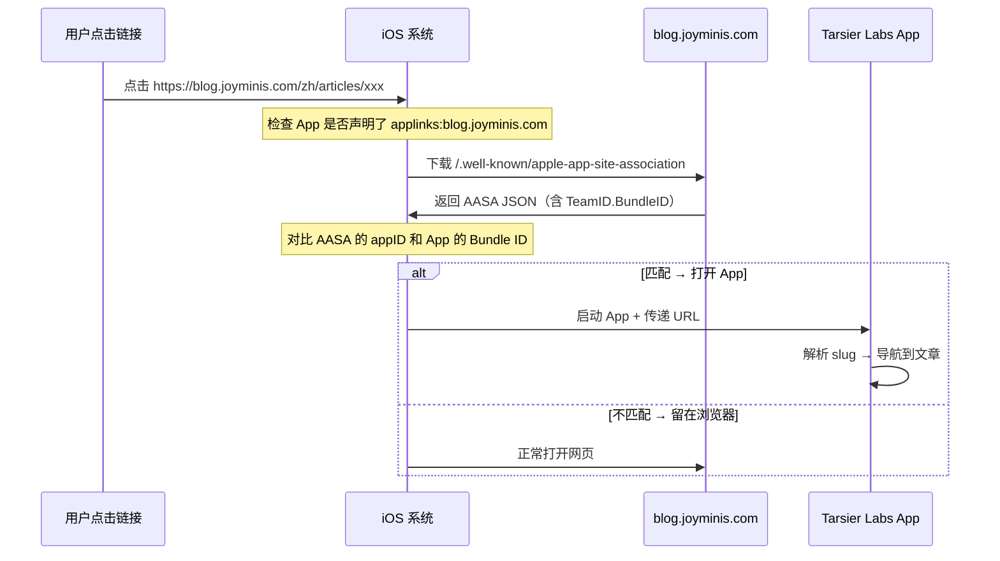

# Universal Links 完整原理解释

先理清楚几个东西分别扮演什么角色，再谈怎么做。

---

## 1. Universal Links 的核心原理

Apple 的 Universal Links 本质是：**当用户点击一个链接时，iOS 帮你决定是打开 App 还是打开浏览器。**



**关键点：**

- App 声明它想处理哪些域名的链接（Xcode Associated Domains：`applinks:blog.joyminis.com`）
- 服务端证明该域名确实属于这个 App（AASA 文件：`appID = TeamID.BundleID`）
- 两边必须完全匹配，Universal Links 才能生效

---

## 2. 为什么需要两个东西

| 组件                   | 在哪配置                                                        | 作用                                               |
| ---------------------- | --------------------------------------------------------------- | -------------------------------------------------- |
| **Associated Domains** | Xcode → Target → Signing & Capabilities                         | App 说："我想处理 blog.joyminis.com 的链接"        |
| **AASA 文件**          | 服务端 blog.joyminis.com/.well-known/apple-app-site-association | 服务端说："这个域名归 TeamID.BundleID 这个 App 管" |

两者缺一不可。

---

## 3. Firebase App Distribution 的作用

Firebase App Distribution 是用来**分发测试包**的，不是 Universal Links 必需的组件。

```
没有 Firebase 时：
  开发 → 通过 Xcode 装到手机 → 测试

有 Firebase 时：
  开发 → 上传到 Firebase → 测试人员通过链接一键安装
```

**Firebase 解决了什么问题：** 你不必每次拉着数据线用 Xcode 装 App 到测试手机上。

---

## 4. dev 环境的问题出在哪

Universal Links 的验证逻辑是死的：

| App 安装方式         | App 的 Bundle ID     | App 声明的域名        | AASA 里的 appID             | 结果          |
| -------------------- | -------------------- | --------------------- | --------------------------- | ------------- |
| App Store            | com.tarsier.labs     | blog.joyminis.com     | PK28T343BP.com.tarsier.labs | ✅ 匹配       |
| Xcode Debug 安装     | com.tarsier.labs     | blog.joyminis.com     | PK28T343BP.com.tarsier.labs | ✅ 匹配       |
| **Xcode Debug 安装** | **com.tarsier.labs** | blog-dev.joyminis.com | PK28T343BP.com.tarsier.labs | **❌ 不匹配** |

问题在第 3 行：App 声明了 `applinks:blog-dev.joyminis.com`，但 AASA 里只写了 `PK28T343BP.com.tarsier.labs`，Apple 去 `blog-dev.joyminis.com/.well-known/apple-app-site-association` 下载后发现有 `PK28T343BP.com.tarsier.labs`，但 App 是 `com.tarsier.labs`，**appID 对不上** ✗

等等——不对，appID 对得上，因为 App 还是 `com.tarsier.labs`。真正的坑是：**苹果不会为 dev 域名去做验证。**

更准确地说：**苹果只为 production 域名（在 App Store 提交审核时关联的）做 Universal Links 验证。** Dev 域名就算配了，真实设备上也不会生效。

---

## 5. 项目里已有的模式（porter.joyminis）

看 AASA 文件里已有的配置：

```json
{
  "appID": "A1B2C3D4E5.com.porter.joyminis",
  "paths": [ "/group/*", "/oauth/callback" ]
},
{
  "appID": "A1B2C3D4E5.com.porter.joyminis.test",
  "paths": [ "/group/*", "/oauth/callback" ]
}
```

这是两个**独立的 App**，分别用不同的 Bundle ID 打包，AASA 里各有一条记录：

| 构建类型   | Bundle ID                  | AASA appID                            |
| ---------- | -------------------------- | ------------------------------------- |
| Release    | `com.porter.joyminis`      | `A1B2C3D4E5.com.porter.joyminis`      |
| Debug/Test | `com.porter.joyminis.test` | `A1B2C3D4E5.com.porter.joyminis.test` |

Tarsier Labs 也是同样的模式，我已经在 AASA 文件里加好了 dev 条目：

- `PK28T343BP.com.tarsier.labs` → production
- `PK28T343BP.com.tarsier.labs.dev` → dev

---

## 6. 实际操作：你到底需要怎么做

### 先上线 production（推荐，今天就做）

**Blog 端（已完成）：**

- AASA 文件已配置 ✅
- Worker 路由已处理 ✅

**RN 端（需要你做）：**

1. Xcode → Target → Signing & Capabilities → + → Associated Domains
2. 输入 `applinks:blog.joyminis.com` ✅ 已经做了
3. 打包 → TestFlight → 测试
4. 点击 `https://blog.joyminis.com/zh/articles/xxx` → 应直接打开 App

### 以后如果想测 dev 环境

因为 Xcode 没法按 Configuration 切换 Associated Domains，只能手动改：

```diff
// 开发测试时改成 dev 域名
- applinks:blog.joyminis.com
+ applinks:blog-dev.joyminis.com

// 测完提交审核前改回 production
- applinks:blog-dev.joyminis.com
+ applinks:blog.joyminis.com
```

**步骤：**

1. Xcode 把 `applinks:blog.joyminis.com` 改成 `applinks:blog-dev.joyminis.com`
2. 装到手机
3. 点击 dev 域名的文章链接测试
4. 测完改回来
5. 不需要 Firebase

---

**核心原则：** AASA 里的 `appID` 必须跟 App 的 Bundle ID 完全对应。我已经在 AASA 里加好了 `com.tarsier.labs.dev` 的条目，你什么时候想测 dev，只需要在 Xcode 里改一下 Associated Domains 的域名就行，不需要再动服务端。
