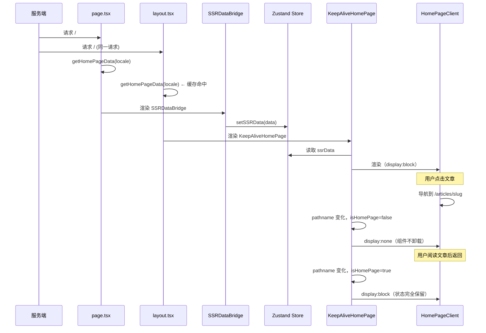

# Vue 式 KeepAlive 方案

## 核心思路

像 Vue 的 `<KeepAlive>` 一样：**首页组件始终挂载在 DOM 中**，导航到文章页时用 CSS `display:none` 隐藏，返回时 `display:block` 显示。这样所有状态（滚动位置、图片加载、组件内部状态）全部保留。

## 架构变化

```
当前（组件卸载/重挂）：
layout → <HomePageStateProvider>
           → <PageTransition>
               → {children}
                   ├── / 时: <HomePageClient>    ← 卸载
                   └── /articles/slug 时: <ArticlePageClient>  ← 挂载

Vue 式 KeepAlive（组件始终挂载）：
layout → <HomePageStateProvider>
           → <KeepAliveHomePage>        ← 始终挂载，display 控制显隐
               → <HomePageClient>       ← 永远不卸载
           → <PageTransition>
               → {children}             ← 只渲染非首页内容
```

## 需要解决的问题

### 问题 1：SSR 数据如何传递？

`page.tsx`（服务端组件）负责 SSR 取数，但 `KeepAliveHomePage` 在 layout 层渲染。需要把 SSR 数据从 `page.tsx` 传到 layout。

**解决方案：`React.cache()` 共享数据**

```typescript
// lib/cached/home-page-data.ts
import { cache } from 'react';

export const getHomePageData = cache(async (locale: string) => {
  const [articles, categories] = await Promise.all([
    serverGet('/v1/frontend/blog/articles', { lang: locale, page: 1, pageSize: 10 }),
    serverGet('/v1/frontend/blog/categories', { lang: locale }),
  ]);
  return { articles, categories };
});
```

`page.tsx` 和 layout 都调用 `getHomePageData(locale)`，React 会返回相同的结果（同一个请求内）。

### 问题 2：首页路由时 page.tsx 渲染什么？

如果 `HomePageClient` 移到了 layout，`page.tsx` 在首页路由时需要渲染什么？

**解决方案：page.tsx 只渲染数据桥接组件**

```tsx
// page.tsx
export default async function HomePage({ params }) {
  const { locale } = await params;
  const data = await getHomePageData(locale);
  
  return <SSRDataBridge data={data} locale={locale} />;
}

// SSRDataBridge.tsx (client component)
'use client';
export function SSRDataBridge({ data, locale }: Props) {
  const setSSRData = useHomePageStore(s => s.setSSRData);
  useEffect(() => { setSSRData({ data, locale }); }, []);
  return null; // 不渲染 UI，只传递数据
}
```

### 问题 3：非首页路由时 layout 怎么知道不显示 KeepAliveHomePage？

**解决方案：`usePathname()` 检测当前路由**

```tsx
// KeepAliveHomePage.tsx
'use client';
export function KeepAliveHomePage() {
  const pathname = usePathname();
  const locale = useLocale();
  const isHomePage = pathname === `/${locale}` || pathname === `/${locale}/`;
  const { ssrData } = useHomePageStore();
  const [hasEverRendered, setHasEverRendered] = useState(false);
  
  // 首次渲染后标记为已渲染，之后永不卸载
  useEffect(() => {
    if (isHomePage && ssrData) setHasEverRendered(true);
  }, [isHomePage, ssrData]);
  
  // 有 SSR 数据时才渲染 HomePageClient
  if (!ssrData && !hasEverRendered) return null;
  
  return (
    <div style={{ display: isHomePage ? 'block' : 'none' }}>
      <HomePageClient
        initialData={ssrData?.articles}
        initialArticleIds={ssrData?.articleIds}
        initialCategories={ssrData?.categories}
        locale={ssrData?.locale || locale}
      />
    </div>
  );
}
```

## 完整实现步骤

### Step 1: 创建 SSR 数据缓存

**新建 `apps/frontend-blog/src/lib/cached/home-page-data.ts`**

使用 `React.cache()` 在服务端共享数据。

### Step 2: 创建 Zustand store 作为数据桥接

**新建 `apps/frontend-blog/src/lib/stores/homePageStore.ts`**

```typescript
import { create } from 'zustand';

interface HomePageSSRData {
  articles: ...;
  categories: ...;
  articleIds: string[];
  locale: string;
}

interface HomePageStore {
  ssrData: HomePageSSRData | null;
  setSSRData: (data: HomePageSSRData) => void;
}

export const useHomePageStore = create<HomePageStore>((set) => ({
  ssrData: null,
  setSSRData: (data) => set({ ssrData: data }),
}));
```

### Step 3: 创建 SSRDataBridge 组件

**新建 `apps/frontend-blog/src/components/SSRDataBridge.tsx`**

客户端组件，从 `page.tsx` 接收 SSR 数据并存入 Zustand store。

### Step 4: 创建 KeepAliveHomePage 组件

**新建 `apps/frontend-blog/src/components/KeepAliveHomePage.tsx`**

客户端组件，在 layout 层渲染 `HomePageClient`，用 `display:none` 控制显隐。

### Step 5: 修改 page.tsx

简化，只渲染 `SSRDataBridge`。

### Step 6: 修改 layout.tsx

添加 `KeepAliveHomePage`，调整 `PageTransition` 只包裹非首页内容。

## 数据流



## 优点

- ✅ **真正的状态保留**：滚动位置、图片加载、组件内部状态全部保留
- ✅ **零加载、零闪烁**：返回时 DOM 直接显示
- ✅ **与 Vue `<KeepAlive>` 原理一致**
- ✅ **不影响文章页性能**：首页只是 `display:none`，不占用 CPU

## 注意事项

1. **内存开销**：首页 DOM 始终存在，但 `display:none` 时不参与布局计算
2. **数据新鲜度**：长时间在文章页后返回，首页数据可能过时。可以在返回时触发静默更新
3. **SSR 数据传递**：`React.cache()` 只在同一个请求内有效，硬刷新时正常工作
