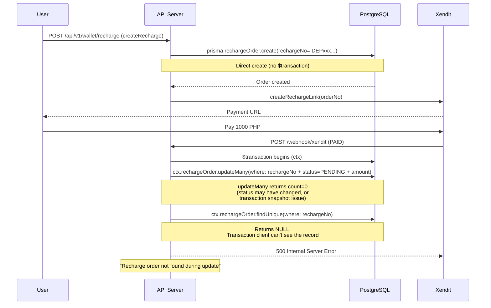

# Fix: Webhook "Recharge order not found" Error

## Problem

Xendit payment webhook callbacks for recharge orders are failing with `500 Internal Server Error` because [`handleInvoiceWebhook()`](apps/api/src/client/wallet/client-wallet.service.ts:181) uses `ctx.rechargeOrder.findUnique()` (the Prisma transaction client) which cannot see the order record, even though the order exists in the database.

**Error log:**
```
POST /api/v1/payment/webhook/xendit → 500
"Recharge order not found during update: DEP20260512093053529930165"
```

**Confirmed:** The order DOES exist in the database. The admin manual sync API (`POST /api/v1/admin/finance/recharge/sync/:rechargeId`) successfully finds the order using `this.prismaService.rechargeOrder.findUnique()` and credits the user with `{ status: "SYNCED_SUCCESS", message: "Order fixed and user credited." }`.

## Root Cause

### Prisma `$transaction` client cannot see the order record

The bug is in [`handleInvoiceWebhook()`](apps/api/src/client/wallet/client-wallet.service.ts:162) at lines 178-188.

**Code flow:**



**The bug:** On line 181, the code uses `ctx.rechargeOrder.findUnique()` — the Prisma `TransactionClient` from `$transaction(async (ctx) => {...})`. Due to transaction isolation/snapshot behavior in PostgreSQL combined with how Prisma manages interactive transactions, the `ctx` client **cannot see recharge orders that were created outside the transaction**. However, `this.prismaService.rechargeOrder.findUnique()` (the regular Prisma client, using a fresh connection) **can** see them — proven by the successful admin sync API call.

**Why `updateMany` returns 0 first:** The compound WHERE clause at line 164-168 includes:
- `rechargeNo: orderNo`
- `rechargeStatus: RECHARGE_STATUS.PENDING` (1)
- `rechargeAmount: amountDecimal`

If the order's status changed (e.g., to PROCESSING via another process) or there's a Decimal precision mismatch, `updateMany` returns 0. Then the error-path `findUnique` with the transaction client fails to find it.

### Contrast with Admin Sync API (Works Fine)

The [`syncRechargeStatus()`](apps/api/src/admin/finance/finance.service.ts:526) method in `finance.service.ts`:

1. **Line 528**: `this.prismaService.rechargeOrder.findUnique(...)` — uses the **regular client**, finds the order successfully
2. **Line 600**: Enters `$transaction` only AFTER confirming the order exists

This confirms the fix: use `this.prismaService` (not `ctx`) for the findUnique in the error path.

## Fix Plan

### Fix 1: Change `ctx.rechargeOrder.findUnique` to `this.prismaService.rechargeOrder.findUnique` (Primary Fix)

**File:** [`apps/api/src/client/wallet/client-wallet.service.ts`](apps/api/src/client/wallet/client-wallet.service.ts:181)

**Change (line 181):**
```typescript
// BEFORE (buggy):
const order = await ctx.rechargeOrder.findUnique({
  where: { rechargeNo: orderNo },
});

// AFTER (fixed):
const order = await this.prismaService.rechargeOrder.findUnique({
  where: { rechargeNo: orderNo },
});
```

This uses the regular Prisma client (outside the transaction context), which queries with a fresh connection and can see all committed data.

**Why this is safe:**
- The `findUnique` is **read-only** — no writes are done using this non-transactional client
- The actual write (`updateMany`) is still done via `ctx` within the transaction, preserving concurrency safety
- The error path (count===0) is exceptional; correctness of the read is critical here
- If the order is found and already `SUCCESS`, we return idempotent response (no writes needed)
- If the order is found with a different status, we throw a concurrency error (no writes)
- Only if `this.prismaService.findUnique` also returns null do we truly 500

### Fix 2: Add diagnostic logging in `createRecharge`

**File:** [`apps/api/src/client/wallet/client-wallet.service.ts`](apps/api/src/client/wallet/client-wallet.service.ts:511)

Add logging around order creation to help future diagnosis:
```typescript
this.logger.log(`[Create Recharge] Generating order: ${rechargeNo}`);
// After create
this.logger.log(`[Create Recharge] Order created: rechargeId=${order.rechargeId}, rechargeNo=${order.rechargeNo}`);
// After Xendit call
this.logger.log(`[Create Recharge] Xendit invoice URL created for: ${order.rechargeNo}`);
```

### Fix 3: Improve error logging in webhook diagnostic flow

**File:** [`apps/api/src/client/wallet/client-wallet.service.ts`](apps/api/src/client/wallet/client-wallet.service.ts:178)

When `updateResult.count === 0`, log the orderNo, status, and attempt both `ctx` and `this.prismaService` lookups for full visibility.

## Files to Modify

1. [`apps/api/src/client/wallet/client-wallet.service.ts`](apps/api/src/client/wallet/client-wallet.service.ts) — Line 181: change `ctx` to `this.prismaService` + add diagnostic logging

## Testing

| Scenario | Expected Result | How to Verify |
|----------|----------------|---------------|
| Normal webhook for pending order | `updateMany` succeeds, order credited | Unit test |
| Webhook for already-successful order | Idempotent response (SUCCESS) | Unit test |
| Webhook for order with mismatched amount | Concurrency error thrown | Unit test |
| Webhook where `ctx.findUnique` would return null | `this.prismaService.findUnique` still finds the order, returns proper error | Integration test |
| Manual admin sync | Still works (no regression) | Existing test |

## Verification Checklist

- [ ] `this.prismaService.rechargeOrder.findUnique` correctly finds the order
- [ ] `updateMany` still uses `ctx` for concurrency safety
- [ ] No other `ctx.*` operations in the same $transaction need the same fix
- [ ] TypeScript type-check passes (no type mismatch from using different prisma client)
