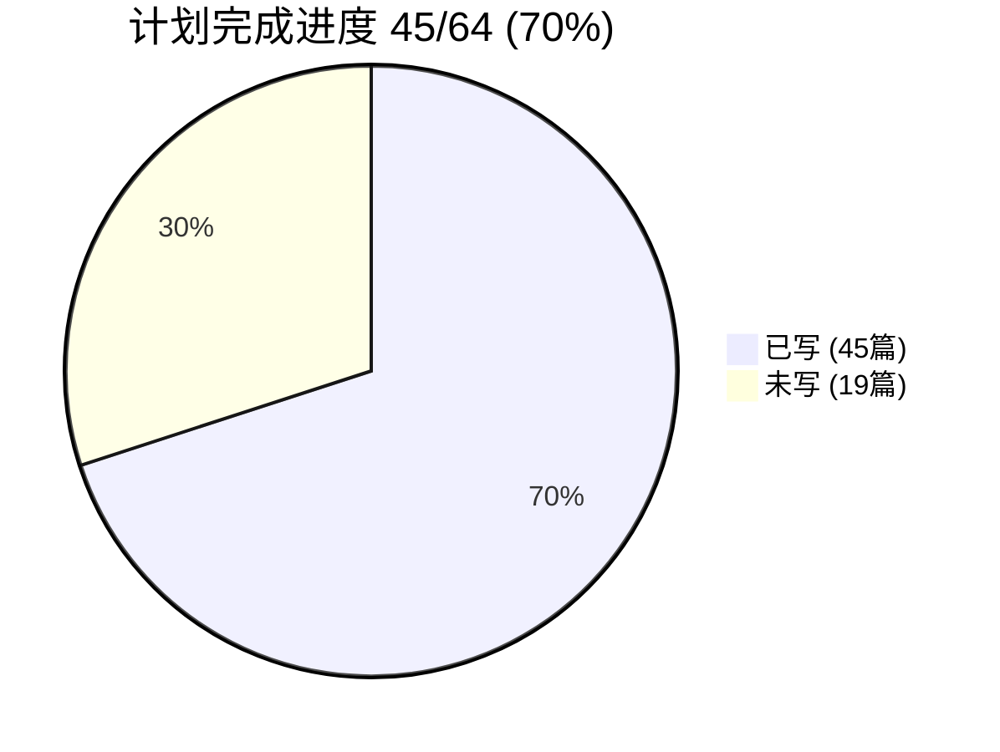
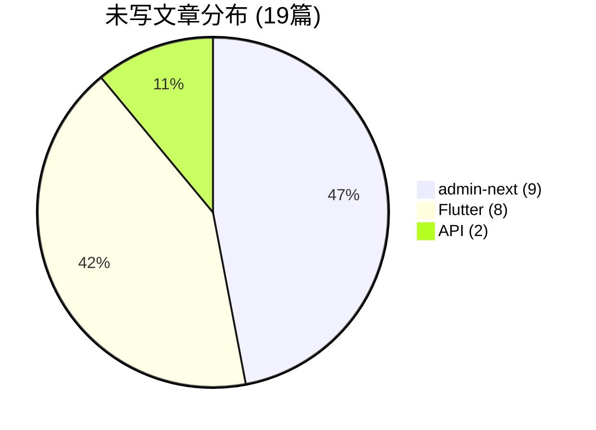

# 博客文章写作进度分析

> 分析时间：2026-05-02
> 对比依据：`plans/full-writing-plan.md`（计划 64 篇） vs `docs/blog/articles/`（实际 108 篇）

---

## 总览

| 项目 | 计划篇数 | 已写(计划内) | 完成率 | 额外已有 | 总计已有 |
|------|---------|-------------|--------|---------|---------|
| frontend-blog | 3 | **3/3** | **100%** ✅ | 25 | 28 |
| admin-next | 16 | **7/16** | **44%** | 0 | 7 |
| API | 18 | **15/18** | **83%** | 4 | 19 |
| Flutter | 27 | **20/27** | **74%** | 0 | 20 |
| 其他(非计划) | — | — | — | 34 | 34 |
| **合计** | **64** | **45/64** | **70%** | **63** | **108** |

> **额外已有**：architecture(7) + backend(5) + devops(6) + performance(3) + projects(4) + security(9) = 34 篇不在计划中的高质量文章。

---

## 一、frontend-blog — ✅ 全部完成 (3/3)

| 计划 | 文章 | 状态 |
|-----|------|------|
| F1 ⭐⭐⭐⭐ | BlurhashImage SSR | ✅ [`blurhash-image-ssr-safe.md`](docs/blog/articles/frontend/blurhash-image-ssr-safe.md) |
| F2 ⭐⭐⭐⭐ | Zustand + Cookie Storage SSR | ✅ [`zustand-cookie-storage-ssr-auth.md`](docs/blog/articles/frontend/zustand-cookie-storage-ssr-auth.md) |
| F3 ⭐⭐⭐⭐⭐ | 三模式 Fetcher 适配层 | ✅ [`nextjs-universal-fetcher.md`](docs/blog/articles/frontend/nextjs-universal-fetcher.md) |

> 此外还有 25 篇 frontend 文章（登录、SEO、PWA、评论、书签、视频、动画等），覆盖率非常高。

---

## 二、admin-next — 进度 7/16 (44%) ⚠️

| 计划 | 文章 | 状态 |
|-----|------|------|
| A1 ⭐⭐⭐⭐⭐ | SmartTable 泛型表格 | ✅ [`smart-table-generic-data-grid.md`](docs/blog/articles/admin/smart-table-generic-data-grid.md) |
| A2 ⭐⭐⭐⭐ | useChatSocket 客服 WebSocket | ✅ [`use-chat-socket-realtime-customer-service.md`](docs/blog/articles/admin/use-chat-socket-realtime-customer-service.md) |
| A3 ⭐⭐⭐ | Server Prefetch + ISR | ❌ **未写** |
| A4 ⭐⭐⭐⭐⭐ | HttpClient 401 自动刷新 | ✅ [`http-client-auth-refresh-retry.md`](docs/blog/articles/admin/http-client-auth-refresh-retry.md) |
| A5 ⭐⭐⭐⭐ | 中间件 JWT 路由守卫 | ✅ [`middleware-jwt-route-guard.md`](docs/blog/articles/admin/middleware-jwt-route-guard.md) |
| A6 ⭐⭐⭐⭐ | Zustand 认证存储 + SSR | ✅ [`zustand-auth-store-ssr-hydration.md`](docs/blog/articles/admin/zustand-auth-store-ssr-hydration.md) |
| A7 ⭐⭐⭐⭐ | DataSynchronizer 深度比较 | ✅ [`data-synchronizer-deep-compare-cycle-safe.md`](docs/blog/articles/admin/data-synchronizer-deep-compare-cycle-safe.md) |
| A8 ⭐⭐⭐⭐ | Sentry 可观测性体系 | ✅ [`sentry-observability-span-utils.md`](docs/blog/articles/admin/sentry-observability-span-utils.md) |
| A9 ⭐⭐⭐⭐ | 安全工具链 Zod+PII+XSS | ❌ **未写** |
| A10 ⭐⭐⭐⭐ | 缓存契约模式 15 模块 | ❌ **未写** |
| A11 ⭐⭐⭐⭐ | API 客户端层 30+ 模块 | ❌ **未写** |
| A12 ⭐⭐⭐ | UI 组件库 12 组件 | ❌ **未写** |
| A13 ⭐⭐⭐ | Browser crypto shim | ❌ **未写** |
| A14 ⭐⭐⭐ | LanguageProvider | ❌ **未写** |
| A15 ⭐⭐⭐ | 路由配置体系 | ❌ **未写** |
| A16 ⭐⭐ | BuildInfo + 工具函数 | ❌ **未写** |

### 剩余 9 篇按优先级排序：

| 优先级 | # | 主题 | 源码规模 |
|-------|---|------|---------|
| 🥇 | A4 ⭐⭐⭐⭐⭐ | ~已写~ | — |
| 🥇 | A9 ⭐⭐⭐⭐ | 安全工具链 | 276L |
| 🥇 | A10 ⭐⭐⭐⭐ | 缓存契约模式 | 15×~70L |
| 🥇 | A11 ⭐⭐⭐⭐ | API 客户端层 | 1145L |
| 🥈 | A3 ⭐⭐⭐ | Server Prefetch | 多文件 |
| 🥈 | A12 ⭐⭐⭐ | UI 组件库 | 631L |
| 🥈 | A14 ⭐⭐⭐ | LanguageProvider | 148L |
| 🥈 | A15 ⭐⭐⭐ | 路由配置 | 164L |
| 🥉 | A13 ⭐⭐⭐ | Crypto shim | 56L |
| 🥉 | A16 ⭐⭐ | BuildInfo | 330L |

---

## 三、API — 进度 15/18 (83%) ✅

> P4 的 `blog-ai-processor-deep-dive.md` 已删除（与 `ai-powered-translation-engine.md` 冗余），其核心内容实际上被后者覆盖。

| 计划 | 文章 | 状态 |
|-----|------|------|
| P1 ⭐⭐⭐⭐⭐ | AI Service | ✅ [`ai-powered-translation-engine.md`](docs/blog/articles/api/ai-powered-translation-engine.md) + [`ai-service-migration-vertex-ai-to-ai-studio.md`](docs/blog/articles/api/ai-service-migration-vertex-ai-to-ai-studio.md) |
| P2 ⭐⭐⭐⭐⭐ | KYC Provider | ✅ [`kyc-provider-aws-rekognition-vertex-ai.md`](docs/blog/articles/api/kyc-provider-aws-rekognition-vertex-ai.md) |
| P3 ⭐⭐⭐⭐⭐ | 媒体处理管道 Sharp+HLS | ❌ **未写** |
| P4 ⭐⭐⭐⭐⭐ | Blog AI 翻译处理器 | ⚠️ 文章已删除，内容被 P1 覆盖 |
| P5 ⭐⭐⭐⭐⭐ | IM 即时通讯 | ✅ [`webrtc-call-signaling-chat-dto.md`](docs/blog/articles/api/webrtc-call-signaling-chat-dto.md) + [`websocket-gateway-event-emitter-architecture.md`](docs/blog/articles/api/websocket-gateway-event-emitter-architecture.md) |
| P6 ⭐⭐⭐⭐ | GroupService 团购 | ✅ [`group-service-redis-lock-settlement.md`](docs/blog/articles/api/group-service-redis-lock-settlement.md) |
| P7 ⭐⭐⭐⭐ | LuckyDraw 抽奖 | ✅ [`lucky-draw-service-lottery-ticket.md`](docs/blog/articles/api/lucky-draw-service-lottery-ticket.md) |
| P8 ⭐⭐⭐⭐ | UploadService R2/S3 | ✅ [`file-upload-cloudflare-r2-media-processing.md`](docs/blog/articles/api/file-upload-cloudflare-r2-media-processing.md) |
| P9 ⭐⭐⭐⭐ | QueueMonitor | ✅ [`queue-monitor-bullmq-dashboard.md`](docs/blog/articles/api/queue-monitor-bullmq-dashboard.md) + [`bullmq-background-jobs-queue-architecture.md`](docs/blog/articles/api/bullmq-background-jobs-queue-architecture.md) |
| P10 ⭐⭐⭐⭐ | 设备安全与风控 | ✅ [`device-security-risk-control.md`](docs/blog/articles/api/device-security-risk-control.md) |
| P11 ⭐⭐⭐⭐ | 博客安全体系 | ✅ [`blog-security-like-dedup-sensitive-word.md`](docs/blog/articles/api/blog-security-like-dedup-sensitive-word.md) |
| P12 ⭐⭐⭐⭐ | 统一响应与异常 | ✅ [`nestjs-guards-interceptors-pipes-filters.md`](docs/blog/articles/api/nestjs-guards-interceptors-pipes-filters.md) |
| P13 ⭐⭐⭐⭐ | CSRF 双中间件 | ❌ **未写** |
| P14 ⭐⭐⭐ | Redis 分布式锁 | ✅ [`redis-distributed-lock-system.md`](docs/blog/articles/api/redis-distributed-lock-system.md) |
| P15 ⭐⭐⭐⭐ | 语言检测引擎 | ✅ [`language-detection-service-franc-min.md`](docs/blog/articles/api/language-detection-service-franc-min.md) |
| P16 ⭐⭐⭐ | 通用 DTO 体系 | ✅ [`generic-dto-system-transforms-pagination.md`](docs/blog/articles/api/generic-dto-system-transforms-pagination.md) |
| P17 ⭐⭐⭐ | 安全工具链 | ✅ [`security-toolchain-otp-throttler-xss-recaptcha.md`](docs/blog/articles/api/security-toolchain-otp-throttler-xss-recaptcha.md) |
| P18 ⭐⭐⭐ | 头像+支付+邮件+缓存 | ✅ [`avatar-service-payment-cache-interceptor.md`](docs/blog/articles/api/avatar-service-payment-cache-interceptor.md) + [`email-resend-notification-service.md`](docs/blog/articles/api/email-resend-notification-service.md) |

### 剩余 3 篇：

| 优先级 | # | 主题 | 源码规模 | 说明 |
|-------|---|------|---------|------|
| 🥇 | **P3** ⭐⭐⭐⭐⭐ | **媒体处理管道** | 412L+277L | Sharp 图像处理 + HLS 视频转码，核心基础设施 |
| 🥇 | **P13** ⭐⭐⭐⭐ | **CSRF 双中间件** | 144L | 安全相关，可与 P12 合并 |
| 🥉 | P4 ⭐⭐⭐⭐⭐ | Blog AI Processor | 1254L | 内容已被 P1 覆盖，考虑是否重写 |

---

## 四、Flutter — 进度 20/27 (74%) ✅

| 计划 | 文章 | 状态 |
|-----|------|------|
| F1 ⭐⭐⭐⭐⭐ | AppBootstrap 数据屏障 | ❌ **未写** |
| F2 ⭐⭐⭐⭐⭐ | UnifiedInterceptor 错误策略 | ❌ **未写** |
| F3 ⭐⭐⭐⭐⭐ | Http 静态类 + 双 Dio | ✅ [`http-static-class-dual-dio-native-adapter.md`](docs/blog/articles/flutter/http-static-class-dual-dio-native-adapter.md) |
| F4 ⭐⭐⭐⭐ | ApiCacheManager 双存储 | ✅ [`api-cache-manager-dual-storage-swr.md`](docs/blog/articles/flutter/api-cache-manager-dual-storage-swr.md) |
| F5 ⭐⭐⭐⭐ | HydratedStateNotifier | ✅ [`hydrated-state-notifier-abstract-persistence.md`](docs/blog/articles/flutter/hydrated-state-notifier-abstract-persistence.md) |
| F6 ⭐⭐⭐⭐ | Design Tokens 生成 | ✅ [`design-tokens-generated-system.md`](docs/blog/articles/flutter/design-tokens-generated-system.md) |
| F7 ⭐⭐⭐ | Pipeline Runner | ✅ [`pipeline-runner-sequential-execution.md`](docs/blog/articles/flutter/pipeline-runner-sequential-execution.md) |
| F8 ⭐⭐⭐⭐ | Deep Link OAuth | ✅ [`deep-link-oauth-global-handler.md`](docs/blog/articles/flutter/deep-link-oauth-global-handler.md) |
| F9 ⭐⭐⭐⭐ | AppStartup 数据预热 | ✅ [`app-startup-data-pre-warming.md`](docs/blog/articles/flutter/app-startup-data-pre-warming.md) |
| F10 ⭐⭐⭐⭐ | Modal 弹窗体系 | ✅ [`modal-system-base-config-radix-sheet-modal.md`](docs/blog/articles/flutter/modal-system-base-config-radix-sheet-modal.md) |
| F11 ⭐⭐⭐⭐ | AuthNotifier 认证状态机 | ✅ [`auth-notifier-token-storage-auth-state-machine.md`](docs/blog/articles/flutter/auth-notifier-token-storage-auth-state-machine.md) |
| F12 ⭐⭐⭐ | Platform Adapter | ✅ [`platform-adapter-conditional-export.md`](docs/blog/articles/flutter/platform-adapter-conditional-export.md) |
| F13 ⭐⭐⭐⭐⭐ | GoRouter 路由体系 | ✅ [`gorouter-route-system-shell-route-auth.md`](docs/blog/articles/flutter/gorouter-route-system-shell-route-auth.md) |
| F14 ⭐⭐⭐⭐⭐ | GlobalHandler+CallKit | ✅ [`global-handler-callkit-webrtc.md`](docs/blog/articles/flutter/global-handler-callkit-webrtc.md) |
| F15 ⭐⭐⭐⭐ | ErrorStrategy 决策表 | ✅ [`error-strategy-decision-table.md`](docs/blog/articles/flutter/error-strategy-decision-table.md) |
| F16 ⭐⭐⭐⭐ | DeviceFingerprint 风控 | ✅ [`device-fingerprint-risk-control.md`](docs/blog/articles/flutter/device-fingerprint-risk-control.md) |
| F17 ⭐⭐⭐ | ServerTimeHelper | ✅ [`server-time-helper-calibration-countdown.md`](docs/blog/articles/flutter/server-time-helper-calibration-countdown.md) |
| F18 ⭐⭐⭐⭐ | ImageCacheManager | ✅ [`image-cache-manager-l1-l2-responsive-image-service.md`](docs/blog/articles/flutter/image-cache-manager-l1-l2-responsive-image-service.md) |
| F19 ⭐⭐⭐⭐ | LuckyFormTheme | ✅ [`lucky-form-theme-validator-system.md`](docs/blog/articles/flutter/lucky-form-theme-validator-system.md) |
| F20 ⭐⭐⭐⭐ | ReactiveForms 代码生成 | ✅ [`reactive-forms-code-generation.md`](docs/blog/articles/flutter/reactive-forms-code-generation.md) |
| F21 ⭐⭐⭐⭐ | GlobalUploadService | ✅ [`global-upload-service-s3-compression-mime.md`](docs/blog/articles/flutter/global-upload-service-s3-compression-mime.md) |
| F22 ⭐⭐⭐ | ShareService+DeepLink | ❌ **未写** |
| F23 ⭐⭐⭐⭐ | KycGuard 路由守卫 | ❌ **未写** |
| F24 ⭐⭐⭐ | MotionX 动画扩展 | ❌ **未写** |
| F25 ⭐⭐⭐ | EventBus 事件总线 | ❌ **未写** |
| F26 ⭐⭐⭐ | FirebaseService 超时保护 | ❌ **未写** |
| F27 ⭐⭐⭐ | 三件套 Hydrated Store | ❌ **未写** |

### 剩余 8 篇按优先级排序：

| 优先级 | # | 主题 | 源码规模 |
|-------|---|------|---------|
| 🥇 | **F1** ⭐⭐⭐⭐⭐ | AppBootstrap 数据屏障 | 222L |
| 🥇 | **F2** ⭐⭐⭐⭐⭐ | UnifiedInterceptor 错误策略 | 162L |
| 🥈 | **F23** ⭐⭐⭐⭐ | KycGuard 路由守卫 | 112L+ |
| 🥉 | F22 ⭐⭐⭐ | ShareService+DeepLink | 348L |
| 🥉 | F24 ⭐⭐⭐ | MotionX 动画 | 78L |
| 🥉 | F25 ⭐⭐⭐ | EventBus | 34L |
| 🥉 | F26 ⭐⭐⭐ | FirebaseService | 180L |
| 🥉 | F27 ⭐⭐⭐ | 三件套 Store | 117L |

---

## 五、整体进度摘要

### 按优先级统计剩余文章

| 优先级 | 数量 | 列表 |
|-------|------|------|
| ⭐⭐⭐⭐⭐ | 3 | Flutter F1, F2 + API P3 |
| ⭐⭐⭐⭐ | 6 | admin-next A9, A10, A11 + API P13 + Flutter F23 |
| ⭐⭐⭐ | 9 | admin-next A3, A12, A13, A14, A15 + Flutter F22, F24, F25, F26 |
| ⭐⭐ | 1 | admin-next A16 |

### 下一步写作建议

**第一优先（⭐⭐⭐⭐⭐）：**
1. **API P3 — 媒体处理管道**（Sharp + HLS）— 唯一缺失的 API 核心基础设施
2. **Flutter F1 — AppBootstrap 数据屏障** — 5 路并行启动屏障模式
3. **Flutter F2 — UnifiedInterceptor 错误策略分发** — 企业级 Dio 拦截器

**第二优先（⭐⭐⭐⭐）：**
4. **admin-next A9 — 安全工具链**（Zod+PII+XSS）— 276L 安全核心
5. **admin-next A10 — 缓存契约模式** — 15 模块统一缓存层
6. **admin-next A11 — API 客户端层** — 1145L 类型化封装
7. **API P13 — CSRF 双中间件** — 144L 安全防护
8. **Flutter F23 — KycGuard 路由守卫** — 认证守卫+弹窗

---

## 六、额外已有文章（非计划）共 34 篇

这些文章不在 `full-writing-plan.md` 的计划范围内，但质量很高：

| 分类 | 数量 | 文章列表 |
|------|------|---------|
| architecture | 7 | 后端架构、博客架构、i18n 架构、WebSocket IM、平台适配、Hooks 架构、TS 配置 |
| backend | 5 | 财务审计、Gemini 熔断、订单支付、钱包乐观锁、WebRTC Signaling |
| devops | 6 | CF Queue ISR、GitLab CI、LHCI、Prisma v6、Sentry+LHCI 监控、SSG/SSR/ISR |
| performance | 3 | Admin SSR 优化、Bundle 优化、Yarn PnP 缓存 |
| projects | 4 | JoyMini Admin、API、Blog、Flutter 项目介绍 |
| security | 9 | AI 评论审核、KYC 认证、设备指纹反欺诈、JWT 权限、点赞去重、reCAPTCHA、敏感词过滤、Admin 中间件 JWT |

---

## 七、总结

**当前状态非常好。** 108 篇已有文章覆盖了全栈各个层面。计划内的 64 篇已完成了 **45 篇（70%）**。

剩余 **19 篇**中，真正优先的只有 **8 篇**（⭐⭐⭐⭐⭐~⭐⭐⭐⭐），其余 11 篇是低优先级补充内容。

| 项目 | 完成率 | 评估 |
|------|-------|------|
| frontend-blog | **100%** | 🎉 全部完成，远超计划 |
| API | **83%** | ✅ 近乎完整，只差 P3 媒体管道和 P13 CSRF |
| Flutter | **74%** | ✅ 核心文章基本完成，剩余 8 篇多为低优先级 |
| admin-next | **44%** | ⚠️ 差距最大，剩余 9 篇中仍有 3 篇 ⭐⭐⭐⭐ 高价值文章 |
