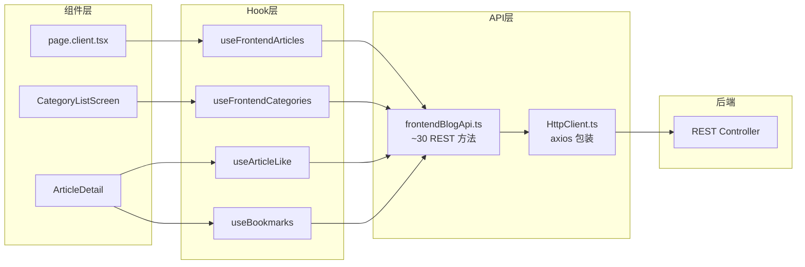
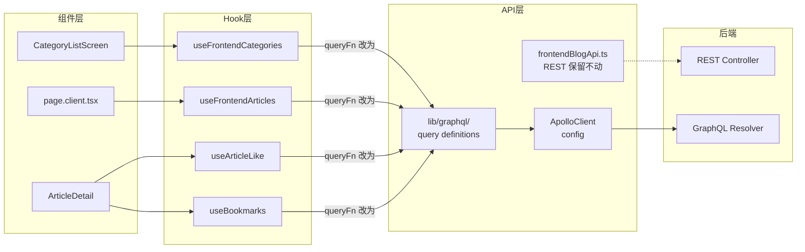

# GraphQL + React Query 数据流详解

> 本文解释在 frontend-blog (Next.js) 中，GraphQL 如何与现有的 React Query 配合工作。

---

## 核心设计理念

**GraphQL 作为 queryFn，React Query 作为缓存层。**

```
修改前（纯 REST）:
  Component → useQuery({ queryFn: frontendBlogApi.getArticles() }) → axios → REST API

修改后（GraphQL 叠加）:
  Component → useQuery({ queryFn: apolloClient.query({ query: GET_ARTICLES }) }) → GraphQL API
                                                                    (REST 保留不动)
```

**上层组件不知道底层变化** — hook 签名不变，返回值不变。

---

## 当前架构（纯 REST）



---

## 改造后架构（REST + GraphQL 共存）



---

## 关键：queryFn 里怎么用 GraphQL

当前 [`useFrontendCategories`](apps/frontend-blog/src/lib/hooks/useFrontendArticles.ts:237) 的 `queryFn` 长这样：

```typescript
// 当前（REST）:
queryFn: async () => {
  const networkPromise = frontendBlogApi.getCategories(locale);
  // ... IndexedDB 缓存逻辑 ...
  return networkPromise;
},
```

改造后，`queryFn` 变成这样：

```typescript
// 改造后（GraphQL）:
queryFn: async () => {
  // 直接用 Apollo Client 查询 GraphQL
  const { data } = await apolloClient.query({
    query: GET_CATEGORIES,
    variables: { locale },
  });
  return data.categories;
},
```

**React Query 的缓存、重试、staleTime 仍然生效** — 只是数据来源从 REST 变成了 GraphQL。

---

## SSR 的特殊处理

Server Component 不能直接用 Apollo Client（它是客户端库）。需要**服务端 GraphQL fetch**：

```typescript
// 当前 SSR page.tsx:
const initialData = await serverGet('/v1/frontend/blog/categories', { lang: locale });

// 改造后 SSR:
async function serverFetchGraphql(query: string, variables: any) {
  const response = await fetch(`${API_URL}/graphql`, {
    method: 'POST',
    headers: { 'Content-Type': 'application/json' },
    body: JSON.stringify({ query, variables }),
  });
  const json = await response.json();
  return json.data;
}

const initialData = await serverFetchGraphql(GET_CATEGORIES, { locale });
```

---

## 为什么用 React Query 包装 GraphQL？

| 功能 | React Query 提供 | Apollo Client 也提供 |
|------|-----------------|---------------------|
| 缓存 | ✅ 5min staleTime | ✅ InMemoryCache |
| 重试 | ✅ 2次重试 | ✅ |
| 乐观更新 | ✅ like/bookmark | ✅ |
| IndexedDB 离线 | ✅ Local-First | ❌ 需要额外配置 |
| SSR initialData | ✅ | ✅ |
| Query Key 管理 | ✅ locale 注入 | ❌ |

**结论**：React Query 提供 IndexedDB Local-First 策略，这是你们现有的离线支持核心。Apollo Client 的缓存不能替代这个。所以 React Query 作为 wrapper 是最小改动方案。

---

## Hook 改造前后对比（以 Categories 为例）

### 改造前

```typescript
// lib/hooks/useFrontendArticles.ts
export function useFrontendCategories(initialData?: FrontendCategory[]) {
  const locale = useCurrentLocale();

  return useQuery({
    queryKey: ['frontendCategories', locale],
    queryFn: async () => {
      const networkPromise = frontendBlogApi.getCategories(locale);
      // ... IndexedDB sync + cache logic ...
      return networkPromise;
    },
    staleTime: 60 * 60 * 1000,
    networkMode: 'offlineFirst',
    initialData,
  });
}
```

### 改造后

```typescript
// lib/hooks/useFrontendArticles.ts — 同一文件，只改 queryFn
import { apolloClient } from '@/lib/graphql/client';
import { GET_CATEGORIES } from '@/lib/graphql/queries/category';

export function useFrontendCategories(initialData?: FrontendCategory[]) {
  const locale = useCurrentLocale();

  return useQuery({
    queryKey: ['frontendCategories', locale],
    queryFn: async () => {
      // GraphQL 查询替代 REST 调用
      const { data } = await apolloClient.query({
        query: GET_CATEGORIES,
        variables: { locale },
        fetchPolicy: 'network-only', // 让 React Query 管理缓存
      });
      return data.categories;
    },
    staleTime: 60 * 60 * 1000,   // React Query 缓存仍然生效
    networkMode: 'offlineFirst',  // IndexedDB 离线策略保留
    initialData,
  });
}
```

---

## GraphQL Schema ↔ TypeScript 类型对应

GraphQL 定义：

```graphql
type Category {
  id: ID!
  name: String!
  slug: String!
  description: String!
  coverImage: String!
  articleCount: Int!
}

type Query {
  categories(locale: String!): [Category!]!
  categoryBySlug(slug: String!, locale: String!): CategoryWithArticles
}
```

TypeScript 类型（已有 [`lib/types/frontend-blog.ts`](apps/frontend-blog/src/lib/types/frontend-blog.ts:86)）：

```typescript
export interface FrontendCategory {
  id: string;
  name: string;
  slug: string;
  description: string;
  coverImage: string;
  articleCount: number;
}
```

**不需要改类型** — GraphQL 返回的数据结构和 REST 一样，都是 `FrontendCategory[]`。

---

## 数据流总结（一条请求的生命周期）

以首页加载 Categories 为例：

```
1. Server Component (SSR):
   serverFetchGraphql(GET_CATEGORIES, { locale: 'en' })
     → POST /graphql
     → CategoryResolver.getCategories()
     → FrontendBlogService.getFrontendCategories()
     → Prisma
     → 返回 FrontendCategory[]
   ↓
2. 作为 initialData 传给 Client Component
   ↓
3. Client Component:
   useFrontendCategories(initialData)
     → React Query 用 initialData 作为缓存种子
     → 立即渲染，无 loading
   ↓
4. 后台（staleTime 60min 后）:
   queryFn → apolloClient.query({ query: GET_CATEGORIES })
     → Apollo Client HTTP POST /graphql
     → 同上链路
     → React Query 更新缓存 → UI 更新
```

---

## 相关的现有文件

| 文件 | 说明 |
|------|------|
| [`lib/hooks/useFrontendArticles.ts`](apps/frontend-blog/src/lib/hooks/useFrontendArticles.ts) | 所有 Blog 数据 hooks，需要修改 queryFn |
| [`lib/hooks/useArticleLike.ts`](apps/frontend-blog/src/lib/hooks/useArticleLike.ts) | 点赞 hooks，含乐观更新 |
| [`lib/hooks/useBookmarks.ts`](apps/frontend-blog/src/lib/hooks/useBookmarks.ts) | 收藏 hooks |
| [`lib/hooks/useComments.ts`](apps/frontend-blog/src/lib/hooks/useComments.ts) | 评论 hooks，含无限滚动 |
| [`lib/api/frontendBlogApi.ts`](apps/frontend-blog/src/lib/api/frontendBlogApi.ts) | REST API 定义 — 保留不动 |
| [`lib/api/queryKeys.ts`](apps/frontend-blog/src/lib/api/queryKeys.ts) | QueryKey 工厂 — 不变 |
| [`lib/types/frontend-blog.ts`](apps/frontend-blog/src/lib/types/frontend-blog.ts) | 类型定义 — 不变 |
| [`app/[locale]/page.tsx`](apps/frontend-blog/src/app/%5Blocale%5D/page.tsx) | 首页 SSR — 改为 GraphQL fetch |
