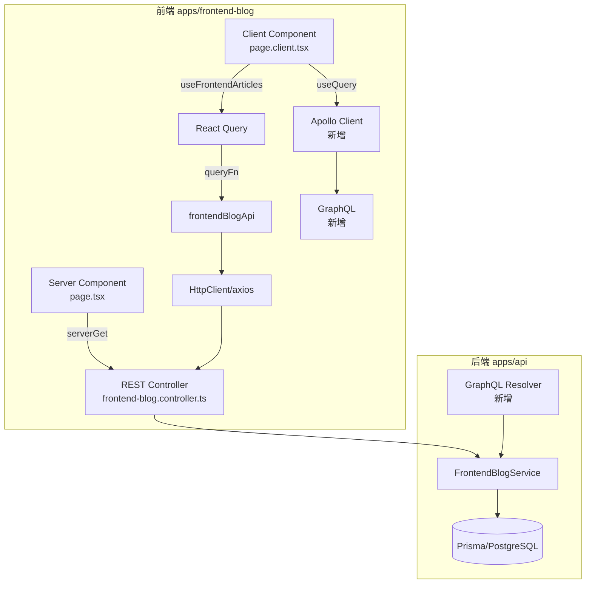

# GraphQL 学习 PoC — 完整大纲

> **目标**：在 monorepo `frontend-blog` (Next.js) 中逐步叠加 GraphQL
> **方式**：不删 REST，一步一步新增 GraphQL 查询，两者共存
> **动机**：积累 GraphQL 实战经验（企业需求）
> **当前架构**：NestJS 11 REST API + Next.js 15 (React Query v5 + axios) + Zustand (auth)

---

## 架构概览



---

## 阶段 1：基础设施 + Categories PoC（当前）

从 **Categories 首页分类** 开始，验证整条链路。

| 步骤 | 内容 | 涉及文件 | 状态 |
|------|------|---------|------|
| Step 1 | 后端安装 GraphQL 依赖 + 配置 GraphQLModule | [`apps/api/package.json`](apps/api/package.json), 新 `GraphqlAppModule` | 📝 已存档 `04-poc-step1-backend-setup.md` |
| Step 2 | 后端创建 CategoryResolver + Category 类型 | 新 `apps/api/src/graphql/` | ⏳ |
| Step 3 | 前端安装 Apollo Client 依赖 | [`apps/frontend-blog/package.json`](apps/frontend-blog/package.json) | ⏳ |
| Step 4 | 前端创建 Apollo Client 配置 | 新 `lib/graphql/client.ts` | ⏳ |
| Step 5 | 创建 Category GraphQL 查询定义 | 新 `lib/graphql/queries/category.ts` | ⏳ |
| Step 6 | 前端修改 `useFrontendCategories` hook 使用 GraphQL | [`lib/hooks/useFrontendArticles.ts`](apps/frontend-blog/src/lib/hooks/useFrontendArticles.ts) | ⏳ |
| Step 7 | 前端修改 Categories 页面 SSR 使用 GraphQL | [`categories/page.tsx`](apps/frontend-blog/src/app/%5Blocale%5D/categories/page.tsx) | ⏳ |
| Step 8 | 验证：REST + GraphQL 同时工作，数据一致 | 浏览器检查 | ⏳ |

---

## 阶段 2：首页文章 + 精选文章

| 步骤 | 内容 | 涉及文件 | 状态 |
|------|------|---------|------|
| Step 9 | 后端创建 ArticleResolver (列表 + 精选 + 详情) | 新 `graphql/article/` | ⏳ |
| Step 10 | 创建 Article GraphQL 查询定义 | 新 `lib/graphql/queries/article.ts` | ⏳ |
| Step 11 | 前端修改 `useFrontendArticles` hook | [`lib/hooks/useFrontendArticles.ts`](apps/frontend-blog/src/lib/hooks/useFrontendArticles.ts) | ⏳ |
| Step 12 | 前端修改 `useFrontendFeaturedArticles` hook | 同上 | ⏳ |
| Step 13 | 前端修改首页 SSR (`page.tsx`) 使用 GraphQL | [`page.tsx`](apps/frontend-blog/src/app/%5Blocale%5D/page.tsx) | ⏳ |
| Step 14 | 前端修改 `useFrontendPopularArticles` hook | [`lib/hooks/useFrontendArticles.ts`](apps/frontend-blog/src/lib/hooks/useFrontendArticles.ts) | ⏳ |

---

## 阶段 3：标签 + 搜索 + 统计

| 步骤 | 内容 | 涉及文件 | 状态 |
|------|------|---------|------|
| Step 15 | 后端创建 TagResolver + SearchResolver | 新 `graphql/tag/` + `graphql/search/` | ⏳ |
| Step 16 | 前端 Tags 页面替换为 GraphQL | [`tags/*`](apps/frontend-blog/src/app/%5Blocale%5D/tags/) | ⏳ |
| Step 17 | 前端 Search 页面替换为 GraphQL | [`search/*`](apps/frontend-blog/src/app/%5Blocale%5D/search/) | ⏳ |
| Step 18 | 前端 Stats + Archive 替换为 GraphQL | [`lib/hooks/useFrontendArticles.ts`](apps/frontend-blog/src/lib/hooks/useFrontendArticles.ts) | ⏳ |

---

## 阶段 4：文章详情页（Mutation）

| 步骤 | 内容 | 涉及文件 | 状态 |
|------|------|---------|------|
| Step 19 | 后端创建 CommentResolver (Query + Mutation) | 新 `graphql/comment/` | ⏳ |
| Step 20 | 前端 ArticleDetail SSR 使用 GraphQL | [`articles/[slug]/page.tsx`](apps/frontend-blog/src/app/%5Blocale%5D/articles/%5Bslug%5D/page.tsx) | ⏳ |
| Step 21 | 前端评论列表替换为 GraphQL | [`lib/hooks/useComments.ts`](apps/frontend-blog/src/lib/hooks/useComments.ts) | ⏳ |
| Step 22 | Mutation: 点赞/取消点赞 | [`lib/hooks/useArticleLike.ts`](apps/frontend-blog/src/lib/hooks/useArticleLike.ts) | ⏳ |
| Step 23 | Mutation: 收藏/取消收藏 | [`lib/hooks/useBookmarks.ts`](apps/frontend-blog/src/lib/hooks/useBookmarks.ts) | ⏳ |
| Step 24 | Mutation: 发表评论 | [`lib/hooks/useComments.ts`](apps/frontend-blog/src/lib/hooks/useComments.ts) | ⏳ |

---

## 阶段 5：收尾

| 步骤 | 内容 | 状态 |
|------|------|------|
| Step 25 | GraphQL Codegen 自动化类型生成 | ⏳ |
| Step 26 | 移除冗余的 REST 类型（可选） | ⏳ |
| Step 27 | 逐步废弃 REST 端点（可选） | ⏳ |

---

## 参考文档

| 文件 | 说明 |
|------|------|
| [`01-graphql-syntax-quick-reference.md`](study/graphql/01-graphql-syntax-quick-reference.md) | GraphQL 语法速查 |
| [`02-graphql-vs-rest-comparison.md`](study/graphql/02-graphql-vs-rest-comparison.md) | REST vs GraphQL 对比 |
| [`03-honest-assessment.md`](study/graphql/03-honest-assessment.md) | 诚实评估优缺点 |
| [`04-poc-step1-backend-setup.md`](study/graphql/04-poc-step1-backend-setup.md) | Step 1: 后端安装配置 |
| [`05-graphql-react-query-dataflow.md`](study/graphql/05-graphql-react-query-dataflow.md) | GraphQL + React Query 数据流详解 |
---

## 核心原则

1. **零删除** — REST 代码不动，GraphQL 作为新层叠加
2. **从首页开始** — 按 `HomeScreen → Categories → Tags → Article Detail` 顺序
3. **React Query 不变** — GraphQL 查询包装在 React Query hooks 内，上层组件不知道底层变化
4. **SSR 同步更新** — Server Component 的 `serverGet()` 也需要替换为 GraphQL 服务端查询
5. **你手写，我出代码文档** — 所有代码以 markdown 文档形式提供

### 数据流对比（修改前 vs 修改后）

```
修改前:
  Component → useFrontendCategories() → frontendBlogApi.getCategories() → axios → REST API

修改后 (GraphQL 叠加):
  Component → useFrontendCategories() → ApolloClient.query() → GraphQL API
                                         (frontendBlogApi.getCategories() 保留不动)
```

### 文件结构变化

```
apps/frontend-blog/src/
  lib/
    graphql/                          # 新增目录
      client.ts                       # Apollo Client 配置
      queries/
        category.ts                   # Category 查询定义
        article.ts                    # Article 查询定义
        tag.ts                        # Tag 查询定义
        comment.ts                    # Comment 查询定义
        bookmark.ts                   # Bookmark 查询定义
        like.ts                       # Like 查询定义
      fragments/
        article.fragment.ts           # 共享 fragment
    api/
      frontendBlogApi.ts              # REST API 保留不动
    hooks/
      useFrontendArticles.ts          # 修改：新增 GraphQL 查询路径
      useArticleLike.ts               # 修改
      useBookmarks.ts                 # 修改
      useComments.ts                  # 修改

apps/api/src/
  graphql/                            # 新增目录
    graphql.module.ts                 # GraphQL 模块配置
    resolvers/
      category.resolver.ts
      article.resolver.ts
      tag.resolver.ts
      comment.resolver.ts
```

---

## 当前进度

**当前步骤**: Step 1 ✅ — 后端安装配置文档已就绪
**下一步**: Step 2 — 后端创建 CategoryResolver + Category 类型
